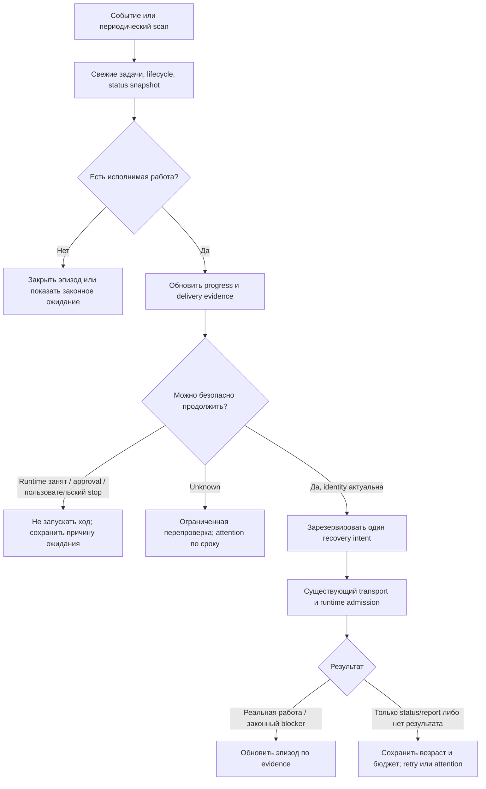

# План: надёжное продолжение работы агентов и устранение тихих зависаний

Дата: 2026-09-10. Статус: **реализация начата; checkpoint A частично выполнен, полный A–E и E2E ещё не завершены**. Текущее evidence: [progress.md](/Users/belief/dev/projects/agent-teams-ai/old-agent-teams-frontend/.codex-reports/agent-work-recovery-implementation/progress.md).

Основной репозиторий: `777genius/agent-teams-ai`. Базовый аудит: `4b8c54ae75d98c9a33e65c5326bd1683c76d28ac`; повторная сверка плана: `56e5f886e57c39be59e922f0462ac9ded6e89819`. Между этими SHA нет изменений в `member-work-sync`, `stallMonitor` и `opencode/delivery`; dirty tree проверять отдельно перед реализацией.
Runtime: `/Users/belief/dev/projects/claude/agent_teams_orchestrator`, исследованная ревизия `3bf24764f25dfd7588b9c8b23748fa0891fd85df`.

Runtime-ссылки ведут на проверенный legacy runtime. Новый `/Users/belief/dev/projects/agent-teams-ai/agent-teams-orchestrator` является отдельным architecture-only репозиторием и не заменяет указанные исходники QueryGuard/poller. Переносить этот план туда без отдельного mapping нельзя.

Этот документ является подробным планом для последующей реализации. Он развивает [аудит](/Users/belief/dev/projects/agent-teams-ai/old-agent-teams-frontend/.codex-reports/agent-stall-reliability-audit-20260910.md) и [разбор безопасного минимального исправления](/Users/belief/dev/projects/agent-teams-ai/old-agent-teams-frontend/.codex-reports/agent-stall-recovery-plan-20260910.md). Перед началом реализации перепроверить актуальный HEAD и локальные изменения; выводы привязаны к указанным версиям.

**Маршрут для исполнителя:** scope/checkpoints в §14 и §17; обязательные сценарии в §12; пошаговые temporal алгоритмы в §19. Начать с карты интеграции §20; затем прочитать §19.10–19.15 до работы над authority, restore, scheduler и runtime: §19.16 уточняет backend preparation, сохранение единственной replica и cache invalidation; там определены physical drain, недеструктивное чтение, порядок locks, stop/resume revision и terminal proof. Все эти требования входят в соответствующие A–D, а не являются необязательным последующим hardening.

**Последний проход Astra xhigh:** §20.16 содержит открытые J1–J2 дефекты journal foundation, J3 недостающее доказательство post-rename recovery и последовательность исправления. При работе над A5 прочитать его вместе с §20.15. §20.17 уточняет три межфазных контракта C/D: allocation после qualification, retirement retry до освобождения slot и сохранение deduplication witness после retention. Формулировки «review не нашёл новых P1/P2» в предыдущих разделах относятся только к указанному там проходу и scope, а не отменяют более поздние находки.

## 1. Цель и границы

Исправить ситуацию, когда у агента есть исполнимые задачи, runtime выглядит запущенным, но агент перестал работать, а система часами не продолжает работу и не объясняет остановку.

Требуемый результат:

1. Работающий агент не получает параллельный автоматический ход из-за старого события, ошибки чтения или потери отчёта.
2. Завершивший ход агент с оставшейся исполнимой работой получает ограниченное безопасное продолжение.
3. Если продолжение невозможно, состояние неизвестно или попытки исчерпаны, пользователь видит причину и доступное действие.
4. Отказ одного участника/команды не отключает обслуживание остальных.
5. Перезапуск приложения, смена backend и повторные события не теряют состояние recovery и не обнуляют его ограничения.

Полный scope включает раннее продолжение после завершившегося хода. Его реализовать после базовых исправлений и включать отдельно для каждого проверенного provider/runtime. До подтверждения capability использовать обычную доставку и явную эскалацию. Не объявлять весь план выполненным только потому, что появились уведомления.

Не входят: новая workflow-платформа, дополнительный LLM-watchdog, автоматическая смена владельцев задач, автоматическое завершение задач, перезапуск пользовательских процессов по одному таймеру, переписывание всей Team Provisioning архитектуры.

Гарантия ограничена работающим приложением/event loop и доступным состоянием. Если процесс приложения полностью завис или выключен, его собственные таймеры не обеспечат восстановление. Внешний supervisor для этого случая не добавлять в данный scope.

**Failure model:** crash/kill процесса приложения, storage worker или runtime при продолжающих работать OS/filesystem; после restart состояние сверяется до новых эффектов. Power loss, OS/kernel crash, потеря диска и повреждение внешними writers не входят в обещание сохранения каждого последнего commit. Они должны приводить к видимой консервативной деградации при обнаруженной неопределённости. Термин durable ниже означает сохранение между процессами в этой модели, а не универсальную power-loss гарантию.

## 2. Реестр проблем и доказательств

| ID  | Проблема                                                                                                                   | Степень подтверждения                                                                                            | Исправление                                                 |
| --- | -------------------------------------------------------------------------------------------------------------------------- | ---------------------------------------------------------------------------------------------------------------- | ----------------------------------------------------------- |
| F1  | Старый reconcile перезаписывает принятый report                                                                            | Воспроизведено production use cases с управляемыми Promise                                                       | Фаза 1: условная запись всех writers                        |
| F2  | Отклонённый report уничтожает действующий accepted lease                                                                   | Воспроизведено последовательно, без смены времени/agenda                                                         | Фаза 1: отделить принятый lease от последней попытки        |
| F3  | Служебный `still_working` позволяет закончить ход и продлевать отсутствие работы                                           | Validator/policy и виртуальные часы; не доказательство поведения конкретной модели                               | Фазы 3–5: независимый progress budget, prompt, continuation |
| F4  | Четыре delivered записи отключают пинки без срока и обязательного обращения к пользователю                                 | Воспроизведено +24h                                                                                              | Фаза 3: persistent attention, общий лимит                   |
| F5  | Inbox delivered не доказывает wake/новый ход; wake error поглощается                                                       | Прочитаны dispatcher, wiring, JSON/SQLite guards                                                                 | Фаза 4: delivery result и provider ledger                   |
| F6  | Незавершившийся Promise удерживает глобальный scheduler после timeout                                                      | Воспроизведено 100 последующих ticks                                                                             | Фаза 2: изоляция и health                                   |
| F7  | No-start без task activity пропускается для части providers; own work лида пропускается                                    | Production policy probe: Codex skip, OpenCode alert                                                              | Фаза 3: общий консервативный no-start                       |
| F8  | `busy:false` получается при ошибке источника и после pruning незавершённого tool                                           | Два production-source probes                                                                                     | Фаза 5: authoritative runtime admission                     |
| F9  | `turn_settled` теряет identity и не доказывает завершение текущего запуска                                                 | Resolver/composition/native emitter прочитаны                                                                    | Фаза 5: propagation и проверка generation                   |
| F10 | Старые payload/hash, повторный report replay, replica merge и два независимых отправителя способны нарушить новый механизм | Прочитаны соответствующие пути; это обязательные риски реализации, не все отдельные incident bugs воспроизведены | Фазы 1, 3, 4, 6                                             |

Доказательства воспроизведений: [первые probes](/Users/belief/dev/projects/agent-teams-ai/old-agent-teams-frontend/.codex-reports/agent-stall-audit-20260910-evidence/probes.mjs), [углублённые probes](/Users/belief/dev/projects/agent-teams-ai/old-agent-teams-frontend/.codex-reports/agent-stall-audit-20260910-evidence/deep-probes.mjs), [вывод](/Users/belief/dev/projects/agent-teams-ai/old-agent-teams-frontend/.codex-reports/agent-stall-audit-20260910-evidence/deep-results.txt). Последние загрузили 26 production-модулей с синтетическими портами. Это не live E2E и не доказательство причины конкретного случая на скриншоте.

## 3. Что сохраняем и кто чем владеет

| Область                                                     | Источник истины / владелец                                                                  |
| ----------------------------------------------------------- | ------------------------------------------------------------------------------------------- |
| Назначение, dependencies, review, clarification, завершение | Существующие task/kanban stores                                                             |
| Принятый отчёт, результат sync, эпизод отсутствия прогресса | Status-store внутри `member-work-sync`                                                      |
| Создание логического recovery intent                        | Один planner в `member-work-sync`                                                           |
| Запись/claim/dedup сообщения                                | Существующий outbox и inbox                                                                 |
| Допуск нового хода, текущий run/session/generation          | Runtime, который действительно запускает ход                                                |
| OpenCode transport acceptance/response/retry                | Существующий `OpenCodePromptDeliveryLedger` и watchdog                                      |
| Native mailbox acceptance/finalization                      | Существующий inbox poller + QueryGuard                                                      |
| Наблюдение task progress/no-start                           | Stall-monitor и узкие progress adapters                                                     |
| Ошибки provider/runtime                                     | `team-runtime-recovery`; не превращать его в конкурирующий планировщик обычных задач        |
| UI attention                                                | Проекция durable status; NotificationManager/native toast являются дополнительной доставкой |

Основные точки кода:

- [Work-sync use cases и ports](/Users/belief/dev/projects/agent-teams-ai/old-agent-teams-frontend/src/features/member-work-sync/core/application/ports.ts), [composition](/Users/belief/dev/projects/agent-teams-ai/old-agent-teams-frontend/src/features/member-work-sync/main/composition/createMemberWorkSyncFeature.ts).
- [JSON store](/Users/belief/dev/projects/agent-teams-ai/old-agent-teams-frontend/src/features/member-work-sync/main/infrastructure/JsonMemberWorkSyncStore.ts), [SQLite store](/Users/belief/dev/projects/agent-teams-ai/old-agent-teams-frontend/src/features/member-work-sync/main/infrastructure/SqliteMemberWorkSyncStore.ts), [worker operations](/Users/belief/dev/projects/agent-teams-ai/old-agent-teams-frontend/src/features/internal-storage/main/infrastructure/worker/memberWorkSyncWorkerOps.ts), [backend/replica](/Users/belief/dev/projects/agent-teams-ai/old-agent-teams-frontend/src/features/member-work-sync/main/infrastructure/BackendSelectingMemberWorkSyncStore.ts).
- [Scheduled dispatch](/Users/belief/dev/projects/agent-teams-ai/old-agent-teams-frontend/src/features/member-work-sync/main/infrastructure/MemberWorkSyncNudgeDispatchScheduler.ts), [event queue](/Users/belief/dev/projects/agent-teams-ai/old-agent-teams-frontend/src/features/member-work-sync/main/infrastructure/MemberWorkSyncEventQueue.ts), [turn-settled drain](/Users/belief/dev/projects/agent-teams-ai/old-agent-teams-frontend/src/features/member-work-sync/main/infrastructure/RuntimeTurnSettledDrainScheduler.ts).
- [Task stall monitor](/Users/belief/dev/projects/agent-teams-ai/old-agent-teams-frontend/src/main/services/team/stallMonitor/TeamTaskStallMonitor.ts), [notifier](/Users/belief/dev/projects/agent-teams-ai/old-agent-teams-frontend/src/main/services/team/stallMonitor/TeamTaskStallNotifier.ts), [cooldown adapter](/Users/belief/dev/projects/agent-teams-ai/old-agent-teams-frontend/src/features/member-work-sync/main/adapters/output/TeamTaskStallJournalWorkSyncCooldown.ts).
- [OpenCode prompt ledger](/Users/belief/dev/projects/agent-teams-ai/old-agent-teams-frontend/src/main/services/team/opencode/delivery/OpenCodePromptDeliveryLedger.ts), [inbox relay](/Users/belief/dev/projects/agent-teams-ai/old-agent-teams-frontend/src/main/services/team/provisioning/TeamProvisioningOpenCodeMemberInboxRelay.ts), [delivery service](/Users/belief/dev/projects/agent-teams-ai/old-agent-teams-frontend/src/main/services/team/opencode/delivery/OpenCodeMemberMessageDeliveryService.ts).
- [Native inbox poller](/Users/belief/dev/projects/claude/agent_teams_orchestrator/src/hooks/useInboxPoller.ts), [QueryGuard](/Users/belief/dev/projects/claude/agent_teams_orchestrator/src/utils/QueryGuard.ts), [incoming admission](/Users/belief/dev/projects/claude/agent_teams_orchestrator/src/utils/incomingPromptAdmission.ts), [queue processor](/Users/belief/dev/projects/claude/agent_teams_orchestrator/src/hooks/useQueueProcessor.ts).

🔒 Инварианты:

- Один текущий владелец mutable state и один выбранный storage backend на сессию.
- Report token подтверждает право/актуальность отчёта, а не продуктивность и не idle.
- Новый status не записывается поверх неизвестной более свежей версии.
- Ошибка/отсутствие наблюдений означает unknown, не idle и не caught_up.
- Одно recovery-разрешение допускает не более одного нового хода. Транспорт может повторяться только по своей проверенной idempotency policy.
- Пользовательский stop, pause, approval, foreground input и смена запуска имеют приоритет над автоматикой.
- Счётчики attemptGeneration, immutable message identity, deletion drain и provider ledger guards не ослабляются.
- Никаких прямых shell/terminal/agent smoke действий на реальных проектах. Только disposable test state.

## 4. Целевой путь решения



`still_working` остаётся ограниченным lease. Ранний continuation является отдельным разрешённым действием для точно завершившегося хода; он не требует подделывать status в `needs_sync` и удалять принятый отчёт.

## 5. Фаза 0: воспроизводимая база и границы изменений

- [ ] Зафиксировать актуальные SHA обоих репозиториев, dirty paths и существующие feature flags. Не перетирать чужие изменения в main wiring/UI/runtime.
- [ ] Перенести подтверждённые probes в обычные regression tests проекта: race accepted-report/reconcile, invalid-report lease loss, perpetual scheduler lock, suppression +24h.
- [ ] Создать fake clock, deferred Promise helpers и fake runtime admission, переиспользуя существующие test helpers. Не строить универсальный simulator.
- [ ] Зафиксировать baseline поведения JSON и SQLite, pending-report replay, legacy snapshots, provider delivery и user cancellation.
- [ ] Создать disposable server sandbox для тяжёлых проверок; реальный runtime запускать только на отдельной тестовой команде на финальном canary.
- [ ] Для hosted review сначала проверить, что worker действительно прочитал исходник и имеет инструменты. Terminal status `done` без source/test evidence не считать ревью.

Выход: воспроизводимые тесты известных отказов и список touched surfaces. Коммит, содержащий только новые падающие tests, не должен попадать в main отдельно от исправления.

## 6. Фаза 1: атомарная актуальность статуса и корректный report

### 6.1. Узкий контракт условной записи

Предлагаемая форма API, имена уточнить по стилю существующего gateway:

```ts
type StatusSnapshot = {
  status: MemberWorkSyncStatus | null;
  token: string; // opaque, создаётся storage adapter, не renderer/моделью
};

type CommitResult =
  | { committed: true; snapshot: StatusSnapshot; projectionDegraded?: string[] }
  | { committed: false; reason: 'conflict' | 'inactive'; current?: StatusSnapshot }
  | { committed: false; reason: 'unavailable' | 'corrupt' | 'invalid_token'; retryable: boolean }
  | { committed: 'unknown'; reason: 'commit_unknown'; mutationId: string };

// readSnapshot(identity) -> StatusSnapshot
// compareAndWrite({ identity, expectedToken, mutationId, nextStatus }) -> CommitResult
```

Это внутренний storage contract. Не отправлять raw snapshot token через MCP/renderer как authority. В worker передавать данные, не callback-функцию или объект всего сервиса.

Read failure не возвращает `StatusSnapshot` с `status:null`: использовать typed read error/result с теми же distinctions. `unavailable` может допускать новый bounded вход после settlement; `corrupt`/`invalid_token` не лечатся blind retry. Если target CAS не отправлен из-за прерванной preparation, возвращается unavailable, а её возможные side effects всё равно остаются в physical drain (§19.10–19.11).

Выбранный вариант без новой таблицы: добавить optional storage-owned `statusRevision = { incarnation, lineageId, sequence, nonce }` в существующий status payload. Каждая успешная новая запись увеличивает sequence внутри lineage и получает новый UUID/nonce; retry уже совершённой domain mutation возвращает ранее сохранённый результат. Nonce не является секретом или правом записи; входной report/renderer не может назначить его сам. Lineage нужна для сравнения replica, nonce - для CAS/ABA. Подробный merge contract в 6.6.

Внутренний snapshot token привязан к точному сохранённому payload, его revision и incarnation. SQLite сравнивает существующий `statusJson` в условном update, JSON сравнивает сохранённый status под существующим lock. Адаптер держит raw token отдельно от нормализованного domain status, иначе нормализация team identity изменит сравниваемые байты. Новая revision переносится через export/import/replica как часть того же status JSON, поэтому отдельная колонка/таблица не нужна.

Условия корректности:

1. Initial insert успешен только при действительно отсутствующем статусе. Физическая ошибка/невалидный JSON не превращается в «статуса нет». Mutation-read должен различать `present / absent / corrupt / unavailable`; обычный tolerant read с quarantine/legacy fallback нельзя автоматически использовать как CAS snapshot. Все canonical status readers, включая UI/metrics/import, сохраняют corrupt evidence, чтобы последующий strict read не увидел ложное ENOENT (§19.11). После corruption запрещено восстановить старый lease из legacy-файла и выдать новый budget как для первого запуска.
2. Identity включает актуальную incarnation команды. Удаление и создание команды с тем же именем не делает старый token пригодным. Использовать существующий deletion identity/lifecycle fence; не создавать второй реестр имён.
3. Nonce меняется даже при возвращении domain полей из A через B обратно в A: старый token не проходит. Legacy adoption выполняется один раз до normal writers под тем же storage admission; первая CAS проверяет точный legacy payload и добавляет lineage/revision. UUID используется только для равенства, не для сортировки «кто новее». `evaluatedAt` не является уникальной версией.
4. Все writers этого status обязаны использовать условную запись. Оставленный публичный безусловный `write` снова открывает гонку. Import/restore может иметь отдельный закрытый путь, недоступный обычным use cases.

**Откуда берётся incarnation.** Текущий `MemberWorkSyncLifecyclePort` даёт только active booleans; готового incarnation contract в нём нет. Добавить узкий trusted read-port с исходами `identified / absent / unidentified / deleting / unavailable`. Использовать логический `_backupIdentityId`, которым уже владеет lifecycle/permanent-deletion механизм, через его публичный узкий adapter. Не использовать inode/birthtime как durable incarnation и не объявлять случайный nonce каждого status новым team ID.

Adoption выполняет существующий lifecycle owner до допуска status/token writers: атомарно закрепляет один marker через существующий identity claim, учитывает deletion и при конфликте перечитывает победивший marker. Read-port сам ID не создаёт. У действующей legacy команды adoption не обнуляет status/history; secret legacy ротируется по 6.4. Полное восстановление той же команды может сменить physical directory identity, сохраняя доказанную logical identity. Explicit recreate после удаления получает новый marker. Missing/corrupt identity у ранее наблюдавшейся команды не разрешает молча создать новый budget: до восстановления continuity effects закрыты, evidence сохраняется. Обязательно проверить race backup adoption ↔ work-sync adoption ↔ deletion; не создавать параллельного владельца marker.

### 6.2. Порядок use case

1. Проверить admission/quiesce и взять status snapshot.
2. Загрузить свежие agenda/runtime inputs; после существенных await проверить cancellation.
3. Вычислить решение чистой функцией, сохраняя независимые accepted-report/health поля.
4. Выполнить compare-and-write.
5. Только после успешного commit возвращать accepted result, создавать accepted metrics и планировать outbox.
6. Conflict: один полный пересчёт от свежего snapshot. Повторный conflict: отложить reconcile; report возвращает явный код `status_conflict` и `retryable:true`. Обновить contract, HTTP/IPC/MCP mapping и pending replay так, чтобы transient conflict не стал terminal rejection. Без бесконечного spin/retry.

CAS не делает task-store и status-store общей транзакцией. Поэтому перед отправкой остаётся свежая проверка agenda/lifecycle; сам continuation просит перечитать текущие задачи, а не выполнять историческое назначение без проверки. Не создавать распределённую транзакцию между task board, provider и inbox.

**Что здесь означает «свежая загрузка».** Повторный вызов `loadAgenda()` сейчас может получить тот же Promise из `rosterInFlightByTeam`/`workInFlightByTeam`. Один только повтор use case после CAS-conflict не доказывает свежесть. Добавить внутренний read context с generation и временем начала физического чтения. Для conflict retry и проверки перед reservation использовать чтение, начавшееся после invalidation; уже выполняющийся старый read может завершиться, но не публикует новый cache и не удовлетворяет этому запросу. Не подменять source generation полем `agenda.generatedAt`: оно создаётся после await и может маркировать старые данные текущим временем.

Для tasks/kanban нет общей транзакции. При несовместимых owner/status/review данных вернуть `unknown/inconsistent_sources`, не пустую agenda. Если за время подготовки изменились task owner, actionable state или review cycle, отменить вычисленное решение и один раз перечитать. Непрерывные изменения приводят к отложенному решению, без цикла до бесконечности. Новый `sourceGeneration` используется только внутри adapter для freshness; это не глобальная версия task-store и не durable authority.

### 6.3. Все места записи и чтения lease

- [ ] Reconciler: прочитать snapshot до await, не сохранять устаревшую вычисленную копию.
- [ ] Reporter accepted branch: `accepted:true` только после commit.
- [ ] Reporter rejected branch: отклонение не отзывает ранее принятый lease.
- [ ] Dispatcher suppression branch: тот же CAS; при conflict перечитать решение, не помечать outbox terminal по устаревшему suppression.
- [ ] Pending-report replay: учитывать retryable conflict, не маркировать его terminal rejected.
- [ ] JSON/SQLite/gateway/backend selector/replica/import/mappers: одинаковая семантика.
- [ ] Generic team backup/restore: исключить прямую подмену work-sync authority старой копией; применить 6.7, включая startup ordering.
- [ ] `SyncDecisionPolicy`, activation, suppression, recovery, background status refresh и accepted-report checker в main wiring: читать accepted report через один helper.

`lastAcceptedReport` добавить optional; старое `report` временно остаётся последней попыткой для совместимости API и диагностики. Helper использует новое поле, а для legacy snapshot - старый `report` только если он accepted и относится к текущей agenda. Пустые/битые timestamps, stale fingerprint и неподходящая lifecycle identity не дают активный lease.

При rejected report обновляются diagnostics/метрика отклонения, но `lastAcceptedReport` и recovery-health сохраняются. После истечения lease исторический accepted report можно хранить для объяснения; helper не должен считать его действующим. `blocked` не превращается в бессрочную блокировку, а `caught_up` допустим только при пустой actionable agenda.

### 6.4. Повтор отчёта после сбоя

Особое место: [PendingReportIntentReplayer](/Users/belief/dev/projects/agent-teams-ai/old-agent-teams-frontend/src/features/member-work-sync/core/application/MemberWorkSyncPendingReportIntentReplayer.ts) умеет обновлять истёкший fallback token и отправлять старый request заново.

- [ ] Ввести внутренний replay context с intent ID и доверенным временем первого сохранения. Не доверять model-supplied `reportedAt`.
- [ ] Один intent не должен продлевать lease при каждом replay. Использовать отдельный `pendingReportReceipt` в status и transfer результата в существующий report-intent journal по протоколу ниже. Одного `sourceIntentId` в `lastAcceptedReport` недостаточно: после I1 → I2 он потеряет память об I1.
- [ ] Сбой между commit report и `markPendingReportProcessed` восстанавливается повторным чтением результата, не новым обещанием «работаю ещё 15 минут».
- [ ] Если срок исходного fallback lease уже истёк, записать факт старого отчёта/processed outcome и запросить свежую синхронизацию; не выдавать новый полный TTL просто из-за возвращения control API. Источник времени - доверенная запись приложения либо аутентифицированная временная привязка исходного token; поля из model request и произвольный локальный файл не становятся доверенными автоматически.
- [ ] Для legacy intent без достоверного возраста или identity - консервативный refresh, без оживления старого lease. Не обновлять токен для invalid signature; существующее различие expired/invalid сохраняется.
- [ ] Новейший принятый report нельзя заменить более старым replay с той же agenda. Conflict и ordering проверяются на commit.

✅ **Выбранный протокол receipt, без общей транзакции двух JSON-файлов:**

1. До применения fallback report получить/создать его запись в существующем report-intent journal. Journal хранит стабильный intent ID, digest исходного request и immutable время поступления; repeat того же ID с другим digest является conflict, не новым отчётом.
2. Status CAS записывает accepted report и `pendingReportReceipt = { intentId, incarnation, requestDigest, acceptedAt, originalExpiresAt?, appliedStatusRevision }` **одним authority write**. Receipt доказывает именно accepted outcome; `resultCode` принадлежит journal row, не receipt. Значения expiry фиксируются один раз. Публичный report result не должен включать полный status snapshot в receipt: это избыточно и быстро устареет.
3. Пока checkpoint не перенесён, следующая **accepted report mutation** этого member сначала обязана завершить transfer. Reconcile, health и suppression могут работать, но сохраняют checkpoint неизменным. Они не считают его новой activity. Нельзя тихо перезаписать I1 receipt новым I2.
4. Transfer идемпотентно записывает processed outcome/receipt в journal I1 одним atomic write его существующего файла. Checkpoint не требует отдельного erase: следующая accepted CAS может заменить его на I2 **только после** подтверждённого journal outcome I1. Не держать member status lock во время записи journal. После await перечитать snapshot; изменённые другим writer поля сохраняются.
5. Crash до status commit: journal pending, report можно один раз пересчитать по исходному expiry. Crash после status commit: checkpoint доказывает принятие; journal восстанавливается без повторного lease. Crash после journal write: повторная проекция безопасна. Следующий I2 не может затереть единственное доказательство I1.
6. Replay сначала проверяет journal outcome, затем status checkpoint, и только потом принимает решение о новом commit. Повтор I1 после успешного I2 возвращает исторический outcome I1 + отдельно актуальный status; не записывает старый status обратно.
7. Если journal недоступен, новая accepted mutation временно получает `retryable: true`, а checkpoint сохраняется. Это локальная деградация отчётов участника; не блокировать весь scheduler. Не выдавать `accepted: false` с terminal rejection для уже committed I1.
8. SQLite может атомарно записать status + journal outcome + metric в одной transaction; наружная семантика одинакова. JSON использует описанный checkpoint. Report-store API должен различать committed result и post-commit projection degradation.

**Retention и online requests:** нельзя удалять processed receipt, пока исходный intent ещё может быть replayed. В первом patch не добавлять независимую TTL-очистку receipts. Старые неизвестные intents после существующей очистки допускают только консервативный refresh без нового accepted lease. Удаление команды чистит status/journal под тем же incarnation fence. Каждая accepted report mutation, включая online, получает внутренний mutation ID до первого commit attempt и использует checkpoint/journal; CAS retry и восстановление одного запроса сохраняют этот ID. Если caller имеет request/idempotency ID, включать его в identity вместе с incarnation и проверять digest. Прямой новый online report без такого ID не дедуплицировать только по всему request: одинаковые живые отчёты могут быть законными renewal. Повтор нового сетевого запроса без стабильного request ID не имеет гарантии exactly once; он проходит обычные lease правила, но не сбрасывает progress budget. Это явное ограничение transport contract, не повод бесконечно повторять внутреннюю mutation после commit error.

**Доверенное время и ordering fallback:** текущий HMAC token `wrs:v1` содержит подписанный `expiresAt`, но не `issuedAt`, incarnation или sequence. Поэтому не предлагать исполнителю «взять issuedAt из token». Расширить внутренний verifier до выдачи проверенных claims с finite timestamp; исходный token не менять при replay. Для fallback верхняя граница lease - expiry исходного проверенного token, даже если обычный live report вправе просить более долгий TTL. Уже истёкший token даёт historical/superseded outcome и fresh-sync request, без accepted renewal. Для legacy request без проверенной временной привязки или без доказательства, что он новее текущего accepted report, **не заменять** существующий accepted report: сохранить diagnostic outcome и запросить свежий online report. Не решать ordering по model `reportedAt`, mtime или новой дате replay. Более выразительный подписанный v2 token можно добавить позже при отдельной необходимости, он не нужен для безопасного первого исправления.

**Incarnation binding без изменения wire token v1:** CAS fence защищает уже начатую mutation, но не старый request, впервые пришедший после recreate одноимённой команды. Поэтому существующий HMAC secret record привязать к team incarnation, а cache key изменить с одного teamName на `(normalizedTeamName, incarnation)`. Создание новой incarnation получает новый secret под lifecycle fence; неизвестная incarnation запрещает принятие report. Secret legacy без binding при adoption ротировать один раз: старые tokens требуют fresh sync, но ранее сохранённый recovery budget не сбрасывается. Удаление одного secret-файла недостаточно: старый cache тоже не должен использоваться.

Create/verify всегда получают identity из trusted lifecycle port, не request модели. До записи нового secret повторно проверить incarnation; late async key creation старой команды не перезаписывает ключ новой. Различать действительно отсутствующий secret, legacy adoption и I/O/corruption: read error не запускает молчаливую генерацию нового ключа на каждом verify. Ошибка означает degraded/unknown, invalid signature не даёт token-refresh обхода. Report token и после этого не подтверждает idle/progress или текущую query generation.

### 6.5. Storage, metrics, replica

Для JSON safety authority использовать существующий `atomicWriteAsync` с `{ durability: 'strict', syncDirectory: true }`, а не default best-effort helper. Это относится к status с lease/checkpoint/reservation/latch, journal transfer перед заменой checkpoint, identity/secret binding и соответствующему runtime admission receipt (в runtime использовать его проверенный эквивалент). Не переводить все metrics/index/audit записи в обязательный sync. Учитывать предусмотренные helper ограничения directory fsync на разных платформах; не обещать power-loss защиту там, где API её не даёт.

Known fsync/rename I/O failure не считается успешным acknowledgment authority и не открывает внешний эффект. Если publish ещё не начался, mutation не применена; если rename уже мог состояться, вернуть `commit_unknown`/неподтверждённую запись, сохранить reservation/slot и выполнить settlement/proof путь. Повторное чтение bytes подтверждает visibility, а не устойчивость к потере питания; для снятия известной ошибки persistence выполнить поддержанную sync-проверку сохранённого файла, не повторяя domain mutation. При сохраняющейся ошибке оставлять attention/degraded. SQLite WAL + `synchronous=NORMAL` соответствует выбранной process-crash модели; глобальный `FULL` и новый storage framework в этот scope не добавлять.

Обязательные fault tests: EIO до rename на file sync; ошибка directory sync после возможного rename; RPC timeout после SQLite commit. Проверить отсутствие внешнего эффекта до подтверждённого authority outcome и отсутствие повторного accepted lease/debit после recovery.

- SQLite: conditional status update и связанные status/accepted metrics в одной worker transaction. Conflict не меняет metrics.
- JSON: не менять существующий порядок locks; сравнение и запись статуса под тем же member lock. Status является authority; восстановимые metrics/index не должны приводить к повторному принятию отчёта, если status успел записаться, а index нет.
- Backend replica публикует только реально committed state. Существующий `markDirty` **до** primary write сохраняется: это safety fence, а не публикация успешного commit. Даже проигравший CAS может оставить dirty marker; здоровый primary затем публикует перечитанный актуальный snapshot. Ошибка репликации после commit является отдельным degraded outcome, не приглашением повторно применить domain mutation.
- Проверить [domain merge](/Users/belief/dev/projects/agent-teams-ai/old-agent-teams-frontend/src/features/member-work-sync/main/infrastructure/memberWorkSyncDomainSnapshotMerge.ts) и [record merge](/Users/belief/dev/projects/agent-teams-ai/old-agent-teams-frontend/src/features/member-work-sync/main/infrastructure/memberWorkSyncSnapshotMerge.ts): сейчас выбор status зависит от `evaluatedAt`. Новые accepted/health поля не должны теряться при equal timestamps/legacy incoming row. Порядок версий допустим только внутри одной provenance/incarnation; нельзя сравнивать независимые counters как глобальные часы.
- При неоднозначном merge действовать по 6.6: блокировать автоматические эффекты member, сохранять evidence обеих версий, не «склеивать» lease чужого запуска с текущим attention. Replica не должна возвращать удалённую команду или superseded intent.

После подтверждённого atomic status write вернуть `committed:true` и при необходимости `projectionDegraded: ['metrics' | 'replica' | 'report_journal']`. Исключение после commit нельзя превращать в обычное «запись не произошла». Если atomic write завершилась с неопределённым результатом, сначала перечитать revision/receipt. До выяснения вернуть `commit_unknown` и запретить повторный side effect; это не CAS-conflict. В SQLite rollback до commit означает неприменённую mutation; transport timeout worker RPC сам по себе rollback не доказывает.

Accepted metric привязана к ID конкретной report mutation/receipt, а не к факту наличия `lastAcceptedReport` на очередном refresh. SQLite transactional metrics точны в рамках transaction. JSON исторические metrics являются best effort; текущее summary восстанавливается по status, но полную историю из последнего status восстановить нельзя. Не вводить новый durable metric journal только ради статистики. Safety decisions/budget не читать из best-effort metrics.

**Physical settlement worker RPC входит в checkpoint A.** В [InternalStorageWorkerClient](/Users/belief/dev/projects/agent-teams-ai/old-agent-teams-frontend/src/features/internal-storage/main/infrastructure/InternalStorageWorkerClient.ts:389) `failWorker()` отвергает RPC и обнуляет worker до завершения `terminate()`. Поэтому settled RPC Promise ещё не доказывает, что старая SQLite mutation больше не может commit. Нельзя разрешать retry по одному отрицательному чтению, выполненному в этом окне.

- Client владеет retirement fence конкретного worker instance. После timeout закрывает новые admission к этому database owner, сохраняет физическое termination/exit ожидание отдельно от уже rejected RPC и не создаёт replacement worker до доказанного прекращения старого writer.
- Верхний use case получает `commit_unknown` и доступ к settlement tracking через узкий инфраструктурный contract; `trackSettling`/deletion drain не должны видеть один лишь завершившийся RPC. Не передавать Worker объект в domain.
- После подтверждённого exit и открытия replacement connection перечитать authority/receipt. Найденная mutation подтверждает commit; доказанное отсутствие после settlement позволяет пересчёт с тем же mutation ID и свежим snapshot. До settlement отсутствие записи не является proof.
- Retire/exit/finally проверяют identity worker instance. Поздний callback W1 не обнуляет W2 и не отвергает его очередь. Различать запрос, уже отправленный W1 (возможный commit), и queued request, ещё не переданный worker (неисполненный).
- Если terminate/exit не подтверждён, storage остаётся global degraded: таймер или запуск второго worker не решают неопределённость. Остальные независимые read-only UI функции работают; обещать изоляцию команд внутри одного зависшего database writer нельзя.

Регрессия: W1 получил mutation → RPC timeout → pause termination → отрицательный probe → поздний commit W1 → exit → replacement read. До exit нет W2/mutation retry/external effect и deletion не объявлен завершённым; после exit найденный receipt возвращается без повторного debit. Отдельно проверить stale W1 exit после W2 и shutdown во время retirement.

### 6.6. Replica lineage: как не вернуть старый budget

Предусловие - один действующий writer/backend owner для incarnation. Session backend selection и существующие locks сохранить; simultaneous old/new desktop writers не поддерживаются как безопасный rollout. Lineage не заменяет ownership. `sequence` является safe integer; invalid/overflow metadata дают degraded read, не обнуление счётчика. Импорт не увеличивает sequence и не создаёт новую lineage из уже версионированного status.

| Две версии status                                 | Решение                                                                                             |
| ------------------------------------------------- | --------------------------------------------------------------------------------------------------- |
| Одна incarnation + lineage, разные sequence       | Выбрать весь status с большим sequence                                                              |
| Те же sequence + nonce и тот же canonical payload | Одна запись, идемпотентный import                                                                   |
| Те же sequence, но разные nonce/payload           | Divergence; не выбирать по времени                                                                  |
| Разные lineage одной incarnation                  | Divergence; counters несравнимы                                                                     |
| Версионированный canonical и legacy incoming      | Legacy не заменяет versioned status; обработать прочие records по их proof rules                    |
| Только legacy                                     | Один adoption под lock после существующего import; не выполнять два независимых adoption по backend |
| Разные incarnation                                | Только текущая lifecycle identity допустима; stale rows не воскресают                               |
| Dirty/missing required replica                    | JSON fallback закрыт существующим fence; ошибка видима                                              |

На SQLite → JSON → SQLite переносить lineage и sequence без изменения. Новая JSON mutation продолжает полученную sequence, а не начинает её с 1. Проверить оба merge модуля, importer, restoreReplicaSnapshot, normalization и mappers: сравнение должно идти по одному contract. Нормализация имени team/member не должна менять storage identity; canonical payload equality проверяется в одной нормализованной форме, тогда как локальный CAS token остаётся привязан к точным persisted bytes своего backend.

При divergence сохранить оба snapshot в ограниченном diagnostic artifact, показать `storage_state_conflict`, остановить автоматические recovery effects этого member и не восстанавливать budget «из свежих задач». Read-only refresh может показать актуальные задачи, но не разрешает lost/unknown intent. Разрешение возможно после установления единственного writer и проверки unresolved inbox/ledger: принять выбранную authority с консервативной историей attempts либо явным owner recovery. Если proof недостаточно, attention остаётся. Это редкая видимая деградация, а не нормальный silent reset. Существующие report/outbox merge rules тоже должны сохранять receipt/reservation correlation; смена status winner не делает доставленный intent непринятым.

При crash между primary commit и clean publication dirty fence остаётся. Здоровый primary перечитывает committed snapshot и восстанавливает clean replica. Нельзя использовать устаревшую clean копию, сняв dirty marker «чтобы fallback заработал». Возврат backend не должен чистить пользовательский stop latch или receipts.

Готовность фазы: все writers проверены exhaustive search; report race/rejection/replay regressions проходят для JSON и SQLite; нет новых blind writes; конфликт не рождает outbox или ложный accepted metric.

### 6.7. Backup/restore тоже является writer

Подтверждённый обход: [TeamBackupFileCollection](/Users/belief/dev/projects/agent-teams-ai/old-agent-teams-frontend/src/main/services/team/TeamBackupFileCollection.ts:26) исключает work-sync `journal.jsonl`, но остальные рекурсивные members-файлы попадают в backup. [TeamBackupRestoreService](/Users/belief/dev/projects/agent-teams-ai/old-agent-teams-frontend/src/main/services/team/TeamBackupRestoreService.ts:240) восстанавливает missing/corrupt JSON напрямую; full restore использует также mtime. Config identity fence защищает от другой команды, но не от старого budget/receipt той же команды.

✅ Выбран минимальный безопасный путь: generic restore **не публикует напрямую** work-sync safety files. Backup продолжает сохранять evidence; восстановление status/reports/outbox и token secret передаётся feature-owned restore/import contract. Один общий path classifier из existing work-sync paths используется в partial и full restore; не дублировать regex в двух ветках. Прочие team/task файлы сохраняют прежнее поведение.

1. До feature restore закрыть work-sync admission команды и дождаться физического settlement, включая worker retirement из 6.5. Drain происходит вне lifecycle lock; затем acquire/revalidate и privileged restore без повторного входа в quiesced normal gate (§19.11). Startup restore и первый work-sync scan должны иметь явную зависимость, а не два независимых fire-and-forget запуска. Ошибка restore оставляет конкретную команду degraded, не запрещает startup других команд.
   До публикации восстановленной команды сохранить в существующем restore/lifecycle metadata состояние `work_sync_restore_pending` для logical identity. Этот fence переживает crash и проверяется при следующем startup до normal writers; один in-memory quiesce недостаточен. Отсутствующий status у восстановленной команды не является initial insert. Если запись fence не подтверждена, не публиковать её как готовую для automation. Снять fence может только feature restore после доказанной continuity и завершения authority import, а не generic restore после копирования config. Не создавать новый независимый реестр команд: расширить metadata существующего restore owner узким feature recovery outcome.
2. Feature получает candidate snapshot + backup logical identity/provenance. Валидирует полную схему, lineage, revision и correlation receipts/reservations/outbox. Отдельные missing JSON не восстанавливаются как независимые defaults.
3. Если живая authority доступна, backup не заменяет более свежую revision. При конфликте действует 6.6. Mtime и факт parseable JSON не доказывают актуальность.
4. Если authority потеряна/повреждена, один старый backup не доказывает, что после него не было reservation или user stop. Его можно использовать для диагностики и консервативного восстановления, но нельзя автоматически включать новые recovery attempts. Требуется reconciliation с доступным ledger/receipt и подтверждённой continuity; при недостатке proof сохранить `storage_state_conflict`/attention и закрыть automatic admission. Нельзя «починить» состояние fresh-sync отчётом или новой lineage с нулевыми counters.
5. Secret из backup не делает старые tokens автоматически пригодными: incarnation проверяется, восстановление неизвестной key history не снимает token rejection. Применить fail-closed правила 6.4.
6. При успешном проверенном import обновить replica по штатному dirty/clean протоколу, затем открыть admission. Неполный import не должен выдавать новую reservation между записью отдельных projections.

Тесты: partial restore corrupt status при более новом receipt; full restore старого backup после spent reservation/stop; restore той же logical identity с новым inode; restore ↔ accepted CAS; delete/recreate ↔ late restore. Проверять, что generic restore не записал protected paths, budget не уменьшился и новая automatic отправка не появилась при недостатке proof. Это часть A, а не необязательная последующая backup feature.

## 7. Фаза 2: scheduler не блокирует остальных

### 7.1. Разделить логический timeout и фактическое завершение

Использовать принцип существующей `MemberWorkSyncEventQueue`: timeout освобождает общую concurrency slot, но запись о физически незавершённой операции остаётся по конкретному ключу.

- [ ] Scheduled dispatch обрабатывает команды с ограниченной конкуренцией, начальный ориентир 2, с отдельным in-flight состоянием на команду.
- [ ] Один timeout команды A не прекращает scan B/C. Повторный dispatch A запрещён до завершения старой операции или доказанной отмены её side effects.
- [ ] Cancellation token относится к попытке и lifecycle generation; поздний результат старого запуска не получает право записать/отправить в новый.
- [ ] `trackSettling` остаётся в deletion drain. Нельзя сообщать «всё остановлено», пока физическая операция ещё может писать.
- [ ] Наличие timed-out work отображается как scheduler health, а не молчаливый early return.

Зависшая I/O-операция может уже выполнить необратимую запись после timeout. Проверка cancellation после await не отменяет произошедшую запись. В этом случае повторный side effect блокируется, результат сверяется по outbox/provider ledger, а пользователь получает degraded state при превышении срока.

### 7.2. Discovery, single-flight и restart

- Discovery списка команд отделить от dispatch. Иметь последний успешный список с временем наблюдения; использовать его только вместе с текущей per-team lifecycle revalidation.
- Разрешить не более одного дополнительного read-only discovery, если предыдущий завис. Поздний ответ не должен заменять более новую discovery generation. При исчерпании бюджета - health error, без бесконечного накопления Promise.
- Проверить `TeamTaskAgendaSource.rosterInFlightByTeam` и `workInFlightByTeam`: зависший Promise не должен маскироваться под свежую загрузку навсегда. Для read-only источников допустим ограниченный replacement с generation fence; для side-effecting операций такого разрешения нет.
- Падение одной команды, отсутствие config, parse error, удалённый member - разные исходы. Не превращать все ошибки в empty agenda/caught_up.
- Не держать неограниченные карты expired teams. Чистить завершённые/удалённые записи, сохраняя ещё реально выполняющиеся операции до settlement.

**Наблюдение не зависит от отправки.** Discovery для observation включает lifecycle-existing/nondeleted teams, даже если runtime отсутствует или unknown. Periodic tick независимо от retained transport запускает bounded enqueue health/reconcile по member в существующую event queue; deadline recovery не определяется только report TTL. Callback observer не ждёт sender. Точные границы и защита от второго writer описаны в §20.7.

### 7.3. Turn-settled drain

- Оставить один физический drain/claim для конкретного spool processing lane; timeout не разрешает второй конкурентный claim того же события.
- Таймаут drain делает проблему видимой, но не выключает periodic status/health checks.
- Событие, помеченное processed после enqueue в in-memory очередь, может потерять точный wake при crash. Обычный periodic refresh обязан закрывать пробел диагностики. Для освобождения reservation slot refresh должен перечитать durable correlated terminal receipt; один idle snapshot точное потерянное событие не заменяет (§20.9). Для early continuation фазы 5 решение сначала сохраняется как durable intent, а событие остаётся лишь сигналом; не требовать доставки каждого Stop exactly once.
- Shutdown: остановить новые admission/timers; дождаться или явно зарегистрировать незавершённые операции. Не удалять shared runtime и пользовательские команды ради cleanup.

Готовность фазы: навсегда зависшая A не мешает B; поздняя A не создаёт второй dispatch; discovery budget ограничен; shutdown/delete/recreate тесты подтверждают отсутствие записи в новую incarnation.

### 7.4. Точный алгоритм scheduler для исполнителя

1. `dispatchDue([teamName], signal)` запускать отдельно для каждой команды; не передавать весь список одному timeout scope. Новая команда получает свободную логическую slot в порядке round-robin.
2. Ключ физической операции содержит incarnation команды. Записать operation ID в map **до** вызова async dispatch. Два конкурентных `runOnce()` должны увидеть один и тот же scheduler admission.
3. Timeout помечает operation как overdue, вызывает cooperative abort и освобождает логическую slot. Физический entry остаётся. Никакой второй dispatch того же ключа, даже если deadline следующего tick уже наступил.
4. Physical entry удаляется только по отдельному `settled`, не по `result.finally`: authority может вернуть commit_unknown раньше scheduler timeout. Удаление также требует совпадения operation ID. Поздний callback предыдущей generation не удаляет новый entry и не меняет новый health. Точный handoff описан в §19.14.
5. Каждый физический Promise имеет обработчик reject, включая проигравший `Promise.race`. Timer очищается на любой ветке. Recovery ошибок не запускается рекурсивно из `finally`.
6. Read-only replacement допускается один на зависший source key: максимум исходный read + один replacement. При исчерпании - `unknown` и health, до physical settlement/явного восстановления источника. Replacement не распространяется на outbox, provider send, JSON write, SQLite worker mutation.
7. В пределах известного active roster допускается максимум одна физическая dispatch-операция на incarnation; не плодить дополнительные экземпляры на каждом tick. При churn deleted/recreated teams незавершённые записи сохраняются для drain. Зафиксировать конечный process-wide предел retained operations, например 128, как защиту от утечки. Его достижение даёт global degraded health и останавливает новые admission: обещание независимости команд относится к изолированному отказу, не бесконечному числу зависших I/O.
8. Status-store/общий disk failure не даст записать durable per-member attention. В этом случае renderer получает отдельный read-only feature-health сигнал из main; не утверждать, что attention сохранён. После восстановления очередной scan восстанавливает durable state.

Проверять виртуальным временем: A висит; B обслужена; A timeout; C обслужена; 100 ticks не увеличили число вызовов A; поздний resolve A не записал в новую incarnation. Отдельно проверить, что общий зависший storage worker корректно отображается как общий отказ, а не обещается изоляция, которой underlying worker не обеспечивает.

## 8. Фаза 3: единый эпизод отсутствия прогресса и видимое внимание

### 8.1. Различать четыре понятия

1. **Runtime activity:** агент/инструмент выполняется. Это запрещает interrupt, но не доказывает полезность.
2. **Task progress:** новый подтверждённый шаг по текущей работе.
3. **Protocol acknowledgement:** status/report/inbox read. Это не task progress.
4. **Expected waiting:** dependency, approval, clarification, user pause. Это не ошибка простоя.

Не вводить критерий «нет diff файлов = не работает»: исследования, review и диагностика могут быть продуктивными без изменений файлов. Не принимать слово «работаю», heartbeat, само сообщение watchdog или изменение времени status за progress.

Progress adapter использует существующие task history/activity/runtime traces, стабильные event IDs и attribution к текущему owner/run/work item. Keyword classifier комментариев остаётся эвристикой; один сгенерированный комментарий не должен закрывать подтверждённый status-only цикл. Неполный trace означает unknown coverage, не доказанное отсутствие работы.

### 8.2. Сохраняемые поля

Добавить маленький optional объект `recoveryHealth` в status, а не отдельную БД/процесс:

- schema version;
- episode ID и identity текущего runtime/work scope;
- `firstObservedAt` / `lastProgressAt` и последний evidence ID;
- `dueAt` для следующего решения;
- phase: observing / continuation_pending / awaiting_outcome / attention / expected_wait;
- причина, связанный outbox/intent ID;
- attention timestamp и явный acknowledgment пользователя, если был.

Имена предложенные. Authority для нового recovery budget - immutable reservations внутри `recoveryHealth`, записываемые тем же status CAS. Outbox/transport ledger остаются authority своих этапов доставки, но не источником, из которого заново выдаётся budget после удаления старого outbox. Не дублировать независимые изменяемые counters в status, planner и runtime.

Разделить две identity: **work episode** привязан к incarnation команды, task ID, текущему owner assignment/work interval и review cycle; **runtime binding** содержит текущий run/instance/session и разрешает конкретную попытку. Автоматический restart runtime меняет binding и инвалидирует permit, но не сбрасывает no-progress возраст/бюджет той же работы. Полный agenda fingerprint включает косметические данные и не подходит как единственный ID эпизода.

Если задача B добавилась к давно стоящей A, возраст A не сбрасывается. Хранить per-work-item baseline в ограниченном списке текущих work obligations, включая expected waiting; при наличии стабильного task history инициализировать его из history, иначе из первого локального наблюдения. Нельзя заменять весь эпизод новым при каждом изменении общего списка. Завершённые/удалённые задачи вычищать по lifecycle правилам, сохраняя ещё unresolved intents.

При отсутствии assignment timestamp использовать первое достоверное локальное наблюдение и сохранять его. Не придумывать время начала из mtime файла или report timestamp. Clock rollback/invalid future date не дают бесконечного продления: active timers используют monotonic clock, persisted wall-clock данные валидируются и перепроверяются после resume.

### 8.3. Лимиты и приоритеты

Начальные значения для реализации/проверки, не описание текущего поведения:

| Параметр                         | Правило                                                                                                                                                           |
| -------------------------------- | ----------------------------------------------------------------------------------------------------------------------------------------------------------------- |
| No-progress attention            | 20 минут от последнего достоверного прогресса/начала наблюдения, плюс один обслуженный scheduler tick                                                             |
| Unknown runtime                  | Ограниченная перепроверка до того же deadline, затем attention с формулировкой неопределённости                                                                   |
| Автоматические новые продолжения | Максимум 2 в одном непродвинувшемся work episode; одновременно не более одного unresolved continuation на member                                                  |
| Existing outbox suppression      | Существующий предел 4 не ослаблять; применяется более строгий из действующих лимитов                                                                              |
| Transport retries                | Переиспользовать действующие caps/backoff только до admission/start или с доказанной provider idempotency; повторный model turn всегда требует нового reservation |
| Grace после успешного settled    | Ориентир 30 секунд плюс существующая более строгая busy/foreground защита; проверить fake clock и canary                                                          |
| Manual continue                  | Одна явная попытка с idempotency key; не безлимитный сброс всей истории                                                                                           |

Лимит новых продолжений расходуется при status CAS, который атомарно добавляет reservation и занимает единственный member unresolved slot. Если reservation создалась, а outbox ещё нет, startup достраивает **тот же** intent из сохранённых immutable данных. Отмена из-за смены assignment закрывает старый эпизод; не переносит его разрешение на новую задачу. Подробный протокол в 8.6.

Renewal `still_working`, status refresh, prompt upgrade и app restart не сбрасывают no-progress deadline. Валидный busy с живой активностью означает «выполняется»; длительное ожидание инструмента показывать как ожидание без interrupt. Budget отсутствия подтверждённого результата не должен исчезать лишь из-за heartbeat.

Подтверждённый новый шаг по тому же work item закрывает предыдущий no-progress episode и задаёт новый baseline для следующего возможного простоя. Законное ожидание approval/dependency/clarification приостанавливает отсчёт исполнимой работы; после подтверждённого снятия ожидания runnable baseline начинается от события доступности работы, **история attempts сохраняется**. Blocked item может исчезнуть из actionable agenda, но его episode остаётся как текущее work obligation. Одно текстовое «жду» или renewal blocked-report без task evidence такого перехода не создаёт. Acknowledgment и manual retry сами по себе progress не создают.

### 8.4. Согласовать stall-monitor и work-sync

Сейчас `TeamTaskStallNotifier.notifyOpenCodeOwners` умеет создавать отдельный `task_stall_remediation` и напрямую вызывать relay. JSON cooldown читает факт `alerted`, который сам по себе не доказывает доставку владельцу.

**Порядок поставки stop-защиты:** persistent member latch, запись user stop/resume, проверки planner/dispatcher и ordinary recovery poller входят уже в checkpoint C. Полный contract описан в 10.7 для удобства чтения, но не откладывается целиком до D. В D добавляется ticket-aware защита async admission раннего continuation. Так C не выпускает новый автоматический sender, который игнорирует stop, и не образует циклическую зависимость C → D → C. Для старого runtime без требуемой stop/cooldown поддержки C ограничивается наблюдением/attention; **новые автоматические work/no-start commands не отправляются даже через ordinary nudge**. User messages и существующий transport сохраняют совместимость, но старые уже queued prompts не получают задним числом новых гарантий. Точный handshake в 10.5.

- [ ] Для автоматических work/no-start continuation stall-monitor передаёт типизированное наблюдение в work-sync через узкий port. Work-sync является единственным владельцем решения о новом recovery intent для этого сценария.
- [ ] Не удалить независимые review/dependency диагностики и существующие provider error recovery.
- [ ] Если старый remediation flow должен оставаться на переходный период, он обязан участвовать в том же member admission/budget и correlation ID. Не оставлять две автономные ветки «послать пинок».
- [ ] Cooldown основывать на подтверждённом целевом действии/общем intent, а не на сообщении лиду. Убрать прямую зависимость нового решения от JSON-файла при SQLite backend: читать через существующий storage port либо заменить этот cooldown общей policy.
- [ ] Факт, что лид уведомлён, не закрывает пользовательский attention и не доказывает продолжение работы owner.

### 8.5. No-start для всех поддерживаемых providers и лида

- Проверять назначенные runnable pending и in-progress задачи, а не только те, где уже появился положительный work-touch.
- Несколько pending задач у агента, который реально выполняет другую задачу, являются очередью, а не несколькими no-start инцидентами. Для pending no-start требуется ожидание начала выбранной/выданной работы либо подтверждённый idle участника с runnable backlog; иначе показывать «в очереди». При этом настоящий in-progress простой задачи A не маскируется добавлением или косметическим обновлением B.
- Native/Codex/Claude без instrumentation: «Начало работы не подтверждено», с временем наблюдения и причиной unknown. Не утверждать, что runtime остановлен.
- Собственные задачи лида участвуют в той же проверке; конечный адресат пользователь, не сам лид.
- Review pickup и review-in-progress сохраняют отдельные cycle IDs/обязательства. Не разбудить старого reviewer после нового request-changes/review cycle.
- Взаимные dependencies/clarification показываются как блокировка/ожидание. Watchdog не исправляет граф зависимостей автоматически и не создаёт переписку лид↔лид без лимита.

Готовность фазы: +6h/+24h не дают молчаливого завершения recovery; status-only renewals не скрывают attention; no-start обнаруживается без task-tool; две одновременные причины дают один разрешённый intent.

### 8.6. Reservation и outbox: атомарная часть и восстановление

✅ **Status является authority reservation; outbox является её delivery-проекцией.** Это закрывает crash window без нового двухфазного commit между JSON-файлами.

Минимальные внутренние данные, не renderer/MCP DTO:

```ts
type RecoveryReservation = {
  intentId: string;
  episodeId: string;
  trigger: 'automatic' | 'manual';
  reservedAt: string;
  workIdentity: WorkIdentity;
  expectedRuntime: ContinuationIdentity | null;
  payload: ImmutableExistingOutboxInput; // достаточно восстановить те же bytes/hash/ID
  state: 'reserved' | 'awaiting_outcome' | 'resolved' | 'cancelled' | 'uncertain';
};

// В одном member status:
// episodesByWorkKey, reservations, unresolvedIntentId, autoResumeStopLatch.
// Имена иллюстративные; типы payload/identity переиспользовать из существующих contracts.
```

Алгоритм:

1. Planner загружает свежие status/agenda/lifecycle, выбранный work episode и транспортные proof. Любое unresolved reservation member запрещает новое, даже если текущая причина пришла от другой задачи или другого мониторинга. До qualified D0 для текущего instance автоматический путь заканчивается observation/attention: не создавать reservation/outbox и не расходовать budget. Capability проверяется до allocation и повторно runtime при admission; её исчезновение после CAS не отменяет уже сохранённую историю.
2. Построить immutable payload существующим builder **до commit**, без отправки. Сохранить готовый payload либо полный immutable envelope существующего outbox input с проверяемым hash. Для новых recovery envelopes prompt не содержит изменяемый control URL: controller находит актуальный endpoint штатным способом по §20.8. Одного `promptVersion` недостаточно: после upgrade старого builder может не оказаться.
3. CAS проверяет snapshot + incarnation, лимит episode, stricter historical suppression и отсутствие `unresolvedIntentId`; добавляет reservation и устанавливает этот pointer одной записью. Два contenders получают один commit; проигравший читает уже существующий intent. Ни budget, ни unresolved slot не выставляются в памяти отдельно до durable commit.
4. Только после commit вызвать существующий idempotent outbox enqueue с тем же ID/payload. Пока enqueue не удался, reservation остаётся unresolved и уже расходует одну automatic attempt. Новые ID в retry запрещены.
5. Startup/periodic repair читает reservations без outbox; сначала проверяет актуальность work/incarnation и stop latch. Актуальные проецирует повторно с теми же bytes. Stale отменяет без отправки. Новая версия prompt не меняет восстановленный payload. Control endpoint разрешается controller при вызове по §20.8, без изменения сохранённых bytes/hash и без retry unknown model acceptance.
6. Если outbox с ID уже существует и hash совпадает - это успех projection. Если hash не совпадает - `attention/payload_conflict`; не заменять payload и не создавать запасной случайный ID.
7. Outcome обновляется status CAS только для соответствующего intent. `delivered` само по себе не освобождает unresolved slot. Proof завершения runtime обработки либо terminal отказ/отмена с durable запретом дальнейшего старта этого intent разрешают terminal state. Retryable отказ до acceptance оставляет тот же intent unresolved: старый backoff ещё способен его отправить. `acceptance_unknown` остаётся unresolved, требует proof/attention и запрещает вторую попытку. Подробный порядок retirement перед освобождением slot в §20.17.
8. Завершённое protocol-only продолжение освобождает member slot, но reservation остаётся в episode как израсходованная попытка. Второе продолжение проходит новый policy decision. Cancelled до старта тоже не возвращает automatic budget в первом patch: это консервативно и предотвращает бесконечное перевыделение при churn.
9. Progress может закрыть episode, но не удаляет unresolved delivery, которая ещё способна стартовать. Её надо supersede/cancel через действующий transport, получить proof либо сохранить как uncertain. История задачи не является доказательством остановки внешнего запроса.
10. Import/export/replica переносит episode, reservations и member pointer **единым status**. JSON index repair/outbox retention не создают новый budget. Старые delivered entries мигрировать в консервативный consumed floor на episode один раз; при неопределённой attribution сохранить более строгую suppression до нового достоверного progress/manual решения, не запускать массовые пинки после upgrade.

Автоматических reservations максимум 2 на открытый work episode. Старые закрытые episodes можно компактировать только после terminal всех их intents и подтверждённого terminal receipt acknowledgment (§20.9), сохранив evidence baseline, действующий stop latch и protection от повторного старого event. Terminal intent с pending ack сохраняется даже при освобождённом member slot; новый intent не заменяет его receipt/ack obligation. Для manual action сохранять idempotency receipt до окончания поддержанного replay window; после удаления receipt старый action token должен быть stale, а не становиться новой попыткой. Неподтверждённый intent нельзя выбросить ради ограничения размера JSON.

| Место crash                             | Что осталось durable                         | Действие после restart                                       |
| --------------------------------------- | -------------------------------------------- | ------------------------------------------------------------ |
| До reservation CAS                      | Нет нового intent                            | Свежий policy decision, ноль потраченных попыток             |
| После CAS, до outbox                    | Reservation + budget debit + unresolved slot | Достроить тот же outbox либо отменить stale                  |
| После inbox write, до отметки delivered | Outbox claim и inbox с тем же ID             | Проверить inbox; не создать второе сообщение                 |
| После delivered, до wake                | Inbox есть, outcome ещё unknown              | Transport recovery того же ID                                |
| После возможного provider acceptance    | Ledger/mailbox proof может отставать         | Proof query; при неопределённости attention, без нового хода |
| После outcome, до status update         | Terminal runtime/transport proof             | Идемпотентно довести reservation до terminal                 |

### 8.7. Несколько задач, progress и часы

Один `firstObservedAt` на весь member недостаточен. Хранить малую map по текущим work obligations, включая expected waiting; `unresolvedIntentId` при этом один на member. В key входят task ID, owner assignment interval и review cycle, но не title/fingerprint/runtime instance. Если источники не дают надёжный assignment interval, использовать локально сохранённый episode nonce при наблюдаемом переходе assignment; пропущенный переход после offline означает uncertainty, а не право считать старый permit актуальным. Исчезновение из actionable agenda само по себе не доказывает terminal/deleted/reassigned: до удаления episode подтвердить причину через task-store.

Для первого patch один intent нацеливать на **один** episode: самый старый eligible runnable baseline, tie-break по стабильному work key. Исчерпанный A остаётся с attention; новая B не даёт повторить продолжение A под другим ID. Prompt явно называет выбранный target и просит перечитать его state. Если впоследствии потребуется один intent на несколько episodes, он должен атомарно списывать budget каждого target; в текущем patch такой режим не вводить.

| Evidence                                           | Влияние на episode                                               |
| -------------------------------------------------- | ---------------------------------------------------------------- |
| Новый status/report/heartbeat или cosmetic update  | Возраст/попытки сохраняются                                      |
| Успешный tool без attribution к задаче             | Runtime activity; не сбрасывает все episodes                     |
| Новый подтверждённый шаг по A, стабильный event ID | Новый baseline только A, не B                                    |
| Повтор того же progress event после restart        | No-op по evidence ID/watermark                                   |
| Завершение/reassign A                              | Закрыть A; отменить его ещё не принятые intents                  |
| Новая pending B при реально выполняемой A          | B в очереди; не выдавать второе продолжение                      |
| Подтверждённая dependency/approval/clarification   | Expected waiting; запрет auto-interrupt                          |
| Снятие подтверждённого ожидания                    | Новый runnable baseline по событию, не по старой дате назначения |
| Нет instrumentation/пропущен кусок trace           | Unknown coverage; внимание с честной причиной                    |

Не хранить полные runtime traces в status. Хранить типизированный последний evidence ID/позицию source cursor и время принятого baseline; сравнение cursor допустимо только внутри того же source/run. Нельзя считать lexical order случайных UUID порядком прогресса. При отсутствии устойчивого cursor ограничиться task-domain переходами и unknown coverage, а не обнулять budget по сомнительному сигналу.

20 минут - стартовая policy-константа, не жёсткий SLA при закрытом приложении/недоступном storage. В process timers использовать monotonic elapsed; durable deadline сохранять как UTC. На restart не добавлять автоматически новый полный TTL. При переводе системных часов назад, будущем/невалидном timestamp или sleep/wake пересчитать evidence freshness; uncertainty показать явно, не продлевать бесконечно и не выдать сразу несколько накопленных attempts. После долгого offline выполнить одно свежее решение, не проигрывать все пропущенные ticks. Busy не разрешает interrupt даже при deadline; UI показывает «долгое выполнение/ожидание», а не утверждает зависание.

## 9. Фаза 4: честная доставка и совместимость prompt

### 9.1. Не смешивать уровни результата

| Наблюдение                                       | Что оно действительно означает                                           |
| ------------------------------------------------ | ------------------------------------------------------------------------ |
| Outbox claimed                                   | Попытка получила владение записью                                        |
| Outbox delivered / inbox persisted               | Сообщение записано в inbox по текущему контракту                         |
| Wake scheduled/coalesced                         | Таймер принят/объединён, prompt ещё мог не поступить                     |
| Passive inbox path                               | Native poller является штатным каналом; отдельный wake не нужен          |
| Provider prompt accepted                         | Runtime принял prompt, выполнение/прогресс ещё не доказаны               |
| Response/report observed                         | Есть ответ/синхронизация; это может быть только protocol acknowledgement |
| Progress / valid waiting / terminal task outcome | Можно обновить эпизод в соответствии с настоящим результатом             |

### 9.2. Wake result и crash windows

- [ ] Wake port возвращает typed result: scheduled/coalesced/passive/unavailable с reason и provider identity, когда она известна. Не терять `false` OpenCode scheduler в main wiring.
- [ ] Исключение wake не переписывает outbox delivered в failed. `markFailed` действует только для текущей claimed generation; guard сохранить.
- [ ] При crash после inbox write и до wake startup/scan находит тот же unresolved message ID и повторяет только transport recovery.
- [ ] При timeout после возможного provider acceptance сперва сверять ledger/proof; неизвестное acceptance не является known failure.
- [ ] При retryable known transport rejection действуют прежние provider retry/backoff того же unresolved intent. Terminal rejection допускает освобождение slot только после durable retirement всех retry путей этого intent (§20.17). Не умножать попытки одновременными outer и inner retries.
- [ ] Consumed/read message не делать unread. Если ход прошёл, но работы нет, reserve нового continuation по фазе 3; прежнее сообщение остаётся завершённым acknowledgement.
- [ ] Native poller тоже участвует в лимитах. Для recovery-tagged nudge ветка `schedule_cooldown` после принятого model turn не вызывает `onQuery` повторно самостоятельно: возвращает outcome planner и завершает старую transport обработку. Следующий model turn требует нового reservation и расходует budget, даже если legacy код привык переиспользовать mailbox ID. Старые pending nudges получают консервативную attribution/адаптацию до dispatch; legacy cooldown не должен оставаться обходом лимита.

В native `getOrdinaryProcessingAction()` принятый work-sync report сейчас приводит к finalize mailbox-сообщения. Само finalize сохранить как транспортное подтверждение обработки; нельзя удерживать inbox processing до завершения всей задачи. Отдельно сообщать outcome `protocol_only`/`progress` в health, если coverage позволяет. Не создавать вторую очередь из непрочитанных старых сообщений.

Finalize не доказывает завершение query и не освобождает unresolved reservation slot. Для освобождения требуется correlated settled/rejected-before-start proof; accepted report во время ещё работающего tool таким proof не является (§19.15).

### 9.3. Prompt

Для новых intent сформулировать:

1. Прочитай актуальные status/agenda.
2. Если есть исполнимая работа, выполни конкретный следующий шаг в текущем ходе.
3. Report синхронизирует состояние; сам по себе не заменяет выполнение задачи и не является причиной уйти в idle.
4. Если продолжение невозможно, используй существующий task blocker/clarification протокол с конкретной причиной.
5. Не выполняй старое назначение без повторной проверки owner/task state; не завершай задачу ради удовлетворения watchdog.

Использовать `wrapAgentBlock`, существующие structured task refs, `isMeta` и message kinds. Не засорять пользовательский transcript внутренними диагностическими полями.

### 9.4. Upgrade старых сообщений

- Существующий persisted payload является неизменным содержимым своего message ID для retry.
- Новый prompt применяется к **новому логическому intent**, не меняет payload уже claimed/delivered попытки.
- Не вводить глобальный суффикс версии во все ID, который после update разбудит каждую команду и обнулит suppression.
- Base/agenda-refresh/status-only/still-stuck/task-protocol-repair/review-pickup имеют разные существующие ветки planner. Проверить каждую; не удалять работающие recovery fallbacks под видом устранения payload conflict.
- Conflict внутри recovery intent должен давать диагностируемый bounded outcome; не «исправлять» его случайным новым ID на каждом tick.
- Correlation полей episode/identity в существующем inbox формате требует проверки нормализаторов, hash builders и runtime readers. Старый runtime, который игнорирует новое поле, не получает early-resume capability.

Готовность фазы: доказан путь write→wake→acceptance→outcome с failures/restart; нет duplicate model turns; payload upgrade не меняет старую доставку и лимиты.

## 10. Фаза 5: безопасное раннее продолжение после завершённого хода

Это самое чувствительное изменение. Начинать после фаз 1–4; нельзя заменить его проверкой `!busy`.

### 10.1. Два разных интерфейса

- **Read-only observation:** fresh busy / idle / unknown плюс runtime identity и coverage. Query не запускает relay, не ремонтирует lane и не обновляет lifecycle скрытым side effect.
- **Command admission:** `admitContinuation(expectedIdentity, intentId, payload)` атомарно проверяет текущий runtime и принимает один новый ход либо возвращает busy/stale/unsupported/unknown.

Существующий composite busy остаётся положительным запретом при известных active tool/approval. Его false не повышается до authoritative idle. Ошибка любого обязательного источника исключает early resume; остальные проверки и attention продолжаются.

Предлагаемые identity поля:

```ts
type ContinuationIdentity = {
  teamIncarnation: string;
  providerId: string;
  runtimeInstanceId: string;
  sessionId: string;
  completedGeneration: string;
  // provider turnId/laneId/threadId добавляются по adapter contract
};
```

`runtimeInstanceId` меняется после process/runtime recreation, `completedGeneration` монотонна внутри instance. Thread/session ID сам по себе не различает последовательные ходы. Missing identity означает unsupported/unknown, а не автоматически текущий запуск.

### 10.2. Native/Claude/Codex: использовать существующий QueryGuard

У QueryGuard уже есть `idle/dispatching/running`, generation и synchronous reserve; это точка расширения, но текущая boolean reservation не подтверждает владельца. `tryStart()` принимает любое `dispatching`, а `forceEnd()` в idle ничего не меняет. Нельзя просто вызвать существующий `reserve()` перед await и объявить admission защищённым.

- [ ] Протянуть generation/runtime instance из владельца query до settled event и continuation metadata. Если upstream provider не даёт turn ID, локальная query generation допустима только при полной привязке к instance и тому же admission owner.
- [ ] Обработчик incoming mailbox continuation проверяет expected generation и синхронно получает owner ticket до первого await. После async persistence старт возможен только через ticket-aware start, описанный в 10.6.
- [ ] Новый пользовательский input, bootstrap, pending command queue, approval/dialog и active runtime delivery имеют приоритет. Existing pending human messages не должны голодать из-за приоритета work-sync nudge в poller.
- [ ] Дубли intent ID не создают новый ход после его принятия. Использовать durable mailbox claim/finalization и существующий runtime record; один in-memory Set недостаточен для crash recovery.
- [ ] Cancel инвалидирует continuation ticket даже при idle; user stop дополнительно устанавливает durable member auto-resume latch. Обычный error/end не считать пользовательским stop. Generation без latch не защищает от нового permit на следующем tick.
- [ ] Codex normalized turn events сейчас не сохраняют весь turn identity. Проверить [normalized events](/Users/belief/dev/projects/claude/agent_teams_orchestrator/src/services/codexNative/normalizedEvents.ts), [app-server mapper](/Users/belief/dev/projects/claude/agent_teams_orchestrator/src/services/codexNative/appServerRunner.ts), [turn executor](/Users/belief/dev/projects/claude/agent_teams_orchestrator/src/services/codexNative/turnExecutor.ts), [emitter](/Users/belief/dev/projects/claude/agent_teams_orchestrator/src/services/codexNative/runtimeTurnSettledEmitter.ts). Сохранить identity через весь путь, не только добавить поле DTO в desktop.
- [ ] Claude Stop hook без точного local runtime instance/generation остаётся advisory. Для runtime под управлением приложения отдавать доказательство из владельца query; для внешнего/старого runtime сохранять обычный inbox path и attention.

### 10.3. OpenCode и lead

- [ ] OpenCode identity включает актуальные run/lane/session и prompt/turn correlation из ledger/observer. Старый lane manifest или responder прошлого run не доказывает idle текущего.
- [ ] Использовать существующую per-member relay сериализацию и provider admission. Проверить, что защита охватывает также user-send/foreground и не только два одновременных watchdog вызова.
- [ ] Сам desktop mutex недостаточен: prompt provider может принимать параллельно. Окончательная проверка generation и принятие запроса выполняются у владельца runtime; если такой контракт пока отсутствует, реализовать тонкую команду в существующем bridge.
- [ ] Lead получает сообщения через существующий relay/stdin path. Не включать legacy lead-mediated relay для native teammates.
- [ ] Lead idle snapshot из fallback без живого tracked run не является authority. Relay capture, silent DM forward, compaction/bootstrap и pending approvals исключают раннее продолжение.
- [ ] OpenCode observer/emitter должны сохранять нужную correlation, а не восстанавливать её по времени последнего файла.

### 10.4. События и race conditions

- Протянуть event identity через normalizer → target resolver → queue → reconcile context; coalescing не смешивает generation разных runs.
- Старое событие можно использовать для безвредного refresh, но нельзя как разрешение продолжения нового запуска.
- `Stop(T1) → Start(T2) → delayed Stop(T1)` даёт ноль дополнительных ходов.
- События error/timeout/user interruption/shutdown не трактуются как успешный productive settled. Provider error обрабатывается соответствующим existing recovery; пользовательский stop не отменяется.
- Grace не является защитой от гонки. Повторная атомарная проверка на admission обязательна даже после grace.
- После успешного admission прогресс подтверждается отдельно. Новый ход, сделавший только status/report, сохраняет возраст эпизода и расходует его ограниченный бюджет.
- Сообщение, которое ожидало допуска и стало stale из-за нового пользовательского хода, supersede-ится. Его нельзя автоматически «обновить» до текущей generation без нового policy decision.

### 10.5. Capability matrix и mixed versions

Один versioned capability contract, не набор независимых flags: `recoveryProtocolVersion` с исходным значением 0. Значение 1 подтверждает поддержку persistent stop/control revision, её точной проверки перед ordinary submit, budget correlation и отдельного settled proof без бесплатного cooldown model retry; значение 2 дополнительно подтверждает ticket/generation early admission. Имена wire полей согласовать с текущим handshake, семантику сохранить. Отсутствующее, неизвестное или неподтверждённое значение считается unsupported. Версия бинарника сама по себе capability не даёт; runtime объявляет реализованный контракт для текущего instance, tests/canary квалифицируют его.

- Новый automatic work/no-start recovery разрешён только при protocol >=1. Early continuation требует >=2 и единственный rollout gate раннего продолжения.
- Protocol 0: новое восстановление ограничено observation/attention. User DMs и обычные не-recovery сообщения не блокируются этим gate.
- Уже queued legacy work-sync сообщения старый poller способен повторить без desktop budget/stop. Desktop не обещает их отмену. Перед объявлением полной stop/budget гарантии для команды нужен проверенный drain/upgrade через поддержанный runtime lifecycle; до него UI показывает ограниченную поддержку. Не удалять inbox и не убивать пользовательский runtime ради миграции.
- Capability привязана к runtime instance; после restart переобнаружить её. Старый capability cache не позволяет включить команды новому/старому бинарнику. Rollback 2 → 1 отключает early path; 1 → 0 запрещает новые автоматические work recovery commands и сохраняет attention.

| Runtime                                                                     | Как получить authority                                                            | До успешной квалификации                                |
| --------------------------------------------------------------------------- | --------------------------------------------------------------------------------- | ------------------------------------------------------- |
| Managed native Codex                                                        | Runtime instance + QueryGuard generation, provider turn correlation если доступна | Обычный inbox/lease, attention; early resume выключен   |
| Managed native Claude                                                       | Тот же локальный query owner, не только shell Stop hook                           | То же                                                   |
| OpenCode lane                                                               | Run/lane/session + provider admission/ledger                                      | Существующий delivery watchdog, attention               |
| Lead                                                                        | Tracked run + общий admission с user input/relay                                  | Обычный relay, attention                                |
| Старый/external/непроверенный runtime, включая неподтверждённые Gemini-пути | Capability отсутствует                                                            | Никаких предположений об idle; совместимый обычный flow |

В этой таблице «обычный inbox/relay/flow» не разрешает новый automatic recovery при protocol 0: речь о совместимых пользовательских и не-recovery сообщениях. Новая ordinary work-recovery доставка требует protocol 1, early resume требует protocol 2. Capability-off не служит обходом stop/budget защиты.

Фаза завершена только после доказательства для заявленных runtime modes. Capability fallback является корректной совместимостью, но не основанием объявить early resume поддержанным там, где его нет.

### 10.6. Ticket-aware admission: точная последовательность

Иллюстративный contract, реализовать у текущего владельца QueryGuard/bridge; не создавать второй независимый guard:

```ts
type ContinuationTicket = {
  runtimeInstanceId: string;
  expectedGeneration: number;
  reservationNonce: string;
  intentId: string;
};

// synchronous reserveContinuation(identity, intentId) -> ticket | refusal
// startReservedContinuation(ticket) -> generation | refusal
// cancelReservedContinuation(ticket) -> cancelled | stale
```

1. Runtime проверяет capability, текущую incarnation/instance/generation, work-continuation origin, stop latch, user queue, approval, bootstrap/compaction и guard state. Reserve синхронен и предшествует первому await. Не повышать advisory idle до authority.
2. Ticket принадлежит конкретному intent и reservationNonce. Пока desktop сохраняет CAS reservation/outbox/inbox, а runtime готовит admission receipt, guard удерживает **именно этот** ticket. Нет глобального mutex через provider await; сериализуется только lane admission, а не наблюдение других команд.
3. Перед фактическим start после последнего await снова проверить ticket, instance, stop latch и higher-priority input. `startReservedContinuation(ticket)` синхронно делает переход в running и выдаёт query generation. Между этой проверкой и существующим synchronous start entrypoint не добавлять await; если provider API требует отдельного await до принятия, это уже `start_unknown` window с durable intent, не повод повторить start.
4. Continuation-specific start не вызывает голый `tryStart()` после утраты ticket. Cancel/forceEnd/user input инвалидируют ticket. Поздний finally освобождает только свой ticket/generation, не новую пользовательскую query. Не менять семантику всех обычных user submits без отдельной проверки call sites; сохранить их допустимый direct path, но запретить им случайно «потребить» чужую continuation reservation.
5. User input во время durable await выигрывает: отменяет ожидающее автоматическое reservation и идёт через обычный user path. Если автоматическая query уже реально запущена, новый input обслуживается существующим steer/queue/cancel поведением, а не новым параллельным стартом. Гарантия приоритета относится к моменту admission, не отменяет прошлое.
6. Durable record содержит intent ID, expected instance/generation, receipt state и payload hash. В одном runtime instance принятый intent повторно не стартует. После recreation меняется instance; старый permit не становится актуальным даже при той же session/thread.
7. Crash после durable admission, но до подтверждённого start даёт `start_unknown`. Startup проверяет mailbox/provider proof; если его нет, остаётся attention. Не обещать exactly once внешний model start через filesystem + network. Достижимая гарантия - отсутствие слепого повторного старта при неизвестном исходе, ценой явного обращения к пользователю.
8. Proof «вызвали start» и proof «получили task progress» различаются. Принятие model turn переводит доставку в awaiting outcome, но не освобождает member slot. Только correlated terminal proof по §19.15 завершает попытку; status-only settled сохраняет budget/возраст и возвращает управление planner.

Обязательная timeline-проверка: reserve C1 → pause before durable receipt → user stop → receipt C1 завершился → start(C1) отклонён → user query U2 стартует → stale finally(C1) не освобождает U2. Отдельно проверить cancellation при idle, cancel до reserve, user input после reserve и crash в каждом окне таблицы 8.6.

#### 10.6.1. Уточнение границы процессов D1, 2026-09-14

Исполняемый контракт и проверенные SHA: [agent-work-recovery-d1-runtime-admission-plan.md](./agent-work-recovery-d1-runtime-admission-plan.md). Первый срез - managed native Codex teammate/app-server, два PR (orchestrator + desktop). Claude, OpenCode и lead квалифицируются следующими срезами, каждый со своим canary.

Desktop резервирует ticket удалённо, затем сохраняет CAS/outbox/inbox. **Фактический `startReservedContinuation` выполняется только в native REPL admission boundary после async preprocessing**. Текущий stub-порт `admit/start/cancel` на базе #650 не является окончательным контрактом: desktop pre-inbox `start` удаляется, остаются `admit/cancel`; native local start не вызывает повторный generic tryStart. Для OpenCode единственный send остаётся у существующего delivery owner после durable intent, adapter его не дублирует.

Durable ticket должен содержать scope/incarnation/instance/generation/nonce/intent/controlRevision. Admission hash до ticket fields и полный immutable envelope hash различаются явно; существующая outbox idempotency не меняется. Reservation cleanup тоже owner-aware: поздний `cancelReservation` не снимает чужой pending ticket. Pending ticket expiry освобождает только local guard, не unresolved slot и не право replay.

Identity проводится через normalizer, queue/coalescing, reconcile и early eligibility. `threadId` не подставляется вместо отсутствующего provider turnId. Correlated settled позволяет обойти только ordinary lease wait, сохраняя остальные policy guards; старое или безадресное событие не даёт permit. Native событие должно стать пригодным для планирования после owner release, иначе transient busy может потерять единственный wake.

В проверенном orchestrator main нет заявлявшейся runtime-проверки controlRevision. Её доставка и fail-closed проверка входят в первый срез, а не считаются готовым D0 механизмом. До protocol-2 handshake новый runtime сохраняет legacy D0 поведение; после handshake все work-sync automatic producers qualified instance проходят общий control gate, чтобы D0 не обходил Stop.

Desktop-origin Stop имеет две границы: durable CAS запрещает новые desktop intents; runtime ACK конкретных instance/controlRevision подтверждает закрытие local admission и отзыв pending tickets. Между ними уже мог быть admitted ход; он получает existing cancellation. ACK не равен завершению provider query. Timeout сохраняет latch и показывает pending/unknown, не полное применение Stop. Native-local Stop закрывает admission синхронно до persistence; старый control sync не снимает этот локальный запрет. Подробности и crash/replay matrix находятся в исполняемом D1-плане.

### 10.7. Пользовательский stop: durable latch и границы действия

**Scope:** team incarnation + member, отдельно от runtime instance и work episode. Хранить `{stoppedAt, reason, stopRevision}` в authority status/lifecycle state с существующим CAS; runtime получает это через текущий control/mailbox contract. Runtime stop сначала синхронно запрещает локальные новые automatic admission, затем подтверждает durable запись. При ошибке persistence локальный запрет остаётся и UI показывает, что сохранение stop не подтверждено. После restart с недоступным/невалидным latch state automatic admission fail-closed, не возобновляется по idle. Если stop не успел сохраниться и весь процесс упал, гарантировать сохранение неизвестного storage события нельзя: UI не должен до durable ack обещать persistent stop. Для успешно подтверждённого stop восстановление latch после restart обязательно.

`stopRevision` здесь является монотонной **control revision**: увеличивается и на stop, и на resume; последнее значение сохраняется даже когда `stopped=false`. Каждая recovery command уже protocol 1 несёт expected control revision и проходит точное сравнение у runtime перед submit. Иначе поздняя команда до stop станет допустимой после нового resume. Полный порядок и две границы stop acknowledgment описаны в §19.15; boolean latch без revision недостаточен.

Все producers автоматических work-sync/stall continuation проверяют latch, включая ordinary recovery nudges и восстановление старого outbox. Не блокировать пользовательские сообщения, обычный task read, diagnostics или транспортные acknowledgment. User cancel event должен нести причину; технический `forceEnd` из cleanup/error не устанавливает user latch автоматически.

Снять latch может только явное user resume/manual continue либо пользовательский запрос, который продукт уже классифицирует как возобновление работы. Report, tool finish, dependency update, другой agent message, app restart и timer его не снимают. Открытие вкладки/прочтение task не является resume. Пользовательский resume проверяет ожидаемый `stopRevision`: поздний callback старого resume не снимает более новый stop.

Для manual continue одним member CAS зафиксировать user grant + idempotency receipt + reservation и изменение latch; delivery идёт после commit по обычным guards. Повтор того же grant возвращает существующий outcome. Если member имеет unresolved/start_unknown intent, manual continue не обходит его без доказанного settlement; UI предлагает диагностику, а не второй параллельный ход. Зафиксировать конкретную семантику: явное manual continue возобновляет automation для этого member и разрешает одну manual attempt; оно не обнуляет уже потраченные automatic attempts текущих episodes. После неуспеха attention остаётся.

При stop после reservation, но до dispatch отменить eligibility; consumed budget не возвращать. Уже accepted provider request нельзя считать отменённым только по записи latch: применить существующий cancellation transport и дождаться его proof либо оставить uncertain. Team stop/remove использует существующий lifecycle/deletion drain; не создавать отдельное обещание физически отменить все процессы мгновенно.

## 11. Фаза 6: UI, наблюдаемость и ручное действие

- [ ] Отдельно показывать sync state и recovery state. Например: «Отчёт принят; прогресс не подтверждён 20 минут». Не использовать зелёное Working как доказательство реального выполнения.
- [ ] Attention содержит member/team, structured task refs, возраст, причину, последний известный delivery/runtime outcome и доступное действие.
- [ ] Базовые действия: открыть задачи/диагностику, повторить безопасную попытку, подтвердить ожидаемую остановку. Не добавлять собственный generic restart UI в этот scope.
- [ ] Manual retry валидируется в main: текущая identity/agenda, idempotency key, pending intent, busy/approval. Double click и две вкладки не дают две отправки. `forceNudge` не превращается в обход runtime guards.
- [ ] Acknowledgment гасит повторный toast конкретного эпизода, но не делает задачу выполненной и не скрывает актуальную причину из панели. Новый существенный отказ после нового прогресса может открыть новый эпизод.
- [ ] NotificationManager сохраняет данные асинхронно и поглощает ошибки записи. Не считать `addTeamNotification()` durable acknowledgement. Источник истины - status-store; startup восстанавливает проекцию с тем же dedupeKey, учитывая acknowledgment.
- [ ] Не обещать exactly-once toast. Настройки уведомлений/snooze соблюдаются; attention остаётся доступным в UI.
- [ ] Использовать existing Radix controls/tooltips, feature renderer view-model/hooks; main/preload/renderer transport contracts валидировать. Не выносить storage/runtime детали в пользовательский flow.

Небольшой набор audit events: status_commit_conflict, recovery_episode_opened, continuation_reserved, continuation_admission_rejected, continuation_accepted, protocol_only_outcome, recovery_attention_required, scheduler_team_timeout. Имена согласовать с существующим audit union; не добавлять событие на каждый read/no-op tick.

Correlation: team/member, runtime instance, episode ID, intent/message ID, attempt generation, reason. Не логировать report token, credentials, полный приватный prompt или бесконечные transcript tails.

## 12. Матрица обязательных edge cases

| ID  | Сценарий                                                | Ожидаемый инвариант / проверка                                                    |
| --- | ------------------------------------------------------- | --------------------------------------------------------------------------------- |
| S01 | Старый reconcile заканчивается после accepted report    | Lease сохранён, stale plan не отправляется                                        |
| S02 | Valid report → invalid token/stale fingerprint          | Rejection не отзывает действующий lease                                           |
| S03 | Одновременные accepted reports                          | Один согласованный порядок commit; нет lost metadata                              |
| S04 | Dispatcher сохраняет suppression во время report        | CAS conflict/recompute; нет ложного terminal                                      |
| S05 | Initial status одновременно создают два запроса         | Один insert, второй conflict                                                      |
| S06 | Clock совпадает/идёт назад, A→B→A                       | Version check не основан на timestamp; тест выбранной token semantics             |
| S07 | Status commit успешен, metrics/replica/ответ упал       | Повтор не продлевает/не применяет эффект второй раз                               |
| S08 | Pending replay через час или после уже принятого intent | Нет свежего lease от старого заявления                                            |
| S09 | Expired fallback token vs invalid signature             | Разные исходы; invalid не обновляется                                             |
| S10 | JSON corruption/read denied                             | Не трактовать как empty/initial insert                                            |
| S11 | SQLite→JSON fallback, equal timestamps, legacy incoming | Accepted/health не теряются; canonical lineage сохраняется                        |
| S12 | Delete/recreate same team name                          | Старые tokens/events/messages не действуют на новую incarnation                   |
| Q01 | Команда A зависла навсегда, B/C живы                    | B/C обслуживаются в пределах своего tick                                          |
| Q02 | A завершилась поздно после timeout                      | Нет второй отправки; старый результат не оживляет отменённое                      |
| Q03 | Discovery завис; поздний результат пришёл после нового  | Ограниченное число запросов; новый список не перезаписан старым                   |
| Q04 | Все источники недоступны                                | Видимая деградация, без бесконечного новых Promise/пинков                         |
| Q05 | Drain пометил событие processed и app упал              | Periodic refresh/durable intent закрывают потерю in-memory queue                  |
| Q06 | Shutdown/delete при pending side effect                 | Admission закрыт, settlement не потерян                                           |
| P01 | +6h/+24h status-only renewals                           | Возраст простоя не сброшен, attention виден                                       |
| P02 | Только task_start/«начинаю», затем тишина               | Start не считается бесконечным прогрессом                                         |
| P03 | Research/read-only review с настоящими evidence         | Не требовать файлового diff                                                       |
| P04 | Нет instrumentation у Codex/Claude/lead                 | No-start обнаружен с honest unknown wording                                       |
| P05 | Новая задача B добавлена к застывшей A                  | Возраст A сохранён                                                                |
| P06 | Rename/описание задачи, новый report/prompt version     | Бюджет не обнулён косметическим изменением                                        |
| P07 | Done/reassign/new review cycle                          | Старое продолжение отменено; новая identity проверена                             |
| P08 | Blocked dependency/clarification/approval               | Нет автоинтеррапта и ложного task completion                                      |
| P09 | Один task stall и turn_settled одновременно             | Один reservation и общий attempt budget                                           |
| P10 | Четыре historical delivered после обновления            | Нет массового нового бюджета/спама                                                |
| P11 | Агент выполняет B, остальные pending задачи ждут        | Queue ожидание не превращается в ложный no-start                                  |
| P12 | Dependency/approval сняты после долгого ожидания        | Новый runnable baseline от подтверждённого события, без мгновенного ложного alarm |
| D01 | Inbox write успешен, wake упал/app crash                | Тот же ID, без нового model message                                               |
| D02 | Provider accepted, ответ/ack потерян                    | Сначала proof query, не безусловный resend                                        |
| D03 | Consumed message, задача осталась                       | Новый logical intent только по policy, не unread/replay                           |
| D04 | Outer retry и provider watchdog одновременно            | Общий ledger/idempotency, attempts не умножаются                                  |
| D05 | Native work-sync cooldown повторяется                   | Ограничение новых model attempts и attention сохраняются                          |
| D06 | Prompt upgrade при pending/claimed/delivered            | Immutable payload и attempt generation сохранены                                  |
| D07 | Payload conflict внутри recovery fallback               | Bounded diagnostic, без random IDs каждый tick                                    |
| D08 | Passive native poller без explicit wake                 | Не ошибочный unavailable; outcome проверяется отдельно                            |
| R01 | Источник busy выбросил exception                        | Unknown, не право запуска                                                         |
| R02 | Tool start без finish, прошло 11+ минут                 | Нет допущения idle и второго хода                                                 |
| R03 | Stop(T1), Start(T2), поздний Stop(T1)                   | Ноль дополнительных turn starts                                                   |
| R04 | Idle read, затем user input до admission                | User выигрывает; continuation отклонён/отложен безопасно                          |
| R05 | Две recovery команды одной generation                   | Не более одного нового хода                                                       |
| R06 | Process restart с той же session/team                   | Runtime instance изменился, старый permit invalid                                 |
| R07 | Stop/error/user cancel/compaction/bootstrap             | Корректная отдельная семантика; user stop не отменяется                           |
| R08 | Pending human message, recovery имеет высокий приоритет | Нет starvation human input                                                        |
| R09 | Старый runtime игнорирует новое поле                    | Capability не включена, normal flow работает                                      |
| U01 | Notification disk write failed, app restart             | Durable attention остаётся; projection восстанавливается                          |
| U02 | Toast отключены или acknowledgment                      | UI причина сохранена; повторных toast без нового эпизода нет                      |
| U03 | Manual retry double click/stale UI                      | Один permit, свежие checks, нет обхода approval                                   |
| U04 | Пользователь остановил команду после retry              | Late callback не возобновляет её                                                  |

Дополнительные обязательные сценарии после Astra xhigh critique:

| ID  | Управляемая последовательность                                                 | Что обязано быть доказано                                                       |
| --- | ------------------------------------------------------------------------------ | ------------------------------------------------------------------------------- |
| C01 | I1 status commit → journal failure → I2 accepted attempt → restart → replay I1 | I2 сначала проецирует I1; один outcome I1, неизменный expiry                    |
| C02 | I1 journal committed → I2 accepted → replay I1                                 | Возвращается outcome I1, текущий I2 не перезаписан                              |
| C03 | Status committed → metrics/replica error                                       | committed + degraded, без повторного accepted metric/domain mutation            |
| C04 | Worker RPC timeout после возможного SQLite commit                              | Сверка revision/receipt, не безусловный повтор                                  |
| C05 | SQLite seq 10 → JSON seq 11 при тех же evaluatedAt → SQLite                    | Сохранены seq 11, latch, receipt, reservations                                  |
| C06 | Одинаковые seq, разные nonce/payload либо разные lineage                       | Divergence, ноль новых recovery effects, budget не обнулён                      |
| C07 | Replica dirty после commit; primary временно недоступен                        | JSON fallback не использует stale clean state                                   |
| C08 | Два planner snapshot → первый reserve CAS → crash до outbox → второй CAS       | Один reservation/debit, тот же восстановленный outbox ID                        |
| C09 | Task progress/reassign, но transport acceptance ещё unknown                    | Episode обновлён, unresolved slot не потерян                                    |
| C10 | Pending payload старой версии → upgrade → projection retry                     | Те же bytes/hash/ID; conflict не создаёт новый intent                           |
| C11 | Native model turn → cooldown → повторная обработка того же ID                  | Второй onQuery запрещён без нового reservation                                  |
| C12 | Reserve ticket → await persist → user cancel → late persist/start              | Ноль starts отменённого ticket                                                  |
| C13 | Stale cancel/finally C1 после старта user U2                                   | U2 guard/queue не повреждены                                                    |
| C14 | User stop в idle → app/runtime restart → periodic scan/report                  | Latch сохранён; ноль automatic starts                                           |
| C15 | Resume R1 → новый stop S2 → late callback R1                                   | S2 не снят; stale stopRevision отклонён                                         |
| C16 | Исчерпанный A → blocked и пропал из actionable → unblock                       | Runnable baseline новый, attempts прежние, A не получил ещё 2 попытки           |
| C17 | Простой A → новая B / progress только B                                        | Возраст/attention A сохранились; нет маскировки всего member                    |
| C18 | CAS conflict → loadAgenda переиспользует старый physical read                  | Такой read не удовлетворяет fresh retry; нет stale send                         |
| C19 | Старый progress event после restart / clock rollback / sleep                   | Нет reset по duplicate evidence и burst накопленных retries                     |
| C20 | Manual grant commit → crash до outbox → повтор UI request                      | Одна manual reservation, тот же grant/outbox; новый stop имеет приоритет        |
| C21 | Token T1 → delete/recreate same name в том же процессе → report T1             | T1 rejected при той же agenda; новый secret/incarnation, cache не оживил старый |
| C22 | Legacy secret adoption / key read error / late key create старой incarnation   | Одна законная rotation; нет silent rekey или перезаписи ключа новой команды     |
| C23 | RPC timeout → terminate pending → missing receipt → late SQLite commit | Нет replacement writer/повторного debit до physical exit; drain сохраняет ownership |
| C24 | Generic partial/full restore старого status после reservation или stop | Нет прямой записи safety files; старый backup не восстанавливает budget |
| C25 | Restore fence → crash до feature import → restart с отсутствующим status | Restore pending сохранён; initial insert/automatic effects запрещены |
| C26 | Backup identity adoption ↔ work-sync adoption ↔ delete/recreate | Один logical marker через existing owner; stale adoption не переименовывает incarnation |
| C27 | Restore той же команды создаёт новый inode, logical marker сохранён | Physical fence обновлён; logical continuity проверена, budget не сброшен |
| C28 | File fsync EIO до rename / directory fsync error после rename | Нет ложного commit acknowledgment/эффекта; uncertain publish сверяется без новой mutation |
| C29 | Protocol 0 с legacy queued nudge / restart с устаревшим capability cache | Новая автоматика не отправляется; старые starts не объявлены защищёнными; capability переобнаружена |
| C30 | Logical timeout внутри authority → physical writer pending → delete | Caller завершён, весь lifecycle fence остаётся в drain; delete ждёт (§19.10) |
| C31 | Heartbeat EIO → истёк lease → второй lifecycle owner того же scope | Второй owner не обгоняет живой callback; другой scope доступен (§19.10) |
| C32 | Preparation import interrupted до target CAS | Target mutation не применена, но import retirement отслеживается; нет ложного CAS conflict (§19.11) |
| C33 | Canonical absent + legacy-v1; corrupt canonical + legacy; UI read перед authority read | Нет initial insert до migration; UI/preparation не стирают corruption и не включают fallback revival (§19.11) |
| C34 | CAS committed → зависла/упала replica projection | Известный commit сохраняется; projection не запускает второй debit (§19.10) |
| C35 | Rejected report с пустыми task IDs/fingerprint → strict read | Диагностика сохранена, accepted lease не изменён, recovery не блокируется decoder (§19.12) |
| C36 | Token другой identity/backend; forged revision; sequence overflow | Отказ без write/reseed; raw bytes не выводятся в UI/log (§19.12) |
| C37 | Admitted writer ждёт lifecycle fence → restore начинает drain; R1 завершается после нового quiesce | Drain вне lock, нет deadlock; stale R1 не возобновляет R2/deletion; startup не ждёт сам себя (§19.11) |
| C38 | Dispatch вернул unknown до scheduler timeout, physical writer ещё жив | 100 ticks не создают второй dispatch A; B/C работают, key освобождается только по physical settled (§19.14) |
| C39 | Protocol 1: C1 pending → stop S1 → resume R2 → late C1 | C1 rejected по старой control revision; resume не переиздаёт старую команду (§19.15) |
| C40 | Desktop stop durable → control delivery/ack delayed, dropped или reordered | UI pending до runtime ack; stale resume/ack не снимает новый stop; restart fail-closed (§19.15) |
| C41 | Report accepted → mailbox finalized, но tool/query ещё running | Reservation slot остаётся unresolved до correlated runtime settled proof (§19.15) |
| C42 | Prepare I1 задержан → prepare I2 в очереди; отдельно restore той же incarnation | Старый кеш/cooldown не переносится, поздний I1 не публикует успех I2 (§19.16) |
| C43 | Sole clean replica → dirty durable → crash до SQLite import | Единственный candidate сохранён; dirty не разрешает JSON fallback (§19.16) |
| C44 | Import/CAS применён → crash до clean; recovered primary + dirty candidate | Более новая revision не откатывается; неизвестная continuity не создаёт fresh budget (§19.16) |
| C45 | Replica с неверным member/incarnation до mapper normalization | Отказ до первой import/CAS mutation, исходные bytes сохранены (§19.16) |
| C46 | JSON-only hydration → crash до read-back | Исходный candidate сохранён; повтор merge безопасен, SQLite dirty fence ошибочно не включён (§19.16) |

| Q07 | Runtime missing/protocol 0/readiness false, tasks исполнимы | Observation продолжает работать; attention появляется к dueAt; automatic starts = 0 (§20.7) |
| Q08 | A wake висит, B той же команды достиг attention dueAt; отдельно общий authority hang | При transport-only hang B наблюдается; при authority hang bounded pending + main feature-health, без lock bypass (§20.7) |
| C47 | Restart сменил control URL; logical intent уже сохранён | Bytes/hash/ID неизменны; controller находит новый endpoint; после unknown новый model submit запрещён (§20.8) |
| C48 | Spool processed → crash до terminal CAS; отдельно terminal CAS → crash до ack → compaction/restart | Receipt и durable pending ack не теряются; repair доставляет прежний ack без повторного terminal transition/start (§20.9) |

## 13. Проверки и evidence

### Как писать temporal tests, чтобы они ловили гонку

Тесты должны управлять **порядком**, а не надеяться на миллисекундный `sleep`. Для каждого сценария явно создать barriers: `snapshotRead`, `beforeCommit`, `afterCommit`, `beforeOutboxWrite`, `afterProviderAcceptance`, `beforeRuntimeStart`. Разрешать следующий barrier вручную и проверять state/число вызовов между шагами. Timeout двигать fake clock; не запускать реальные многочасовые ожидания.

Для crash test создать новый экземпляр use case/store/runtime adapter поверх тех же временных файлов/тестовой SQLite после выбранного barrier. Простого повторного вызова на том же объекте недостаточно: его in-memory map может скрыть отсутствие durable recovery. Для native crash использовать новый `runtimeInstanceId`; старый mailbox/permit сохранить в fixture. Проверять не только ожидаемое действие, но и **ноль** запрещённых starts, повторных debit, новых message IDs и изменений accepted expiry.

Storage contract suite выполняет одни и те же assertions на JSON и SQLite. Fixture исходного legacy JSON, повреждённого JSON, stale replica и проигравшего CAS обязательны. Ошибку inject отдельно до authority write и после неё: одинаковый rejected Promise не означает одинаковые side effects. После post-commit failure сравнивать persisted snapshot, receipt и outbox, а не только return value.

### Автоматические проверки

1. Domain tests для accepted-report helper, episode/budget/identity policy.
2. Temporal application tests с deferred Promise для всех status writers, reservation и отмены.
3. Одинаковый storage contract suite для JSON и SQLite: CAS, metrics, replay, replica/import, corrupted state.
4. Composition tests реальной связки scheduler→reconcile→planner→outbox→fake provider→outcome. Проверять и отсутствие лишних вызовов, и сохранённое состояние.
5. Native tests вокруг QueryGuard/incomingPromptAdmission/poller; OpenCode bridge/ledger/relay parity tests. Считать реальные admission/turn-start events, не только отправленные inbox records.
6. Renderer tests для attention, acknowledgment, stale/double manual retry, localization fallback.

Существующие suites для расширения: [use cases](/Users/belief/dev/projects/agent-teams-ai/old-agent-teams-frontend/test/features/member-work-sync/core/MemberWorkSyncUseCases.test.ts), [composition](/Users/belief/dev/projects/agent-teams-ai/old-agent-teams-frontend/test/features/member-work-sync/main/createMemberWorkSyncFeature.test.ts), [scheduler](/Users/belief/dev/projects/agent-teams-ai/old-agent-teams-frontend/test/features/member-work-sync/main/MemberWorkSyncNudgeDispatchScheduler.test.ts), [worker storage](/Users/belief/dev/projects/agent-teams-ai/old-agent-teams-frontend/test/features/internal-storage/memberWorkSyncWorkerOps.test.ts), [fallback continuity](/Users/belief/dev/projects/agent-teams-ai/old-agent-teams-frontend/test/features/internal-storage/InternalStorageFallbackContinuity.test.ts), [renderer](/Users/belief/dev/projects/agent-teams-ai/old-agent-teams-frontend/test/features/member-work-sync/renderer/memberWorkSyncRenderer.test.tsx), [native poller](/Users/belief/dev/projects/claude/agent_teams_orchestrator/src/hooks/useInboxPoller.test.ts).

Пример focused verification после реализации, из disposable checkout desktop repo:

```sh
pnpm exec vitest run test/features/member-work-sync test/features/internal-storage/memberWorkSyncWorkerOps.test.ts test/features/internal-storage/InternalStorageFallbackContinuity.test.ts
pnpm typecheck
pnpm guard:source-file-size
pnpm guard:team-provisioning-architecture
```

Дополнительно запустить затронутые stall-monitor/OpenCode delivery tests, native `bun test` по конкретным изменённым test files, `pnpm lint:fast:files -- <свои файлы>` и обязательный project lint для финального широкого patch. Эти команды являются планом, не отметкой «уже прошло». Не запускать полный набор повторно без нового изменения/риска. При выводе через `tail -20` сохранять exit code (`pipefail`) и полный log artifact.

Новые production файлы не более 800 строк; legacy oversized файлы не увеличивать сверх ratchet. Выносить новую policy/adapter в небольшой модуль, не поднимать baseline. Не выполнять массовый lint:fix или unrelated refactor.

### Live canary в sandbox

- Создать новую тестовую папку, отдельные teams/tasks и ограниченный набор искусственных работ без пользовательских данных.
- Проверить управляемые native Codex/Claude и OpenCode отдельно; lead case отдельно. Недоступный provider явно отметить как неподтверждённый, не считать mock достаточным доказательством его поддержки.
- Сценарий A: задача → только status/report → settled → один безопасный continuation → настоящий task progress.
- Сценарий B: задача → только status/report повторно → лимит → persistent attention пользователю.
- Сценарий C: пользовательский ход/долгий tool/approval пересекается с recovery → ноль дополнительных starts.
- Сценарий D: остановка/restart приложения между inbox write и acceptance → восстановление того же intent без дублей.
- Логи evidence: exact desktop/orchestrator SHA, capability version, test team identity, intent/message IDs, count turn starts, финальные status/outbox/ledger, reason отмены/attention. Не сохранять credentials.
- Desktop UI проверять `pnpm dev:mcp` через CDP 9222 и test fixtures; не использовать native folder picker/Computer Use. Для dev runtime - штатный source launcher. Для release-like canary - собранный production wrapper и зафиксированный SHA; stale dist не является evidence source-кода.
- Cleanup только test-owned teams, timers/processes и папки; не останавливать общие OpenCode hosts/чужие команды.

## 14. Порядок поставки и объём

Все фазы входят в общий план; capability early resume допускается включать только после соответствующего доказательства.

| Checkpoint | Содержимое                                                 | Зависимость                                                  | Ориентир production LOC | Оценка /10         |
| ---------- | ---------------------------------------------------------- | ------------------------------------------------------------ | ----------------------: | ------------------ |
| A          | Фазы 0–1: status/lease/replay/replica + identity/restore/worker fences | Нет                                                   |                800–1450 | 🎯 8 · 🛡️ 9 · 🧠 8 |
| B          | Фаза 2: scheduler isolation/health                         | A для новых status writes                                    |                 150–250 | 🎯 9 · 🛡️ 9 · 🧠 5 |
| C          | Фазы 3–4: episode, общий бюджет, no-start, delivery/prompt | A+B для preparation/attention; D0 для automatic delivery      |                650–1100 | 🎯 8 · 🛡️ 8 · 🧠 7 |
| D          | D0: protocol 1 ordinary admission; D1: protocol 2 early continuation | D0 после A и согласованного C envelope; D1 после C+D0 |     550–950 в двух repo | 🎯 8 · 🛡️ 9 · 🧠 8 |
| E          | Фаза 6 + сквозная квалификация/полировка                   | Attention UI поставлять вместе с C; финальный canary после D |    60–120 дополнительно | 🎯 9 · 🛡️ 8 · 🧠 4 |

Это пересмотренные после critique оценки full scope, включая receipt transfer, replica lineage, durable reservation и ticket-aware admission. Они не заменяют прежнюю оценку минимального стабилизирующего патча. Tests ориентировочно сопоставимы с production LOC; уточнять по первому checkpoint, без подгонки под число строк. Полный scope больше «пары сотен строк»: обещать надёжные crash/replay/user-stop гарантии, скрыв эти стыки, было бы неверно. Быстрый полезный результат поставляется через A/B, runtime расширение идёт следом.

Повторная критика добавила около 300–600 production LOC к первоначальной оценке A на существующих identity/restore/worker границах; общий ориентир теперь 2200–3900 production LOC плюс tests, уверенность оценки 5/10 до первого patch. Эти изменения закрывают подтверждённые обходы safety contract, а не расширяют продукт новой платформой. При превышении review budget разделять A на совместимые подготовительные adapters/fences и включение CAS consumers; нельзя включить новые гарантии между ними, оставив generic restore или старый worker путь обхода.

**Порядок activation без цикла C ↔ D:** A → B → C schema/planner/attention с выключенной отправкой → D0 (protocol 1, ordinary admission, control revision, terminal proof) → включение C только на квалифицированных instances → D1 (protocol 2, ticket/generation early admission) → E. D0 является первой частью D, не новой платформой или дополнительной фазой продукта. Runtime D0 может разрабатываться параллельно с C после фиксации immutable envelope, но C не получает разрешение отправлять recovery от одного факта наличия outbox. Полезные A/B и attention не ждут D1.

До квалификации D0 «выключенная отправка» означает также запрет новых automatic reservation и outbox allocation, а не только skip sink. Observation/attention и proof repair уже существующих intents продолжаются. После включения выполнить одно свежее policy decision, без накопления budget debit или очереди пропущенных пинков за время rollout.

Каждый PR должен иметь самостоятельный инвариант, focused tests и отдельный revert. Целевой review budget около 2000 changed LOC, включая tests; если C/D больше, разделять по закрытым контрактам и providers, не оставлять half-wired unsafe поведение. Readers/capability handshake поставляются раньше writers/включения.

При параллельной реализации ownership не пересекается: storage, scheduler, episode/UX и runtime admission отдельными bounded scopes; composition/main integration принадлежит одному интегратору. Предпочитать hosted workers, не запускать локальную тяжёлую параллельную работу. Передавать каждому worker invariants, exact base SHA, scope и необходимые tests; чужие изменения не откатывать.

## 15. Самые опасные места и запрещённые сокращения

🚨 **Не переносить проверку idle только в desktop.** Между read и send появится race; runtime должен атомарно принять permit.

🚨 **Не снимать guard после timeout, пока старая отправка ещё может выполниться.** Это прямой путь к двум ходам/повторным эффектам.

🚨 **Не исправлять только два очевидных status writers.** Dispatcher, replay, importer и replica способны вернуть старое состояние.

🚨 **Не держать глобальный mutex на всех командах и не держать member mutex через provider/network await.** Это переносит проблему зависания в новую точку.

🚨 **Не считать служебный ответ продуктивным завершением recovery.** Mailbox finalize может быть корректным transport acknowledgement; episode при этом продолжается.

🚨 **Не делать бесконечный auto-retry из unknown acceptance.** Неопределённость требует proof query либо attention, не второго model prompt.

🚨 **Не прятать отказ под логом/tooltip и не полагаться только на уведомление лиду.** Attention должен быть durable и видим пользователю.

🚨 **Не обнулять бюджет при restart/rename/new report.** Иначе ограничение не ограничивает длительный простой.

🚨 **Не объявлять capability по наличию версии/поля.** Нужен рабочий runtime contract и негативные temporal tests.

## 16. Откат, включение и критерии завершения

- Compatibility-first: новые optional поля читаются старым кодом без parse failure; defaults не разрешают early continuation. Старый writer может удалить новые поля, поэтому downgrade не обещает сохранение новых гарантий; перед откатом выключить новые commands и дождаться/зафиксировать in-flight work.
- Не удалять старые outbox/ledger records при rollout. Не выполнять destructive migration или wholesale reset.
- Включение early resume отдельным узким capability/config gate; отключение сохраняет status fixes, ordinary inbox flow, periodic scans и attention.
- Не добавлять много глобальных flags: один rollout gate нового early-resume поведения плюс runtime capability достаточно. Core consistency fixes работают без feature flag.
- При росте duplicate starts или stale-admission incidents отключить early resume и сверить ledger. Не пытаться компенсировать дубль автоматическим kill случайного runtime.
- Не публиковать релиз в рамках выполнения этого плана без отдельного разрешения на конкретную версию. Квалификация релиза использует draft; техническая готовность и публикация разные действия.

План выполнен, когда:

- [ ] Все F1–F10 имеют исправление или доказанное безопасное поведение и связанный test/evidence.
- [ ] Ни rejected report, ни late reconcile/replay не отзывают актуальный accepted lease.
- [ ] Один зависший team scan не блокирует остальные; unresolved writes не дублируются.
- [ ] Status-only цикл заканчивается реальным продолжением либо persistent attention в заявленный срок.
- [ ] Старый Stop, runtime restart, pending user input, active tool и approval не создают параллельный автоматический ход.
- [ ] Native/OpenCode и lead delivery остаются штатными; new continuation и transport retry различаются в evidence.
- [ ] No-start покрыт без обязательного первого work-touch; ожидание dependencies/clarification не выдается за ошибку.
- [ ] Retry/prompt upgrade/backend fallback/app restart сохраняют identity и бюджет.
- [ ] Attention работает при пропущенном toast, а manual retry идемпотентен и проверяет актуальное состояние.
- [ ] Пройдены оба storage contract suites, temporal composition tests, architecture/type/lint gates и sandbox canary заявленных providers.
- [ ] В отчёте о реализации указаны exact SHA, реально выполненные checks, неподдержанные runtime modes и остаточные ограничения.

Ожидаемая надёжность после базовых исправлений и доказанной квалификации: около **8/10** против текущих **5/10** для защиты от тихого простоя. Более высокая оценка требует наблюдений реальных длительных запусков; число тестов или наличие нового watchdog сами по себе её не доказывают.

## 17. Контракт для агентов-исполнителей

### 17.1. Что считать принятым решением

| Область             | Зафиксированный выбор                                        | Не оставлять исполнителю как альтернативу                   |
| ------------------- | ------------------------------------------------------------ | ----------------------------------------------------------- |
| Status concurrency  | Storage CAS всех writers + lineage metadata                  | Общий app mutex вместо CAS / blind write после await        |
| Accepted report     | Отдельный lastAccepted + checkpoint → reports journal        | Только один sourceIntentId в последнем report               |
| Recovery budget     | Immutable reservations в status authority                    | Считать разрешения по отсутствующему/очищенному outbox      |
| JSON crash recovery | Одна authority запись; остальные записи восстановимы         | Делать вид, что два atomic rename образуют транзакцию       |
| Runtime admission   | Ticket-aware QueryGuard/bridge + durable intent + stop latch | `!busy`, boolean reserve или grace как защита               |
| Unknown acceptance  | Proof query либо persistent attention                        | Слепой retry после timeout                                  |
| Progress            | Evidence по work obligation, waiting сохраняет budget        | Member-wide reset по report/любому tool/новой задаче        |
| Unsupported runtime | Обычный поддержанный flow + attention                        | Включить early resume по номеру версии без capability proof |

Рассмотренные стратегии доставки:

| Вариант                                                    | Оценка                      | Объём и решение                                                                                                                |
| ---------------------------------------------------------- | --------------------------- | ------------------------------------------------------------------------------------------------------------------------------ |
| Только CAS/accepted/scheduler с обязательными storage fences | 🎯 8/10 · 🛡️ 7/10 · 🧠 6/10 | Около 950–1700 production LOC с receipt/replica/restore/worker guards. Полезный первый checkpoint; не закрывает весь запрос |
| Последовательные A–E на существующих stores/outbox/runtime | 🎯 8/10 · 🛡️ 8/10 · 🧠 7/10 | Около 2200–3900 production LOC плюс tests. **Выбранный full scope**, с отдельным включением runtime modes                      |
| Новый отдельный LLM-watchdog/универсальный coordinator     | 🎯 4/10 · 🛡️ 5/10 · 🧠 9/10 | Вероятно 4000+ LOC, низкая точность оценки. Не выбран: ещё один источник prompts и state не исправляет storage/admission races |

Оценки инженерные, не измеренная вероятность отказа. Минимальность здесь означает переиспользование existing authority/transport, а не удаление guards ради меньшего diff.

### 17.2. Порядок работы внутри checkpoint

1. **До изменения:** прочитать указанные source entrypoints, локальные инструкции и actual diff. Зафиксировать контракт inputs/outputs и два-три temporal сценария собственного scope. Не запускать agents на пользовательских проектах.
2. **Storage A:** сначала trusted identity/adoption и restore startup fence; затем shared domain/ports и одинаковые adapter semantics; затем worker retirement/transaction, strict JSON authority writes/locks, gateway, backend/import/replica и protected backup restore; затем все writers и readers. Отдельно пройти pending replay, rejected branch и dispatcher suppression, а не остановиться на Reporter/Reconciler. Transport mapping новых `retryable/unknown/degraded` исходов входит в тот же checkpoint. Authority missing после restore и negative proof до worker exit не считать отсутствующей mutation.
3. **Scheduler B:** сначала per-key physical operation lifecycle и deterministic tests; затем discovery/freshness/health projection и disposal. Не лечить глобальный worker hang простым ростом concurrency.
4. **Episode C:** сначала чистая policy и status schema; затем CAS reservation + projection repair; затем routing stall-monitor/work-sync и native cooldown; затем базовая persistent attention UI. Новый sender не включать раньше общего budget/stop admission. Не выпускать генерацию recovery prompts с невидимой attention.
5. **Runtime D:** сначала ticket primitives и negative tests без включённой capability; затем propagation instance/generation/intent и durable receipt; затем managed native vertical slice. OpenCode/lead проходят отдельно. Непроверенный mode остаётся capability-off, остальные не ждут его как общего blocker.
6. **Квалификация E:** storage crash matrix и provider sandbox canary подтверждают реальные starts/outcome. Проверить user stop/late callback отдельно от happy path. UI polish не заменяет доказательства отсутствия duplicate starts.
7. **Перед передачей:** указать exact SHA, собственный diff, запущенные checks с exit codes, какие C/S/Q/P/D/R/U cases покрыты и какие provider modes не проверены. Падающий тест объяснить фактом, не замокать проблемный production path ради зелёного результата.

Не плодить generic recovery framework. Новые helpers должны соответствовать конкретным границам: status commit, receipt projection, episode policy, reservation projection, runtime ticket. Если интерфейс требует whole-service cast, скрытого mutable singleton или циклической зависимости, остановиться на этом месте и сузить port, а не разносить cast по файлам.

### 17.3. Locks, commit outcomes и deletion

- JSON сохранить текущий порядок: team operation queue → существующий index lock → member file lock для конкретной операции. Replica/backend outer mutex остаётся снаружи. Не вызывать публичный метод, который повторно входит в ту же team queue, из её собственного callback.
- Receipt transfer и outbox projection выполняются отдельными идемпотентными операциями **после** status authority commit. Не удерживать одновременно status-file и reports/outbox-file lock ради имитации cross-file transaction.
- CAS retry пересчитывает решение, а не повторяет старый nextStatus с новым token. Всегда сохранять independent fields: lastAcceptedReport, checkpoint, episodes/reservations, latch и acknowledgment.
- `committed`, `conflict`, `inactive`, `commit_unknown`, `projection_degraded` имеют разные ветки. Метрика, toast, enqueue и HTTP response не откатывают состоявшуюся authority запись. До установления unknown write outcome не выдавать новый permit; нужен read/proof, не автоматический resend.
- Side-effecting операции входят в существующий deletion operation gate и `trackSettling`. Team incarnation проверяется не только при первом read, но и перед authority commit/admission. Удаление старой команды не очищает state одноимённой новой команды.
- Зависшая projection может блокировать конкретный member intent, но не чтение и health остальных команд. Timeout освобождает логическое обслуживание, не ownership незавершённой записи. Если shared storage сам недоступен, сообщить общий degraded health честно.

## 18. Результат независимой критики

Проверка выполнена сабагентом **gpt-6-astra, reasoning effort xhigh**, read-only. Исходная готовность плана к передаче исполнителю оценена критиком в **6/10**, полнота перечисленных рисков в **9/10**. Это оценка плана, не новая измеренная оценка работающего продукта.

| Замечание критика                                        | Исправление в этом документе                                                             |
| -------------------------------------------------------- | ---------------------------------------------------------------------------------------- |
| P1: I1 receipt затрётся следующим I2                     | 6.4: отдельный checkpoint, перенос в journal до замены, crash cuts, retention            |
| P1: неатомарный budget/reservation/outbox                | 8.6: status authority, один CAS debit + unresolved slot, repair immutable payload        |
| P1: nonce не задаёт replica ordering                     | 6.6: incarnation/lineage/sequence/nonce, divergence и dirty fence                        |
| P1: cancel → late callback запускает continuation        | 10.6–10.7: owner ticket, проверка перед start, durable user-stop latch                   |
| P1: native cooldown повторяет model turn бесплатно       | 8.3 и 9.2: граница admission/start, новый model turn расходует новую reservation         |
| P2: waiting исчезает из actionable и сбрасывает budget   | 8.3 и 8.7: work obligations сохраняются, runnable timer отделён от attempts              |
| P2: post-commit metrics error повторяет mutation         | 6.5: committed/degraded/unknown outcomes, metrics не являются safety authority           |
| Дополнительный риск stale single-flight                  | 6.2 и 7.4: physical read generation, bounded replacement; generatedAt не freshness proof |
| Повторное ревью: старый HMAC token после recreate        | 6.4: secret record/cache привязаны к incarnation, legacy rotation, C21–C22               |
| Повторное ревью: противоречивое actionable-only хранение | 8.2 согласован с 8.3/8.7: сохраняются все work obligations, включая waiting              |

Все перечисленные замечания исправлены **в плане**. Тот же критик повторно проверил изменённые storage/reservation/admission разделы, затем отдельно перепроверил последние incarnation/waiting правки и порядок C/D: остаточных P1/P2 в проверенных разделах не обнаружил. Проверка не означает, что production-код уже исправлен или квалифицирован. Следующий шаг реализации - checkpoint A; runtime/deployment команды в ходе подготовки документа не выполнялись.

### Дополнительный проход Astra xhigh по запросу пользователя

Независимый read-only критик проверил наиболее сложные контракты по исходникам и нашёл **2 P1 и 3 P2 пробела плана**. Это подтверждённые стыки текущего кода и будущего исправления; новые runtime гонки в этом проходе не воспроизводились.

| Приоритет и замечание | Исправление | Новые проверки |
| --- | --- | --- |
| P1: generic backup restore обходит CAS и может вернуть старый budget/latch | 6.7: protected paths, feature-owned import и persistent restore_pending до публикации | C24–C25, C27 |
| P1: rejected RPC ещё не означает прекращение SQLite writer | 6.5: transport-owned retirement fence, physical exit до replacement и negative proof | C23 |
| P2: incarnation отсутствует в текущем lifecycle API и создаётся лениво | 6.1: trusted identity read-port, один adoption через существующего owner | C26–C27 |
| P2: durability не отделяла process crash от power loss | 1 и 6.5: явная модель отказов, strict safety writes, обработка uncertain publish | C28 |
| P2: ordinary flow старого poller обходит новые stop/budget гарантии | 8.4 и 10.5: единый recovery protocol 0/1/2, явная граница legacy queued messages | C29 |

После внесения правок тот же **gpt-6-astra xhigh** повторно прочёл изменённые разделы и их согласование с §19: остаточных P1/P2 **в проверенных исправлениях не обнаружено**. Оценка готовности плана к реализации **9/10**. Это не оценка исправленной production-системы: код и E2E ещё должны доказать каждый контракт. §19 добавляет пошаговые timelines и требования к evidence для агентов-исполнителей.

### Последний проход: критика интеграционных стыков и повторная проверка

По отдельному запросу пользователя **Astra xhigh** проверил план по текущим исходникам и повторно перечитал исправленные §6.1/6.7/7.4/9.2/10.5/10.7 и §19.10–19.15. Результат повторной проверки: **остаточных P1/P2 в проверенных стыках не обнаружено, готовность плана 9/10**. Это экспертная оценка полноты контракта, не вероятность безотказности продукта и не подтверждение реализации.

| Замечание | Что теперь должен сделать исполнитель | Evidence |
| --- | --- | --- |
| Logical RPC outcome может завершить fence раньше writer | Удерживать весь physical Promise; catch interruption внутри `withCurrent`; сохранять известный commit | §19.10, C30–C32/C34 |
| Restore hook внутри уже захваченного identity fence может ждать writer, которому нужен тот же lock | Вынести quiesce/drain наружу; private import в held scope; owner generation при resume | §19.11, C37 |
| UI/tolerant read убирает corrupt canonical до strict snapshot; import может заменить его legacy | Недеструктивные reads всех consumers и strict preflight до preparation mutation | §19.11, C33 |
| Decoder отвергает допустимую диагностику rejected report | Разделить accepted validation и rejected diagnostics, сохранить исходные bytes | §19.12, C35–C36 |
| Scheduler принимает early unknown result за physical settlement | Main-level `{result, settled}` и per-attempt tracking без self-wait | §19.14, C38 |
| Stop → resume снова разрешает старый ordinary recovery intent | Revision на stop и resume, immutable expected revision, проверка protocol 1 перед submit | §19.15, C39 |
| Durable stop в desktop ещё не означает применения у runtime owner | Различать сохранение и runtime ack, показывать pending до обоих proof | §19.15, C40 |
| Mailbox finalize по report не доказывает query settled | Сохранять unresolved slot до correlated terminal proof | §19.15, C41 |

Restore nesting, tolerant reader/import и ранний mailbox finalize подтверждены чтением source; temporal последствия и новый distributed stop contract требуют указанных regression tests. В этом документном проходе production-код не изменялся, runtime и E2E не запускались. Уже имеющиеся незавершённые implementation changes остаются незавершёнными; замечания исправлены в плане и не отмечаются как закрытые production defects.

## 19. Пошаговые разборы сложных переходов для исполнителей

Этот раздел уточняет контракты разделов 6–10. Он не вводит новый coordinator, отдельный журнал или дополнительный источник истины. Имена локальных переменных ниже иллюстративные; состояния и порядок эффектов обязательны.

### 19.1. Что переносить через await, а что перечитывать

| Значение | Допустимо сохранить для продолжения операции | Что делать после await |
| --- | --- | --- |
| `mutationId`, request digest, исходный expiry | Да, неизменно на всю mutation | Не генерировать заново при conflict, timeout или journal retry |
| Raw snapshot token | Да, как expected version | CAS со старым token либо новый snapshot и полный пересчёт; не подставлять новый token к старому решению |
| Task owner/actionability/review cycle | Только как проверяемый input snapshot | Перед reservation подтвердить freshness; смена исходных данных отменяет старое решение |
| Team incarnation | Да, как identity данной операции | Сверить с trusted lifecycle; не перепривязать старую операцию к новой одноимённой команде |
| Runtime ticket | Да, как право конкретного владельца | Проверить через ticket-aware start; потерянный ticket не заменять boolean `tryStart()` |
| Immutable reservation payload/hash/message ID | Да, как committed authority | Восстанавливать те же bytes; изменившаяся agenda не разрешает переписать старый payload |
| `busy:false`, отсутствие сообщений/ошибок | Нет, как разрешение на запуск | Использовать только свежий runtime admission; read failure означает unknown |

Любой callback после await должен отвечать на два разных вопроса: «моя операция ещё владеет этим состоянием?» и «внешний эффект уже мог произойти?». Отрицательный ответ на первый вопрос не доказывает отрицательного ответа на второй. Поздний provider acceptance требуется записать как evidence старой попытки, даже если её episode уже закрыт; запускать новое действие этим callback нельзя.

### 19.2. Два accepted reports и сбой журнала

Пусть journal I1 pending, status revision 40, checkpoint отсутствует:

1. I1 выполняет CAS 40 → 41: accepted lease и checkpoint I1 сохранены вместе. С этого момента I1 committed независимо от успеха HTTP response/metrics.
2. Projection journal I1 падает. Ответ отражает committed + degradation; не повторять применение lease. Status остаётся доказательством I1.
3. I2 читает revision 41. Перед своей accepted mutation переносит checkpoint I1 в journal. Если это невозможно, I2 получает retryable outcome, не стирающий I1.
4. Пока выполняется transfer, reconcile записывает revision 42, сохранив checkpoint I1. I2 не пишет подготовленный status поверх 42: перечитывает snapshot и пересчитывает своё решение.
5. Только после подтверждённого journal outcome I1 I2 может записать свой lease/checkpoint. Его CAS сохраняет прочие поля revision 42.
6. После restart replay I1 сначала находит historical receipt. Возвращает исходный результат I1 и отдельно текущее состояние; expiry I1 и lease I2 не меняются.

**Проверки между шагами:** journal fault не меняет accepted count повторно; checkpoint не исчезает; conflict не создаёт outbox; replay не обновляет `acceptedAt`. Тест должен пересоздать service/store instance из сохранённых данных, иначе он проверяет только in-memory дедупликацию.

### 19.3. Reservation и transport: три разные точки фиксации

Не объединять в один `delivered: true`:

| Точка | Что доказано | Чего ещё не доказано |
| --- | --- | --- |
| Status CAS reservation | Разрешение из бюджета потрачено, immutable intent существует | Сообщение попало в inbox/provider |
| Inbox/ledger acceptance | Transport принял конкретный ID/payload по своему контракту | Runtime начал model turn, задача продвинулась |
| Runtime admission/start evidence | Конкретный intent допущен/запущен в конкретной generation | Полезный прогресс, успешное завершение задачи |

Разбор crash cuts:

1. Crash до reservation CAS: никаких side effects; следующий scan вычисляет новое решение из актуального status.
2. CAS успешен, outbox отсутствует: projection repair создаёт outbox по сохранённому intent. Повторный debit запрещён.
3. Outbox write вернул timeout: найти тот же ID/hash. Не создавать новый ID; отсутствие доказанного ответа не означает отсутствие записи.
4. Inbox принял, wake упал: сохраняется transport identity, wake/proof выполняются только по существующему контракту provider. Случайный новый prompt не является retry wake.
5. Model turn принят, но outcome только status/report: завершить транспортную обработку старого intent. Новый model turn допускается только новой reservation, если policy ещё разрешает её.
6. Task стала done/reassigned, а acceptance unknown: eligibility старого intent закрывается, но unresolved member slot сохраняется до proof. Закрытие episode не отменяет уже возможный внешний эффект.

Для каждого adapter явно перечислить, **какой существующий record или событие** доказывает accepted/rejected/started/settled. Если adapter не может получить proof, результат остаётся unknown с attention; тест не должен выдумывать новый authoritative boolean в mock, которого нет в production.

### 19.4. Scheduler: две шкалы времени одной операции

Пример при двух логических slots: A и B запущены; A не отвечает, B завершилась. C может занять slot B. После timeout A освобождается логическая ёмкость, но physical map продолжает содержать A.

- Следующие ticks пропускают A и обслуживают другие команды. Они не вызывают A повторно ради проверки «ожила ли она».
- Поздний resolve/reject A завершает только её operation ID. Он не удаляет entry новой incarnation и не скрывает более новую health problem.
- `runOnce()` означает завершение логического прохода, а не гарантию отсутствия retained I/O. Drain и health используют physical tracking отдельно.
- `dispose()` запрещает новые admissions. Если physical Promise не завершился, нельзя утверждать, что side effects отменены: shutdown coordinator должен сохранить честный исход и существующую политику завершения процесса.
- Тест A никогда не разрешается: проверить продвижение B/C и постоянное число вызовов A, затем отдельно разрешить A для cleanup теста. Не ждать бесконечный drain внутри assertion timeout и не подменять production timeout искусственным успешным settlement.

### 19.5. Runtime ticket и пользовательский ввод

Точный порядок теста должен проходить через настоящий QueryGuard и production incoming admission:

1. Guard idle, generation G. Reserve C1 возвращает ticket N1; pause на записи durable receipt.
2. Приходит user stop: локальная admission закрыта синхронно, N1 инвалидирован; durable stop подтверждается отдельно.
3. Запись receipt C1 завершается поздно. Start с N1 возвращает refusal. Receipt остаётся историей попытки, но не возобновляет её.
4. Явный разрешённый user request U2 снимает latch по актуальной stopRevision и использует обычный user path. Получает свою generation.
5. `finally(C1)` не меняет guard, queue flags или active query U2. Проверить не только число `onQuery`, но и сохранность owner/generation U2.

Отдельный вариант: U2 пришёл без предварительного stop, пока C1 ждёт persistence. Он имеет приоритет над ещё не начатой автоматикой; отмена N1 не должна удалить U2 из очереди. Если C1 уже стартовал, использовать существующий steer/queue/cancel путь, а не разрешать параллельный start U2.

**Особенно внимательно:** обычный `forceEnd()` из error cleanup не равен пользовательскому stop; callback с устаревшим `stopRevision` не снимает новый latch; generation без runtimeInstance не защищает от restart; capability-off не разрешает обойти общие recovery budget и stop guards через ordinary nudge.

### 19.6. Как передавать работу следующему агенту

Каждый checkpoint сопровождается коротким evidence manifest, а не только сообщением «тесты зелёные»:

```text
Base SHA desktop / runtime:
Owned diff или commit SHA:
Реализованный контракт и изменённые consumers:
Покрытые edge-case IDs:
Команды проверок, exit codes, пути полных логов:
Crash barriers, которые действительно проходили через production code:
Provider/runtime modes, реально проверенные в sandbox:
Непроверенные режимы и установленный capability fallback:
Оставшиеся риски / следующий checkpoint:
```

Перед интеграцией проверить совместимость контрактов соседних scopes. Например, добавленный `commit_unknown` бесполезен, если HTTP mapping превращает его в terminal rejection, а новый ticket небезопасен, если один poller всё ещё вызывает старый `tryStart()` после await. Проверять полный путь consumer → port → adapter → persistence/runtime → response, не только тип и happy-path unit test нового helper.

### 19.7. Дубликаты внутри snapshot: проверять до overlay

`canonical` не гарантированно уникален по normalized member key. Оба merge adapters обязаны сворачивать записи одного snapshot тем же revision comparator, что и совпадения между snapshots. Порядок массива не определяет победителя.

1. Нормализовать member key существующим normalizer, не изменяя raw CAS token.
2. Для каждой записи canonical проверить revision и сравнить с уже накопленной записью этого key.
3. Так же свернуть incoming; затем сопоставить состояния через тот же comparator. Можно использовать один общий fold, если каждый input проходит эти проверки.
4. `incoming=null` или пустой overlay не разрешает ранний возврат непроверенного canonical.
5. Разные incarnation/lineage или одинаковый sequence с разными nonce/payload означают конфликт. Не выбирать победителя по timestamp или позиции массива.

Обязательные тестовые входы для domain и storage-record adapters: `[seq11, seq10]` и обратный порядок; одинаковый sequence с разными nonce; versioned + legacy; aliases одного normalized member; дубликаты в каждом input; пустой overlay. Для nullable domain API отдельно проверить `null`. Assert включает сохранение всего winner payload, а не одного sequence.

### 19.8. Adoption: неизвестная история не равна отсутствующей

Перед `claimMarker` lifecycle owner под существующим fence получает `known | absent | unavailable`. Это отдельная операция от чтения текущего config: отсутствие `_backupIdentityId` само по себе не доказывает legacy-команду.

| Наблюдение истории | Действие |
| --- | --- |
| `known`: прежняя identity в registry или manifest | Вернуть `identity_lost`; не создавать UUID и не заменять marker |
| `unavailable`: owner ещё загружается/закрывается, read error, повреждённый JSON/schema | Не выполнять adoption; вернуть retryable unavailable |
| `absent`: owner готов, strict reads подтверждают отсутствие записей | Разрешить существующий atomic claim; вернуть перечитанный winning marker |

Пустой стартовый in-memory registry не является доказательством `absent`. Tolerant `loadManifest`, возвращающий `null` при EIO/parse failure, для этой проверки неприменим. Использовать существующие registry/manifest paths, не заводить второй registry. Известная старая identity достаточна для запрета adoption даже при недоступности других данных.

Не ожидать полный initialization, удерживая lifecycle fence: restore/initialization сами могут потребовать этот fence. До готовности вернуть `unavailable`; следующий normal scan повторит чтение. Не делать busy retry внутри lock.

Integration tests должны проходить через настоящий owner и временные backup paths: задержать загрузку registry управляемым Promise, вызвать adoption и проверить unchanged config до release; затем отдельно повредить manifest JSON, сделать manifest нечитаемым, повредить registry, проверить известную identity и доказанно свежую legacy-команду. Один boolean mock `hasPriorIdentity=false` не доказывает безопасное поведение этих ветвей. Для read failure допустим детерминированный EISDIR в sandbox; он не заменяет проверку delayed initialization.

### 19.9. JSON lock обязан жить до завершения физической записи

Проверка исходников при реализации выявила, что прежний `fileLock` разрешал снимать lock старше 30 секунд даже при живом PID. Для CAS это недопустимо: A может зависнуть на fsync, B перехватить lock и сохранить свою версию, затем поздний rename A затрёт B. Повторного чтения перед rename недостаточно из-за окна между read и publish.

Использовать узкий `preventLiveOwnerTakeover` режим существующего lock. Порядок остаётся team queue → metrics lock → member lock. Режим включён и для CAS, и для прежнего status-write на период перевода consumers. Marker режима сохраняется в owner record, поэтому новый обычный waiter тоже уважает strict owner. Возраст lock не доказывает завершение writer; подтверждённо погибший PID позволяет reclaim. Неизвестный/нечитаемый owner не превращается в доказанно свободный lock. Это не отменяет принятого запрета simultaneous old/new desktop writers: старая версия приложения ещё не знает marker.

Acquisition также имеет failure cuts. После `open(wx)` сохранить identity созданного файла; записать owner record полностью, учитывая короткие системные writes. При write/close error callback не запускается, а cleanup удаляет только доказанно собственный файл. Другая inode или другой owner token запрещает cleanup. Ошибка, при которой ownership подтвердить нельзя, остаётся явной неопределённостью, а не разрешением удалить чужой lock.

Проверки: pause первого CAS на реальном atomic-write fsync; сдвинуть наблюдаемое время более чем на 30 секунд; второй store не публикует статус до release первого и затем получает conflict. Отдельно: обычный waiter против strict owner; strict waiter против старого живого owner; dead-owner reclaim; replacement token при late release; ошибка записи/закрытия owner record и успешный следующий acquire после восстановления FS. Promise очереди должен хранить settlement отдельно от caller rejection: caller получает ошибку один раз, следующий write продолжается, лишний rejected tracking Promise не остаётся.

### 19.10. Authority adapter: ответ caller и физическое завершение

Владелец этого алгоритма - main-process adapter существующего выбранного backend. Domain получает snapshot/commit outcome, но не worker, файловый lock или Promise его завершения. Использовать существующие lifecycle owner и `MemberWorkSyncTeamOperationGate`, не создавать второй deletion coordinator.

Операция имеет два окончания:

- **Logical result:** caller получил committed/conflict/unavailable/commit_unknown и может освободить scheduler slot.
- **Physical completion:** preparation, потенциальная запись, worker retirement и освобождение lifecycle fence действительно завершены. Только теперь deletion drain вправе считать операцию законченной.

Порядок реализации:

1. Войти в существующий team operation gate. Получить trusted identity; если требуется legacy adoption, провести её отдельной операцией owner до входа в `withCurrent`, без повторного захвата того же lock.
2. Создать отдельный deferred для logical result. Physical operation запускать через microtask, чтобы зарегистрировать **весь** Promise в `admission.trackSettling` до первого возможного эффекта. Все reject должны иметь обработчик, включая поздний reject после ответа caller.
3. Physical operation входит в `withCurrent(team, expectedIncarnation, callback)`. Внутри выполняются backend preparation, strict snapshot read и при необходимости CAS. Перед CAS ещё раз применяются expected-token и revision проверки; nextStatus не является источником team identity.
4. Перехват `InternalStorageOperationInterruptedError` расположить **внутри callback `withCurrent`**. Сначала вернуть caller исход из таблицы ниже; затем `await error.settled`, оставаясь внутри lifecycle fence. Catch снаружи `withCurrent` уже не удерживает fence и для этой защиты непригоден.
5. После settlement не продолжать старую mutation автоматически. Новый вход получает admission, текущую identity и fresh snapshot; stable mutation ID сохраняется, старое вычисленное решение пересчитывается.
6. Lifecycle-release/heartbeat failure после известного commit не превращает его в «не записано». Отдельно от immutable mutation outcome сообщить health degradation; не открывать дальнейшие recovery effects до восстановления требуемых guards.

| Место сбоя | Logical outcome | Что продолжает удерживать physical tail |
| --- | --- | --- |
| Identity/token invalid до mutation | inactive/conflict/invalid по узкому контракту | Только уже начатое cleanup; никакой записи |
| Preparation/import прерван, target CAS ещё не отправлен | unavailable, target mutation не применена | Возможная import mutation и retirement |
| Target CAS гарантированно не отправлен worker | retryable unavailable, не CAS conflict | Retirement предыдущего worker, если он есть |
| Target CAS отправлен, подтверждения нет | commit_unknown со stable mutation ID | Exit старого writer; затем разрешён proof |
| CAS committed, replica/journal/metrics затем отказали | committed + projectionDegraded | Незавершённая projection и её ownership |
| JSON rename мог произойти, sync завершился ошибкой | commit_unknown | Settlement файловой операции; отдельное persistence proof |

Не классифицировать исход только по последнему исключению. Adapter должен знать фазу операции и сохранять уже доказанный commit до запуска projections. Чтение bytes после EIO само по себе не снимает известную persistence error. Возвращённый `projectionDegraded` не даёт автоматического разрешения на следующий внешний эффект, если сломан guard, от которого этот эффект зависит.

**Lifecycle lock:** same-process mutex по вычисленному scope path должен охватывать acquire → callback → heartbeat settlement → release у всех экземпляров lifecycle owner. Файловый lease с истёкшим heartbeat не доказывает прекращение живой операции. Это защита в принятой модели одного desktop owner; не объявлять её межпроцессным fencing для одновременно запущенных старой и новой версий.

Acceptance: pause worker exit после RPC failure; caller уже получил unknown, а delete и same-name recreate ещё ожидают. В другом тесте CAS уже committed, затем падает replica read: caller сохраняет committed. Ошибка heartbeat + наблюдаемое время >30 секунд не позволяет второму owner войти в тот же scope до physical release; другой scope обслуживается. В тестах очередь проверяется на входе в production `withLock`, а не ожиданием второго filesystem acquire, который правильно работающая очередь ещё не должна выполнять.

### 19.11. Первый read тоже может записывать: preparation и отсутствие status

Подтверждено чтением текущего кода: `BackendSelectingMemberWorkSyncStore.run` выполняет pending purge, replica hydration/import и dirty/clean publication; `SqliteMemberWorkSyncStore.ready` вызывает legacy importer. Следовательно, `readSnapshot` нельзя автоматически считать чистым read и запускать вне mutation admission/lifecycle fence.

Порядок подготовки одной incarnation:

1. Проверить owner readiness, deletion и persistent restore-pending. Если restore не закончен, normal path возвращает unavailable; он не пытается лечить пустой status начальной записью.
2. **До первой import/hydration mutation** выполнить недеструктивный strict preflight canonical safety records и входящего snapshot. Malformed/unavailable закрывают normal preparation; их нельзя сначала заменить legacy-копией, а затем проверить уже заменённый результат. Canonical absence проверить вместе с legacy/archive/quarantine/restore history: она пока не даёт initial-insert permit.
3. Для валидных inputs под тем же physical tracking выполнить штатный pending purge/import/hydration для выбранного backend; purge допускается только по действующему lifecycle proof. Сохранять существующий outer backend/replica mutex. Полный порядок вложенных locks: lifecycle fence → backend/replica mutex → store queue/index lock → member lock. Участок, уже находящийся внутри lock, вызывает узкий внутренний helper, а не повторно входит через публичный facade. После контролируемой migration выполнить новый strict read. До изменения проверить обратные вызовы restore/deletion, чтобы не построить обратный порядок.
4. Если importer применил данные, но archive/publication не подтвердились, не выставлять in-memory prepared/hydrated flag как полный успех. Повтор подготовки использует идемпотентный merge и сохранённую provenance, не пересоздаёт revision.
5. Canonical absence разрешает initial CAS только после доказанной завершённой подготовки текущей identity. Corruption, EIO и required-replica missing не переводятся в `null`; tolerant read с quarantine запрещён как доказательство отсутствия.
6. Только теперь выдать snapshot token. Token не должен пережить смену backend или incarnation как действительное expected state.

Обязательные сценарии: canonical ENOENT + legacy-v1 с историей; canonical corrupt + legacy present; timeout импортирующего worker до target CAS; restore-pending после restart; crash после primary import до archive; interrupted clean publication. Assert проверяет отсутствие fresh lineage/нулевого budget и отсутствие нового recovery intent, а не только ошибку функции.

**Все reads должны сохранять corrupt evidence.** Текущий `JsonMemberWorkSyncStore.readJsonFile` способен quarantine-ить файл; `readMemberStatusFile` и import используют tolerant path. До подключения authority перевести ВСЕ чтения canonical safety status, включая UI/metrics/import, на недеструктивное чтение с явным malformed/unavailable. Иначе UI раньше уберёт corrupt canonical, а последующий strict read увидит ложное ENOENT. UI может показать недоступность; не может молча repair/reset authority. Существующий quarantine artifact/архив при отсутствующем canonical не доказывает новый member: сохранить conservative unknown continuity. Новый отдельный registry для этого не нужен; использовать существующие paths/history и restore fence.

**Restore/deletion drain не является вложенным lock.** Сначала синхронно закрыть admission команды, затем вне lifecycle/backend/store locks дождаться уже admitted physical operations. Только после drain захватить lifecycle fence, перепроверить identity и выполнять privileged restore/purge. Иначе получится цикл: restore держит lifecycle fence и ждёт gate, а admitted writer находится в gate и ждёт тот же fence. В частности, текущий `TeamBackupService.restoreIfNeeded` уже оборачивает `restoreTeam` в identity fence: нельзя просто добавить drain внутрь этого callback, нужно перенести orchestration boundary наружу.

Внутри privileged callback не вызывать обычный публичный store facade, который снова требует quiesced admission или тот же lifecycle lock; передавать ограниченный внутренний import/purge port. Последовательность: quiesce → drain → acquire/revalidate → durable pending → generic copy + feature import → durable clear pending → release → resume. Возобновлять admission вправе только владелец той же restore generation; поздний `finally` R1 не открывает gate, уже закрытый R2 или deletion. Ошибка оставляет pending/degraded. Startup restore использует explicit internal context готовности своего owner: нельзя ждать общий `initialize`, который сам ожидает данный restore. Normal запросы до завершения initialization получают unavailable.

### 19.12. Raw token, decoder и новая revision: три отдельные обязанности

**Raw token** остаётся внутренним значением main/adapter: version формата, normalized team/member key, trusted incarnation, выбранный backend и точные raw bytes либо явное absence. Не экспортировать его в renderer/MCP и не логировать целиком: payload может содержать пользовательский текст. Дополнительная HMAC-подпись внутреннего token не нужна при этой границе; report HMAC из §6.4 решает другую задачу.

**Decoder** проверяет persisted schema и identity, возвращает исходный payload без «ремонта», пересортировки массивов или стирания неизвестных полей. Schema новой authority расширяется одновременно с `lastAcceptedReport`, receipt, episodes и reservations; одного поверхностного object-check недостаточно. Не смешивать семантическое принятие отчёта с валидностью его диагностической записи: текущий Reporter сохраняет `accepted:false` с исходными `taskIds:['']`/`['  ']` и пустым fingerprint. Это допустимая диагностика отклонённого запроса, а не основание объявить весь status повреждённым. Для accepted reports действуют строгие IDs и lease checks. Не превращать rejected report в accepted при migration.

**Version builder** получает проверенный current snapshot и domain nextStatus, клонирует payload, игнорирует переданную caller revision. Для versioned current сохраняет incarnation/lineage, увеличивает sequence на один, создаёт новый nonce. Для доказанного legacy adoption создаёт lineage и sequence=1, сохраняя payload/history. Invalid revision, overflow и чужая incarnation дают отказ, не reseed. Import переносит revision неизменно; он не является новой domain mutation.

Тесты отдельно доказывают: null не равен missing token field; whitespace raw bytes значимы для CAS; token другого member/backend/incarnation отвергнут; domain clone не меняет expected raw; forged next revision не принимается; rejected diagnostic round-trip сохраняет bytes; versioned overflow не сбрасывает sequence. Затем integration через реальный Reporter и оба adapter доказывает, что helper действительно включён в основной путь.

### 19.13. Как не выдать готовые helpers за закрытый checkpoint A

Чеклист интеграции остаётся обязательным, даже если отдельные CAS/decoder/version/worker tests зелёные:

- [ ] Все normal status writers переведены на conditional mutation; старый `write` удалён из публичного port либо оставлен только в явно ограниченном migration helper. Exhaustive search включает rejected report, pending replay, suppression и фоновые refresh.
- [ ] Каждый writer пересчитывает stale решение после conflict и сохраняет независимые accepted/checkpoint/episode/latch поля. Нет spread старого status поверх свежего с заменой token.
- [ ] RPC/HTTP/MCP и pending replay различают committed, conflict, retryable и unknown; terminal marking соответствует authority outcome.
- [ ] Preparation, restore, purge и projections включены в physical drain. Доказан отсутствие lock cycle при restore и deletion.
- [ ] Runtime sender ещё не получает разрешение от нового status до завершения общего reservation/admission контракта. Частичная phase A не включает phase D автоматически.
- [ ] В evidence отдельно перечислены helper tests, production-path integration и фактический sandbox runtime E2E. Не запускать последний на реальных командах пользователя.

Найденные при текущей реализации незавершённости не скрывать: decoder diagnostic compatibility и integration с writers требуют отдельной проверки; scope-drain меняет старые test barriers; foundation tests не доказывают исправление исходного многочасового зависания. Документ задаёт acceptance будущего результата, а не утверждает прохождение этих checks.

### 19.14. Handoff scheduler → composition → physical tails

Текущий scheduler port возвращает только `Promise<Summary>`. После разделения logical/physical в §19.10 этого недостаточно: `commit_unknown` может вернуться ДО scheduler timeout, а writer продолжит работу. Если удалить per-team entry по такому return, каждый tick создаст ещё одну операцию A, ожидающую lifecycle lock, и исчерпает общий retained limit.

✅ Для scheduler adapter добавить узкий main-level результат запуска `{ result: Promise<Summary>, settled: Promise<void> }`. Domain use case не получает scheduler internals. Composition создаёт per-attempt collector тех же physical tails, которые передаёт в существующий `admission.trackSettling`. Team gate отвечает за deletion drain, collector отвечает только за конкретную scheduler attempt; они не заменяют друг друга.

Алгоритм collector:

1. Scheduler синхронно резервирует key/operation ID до вызова adapter; adapter откладывает начало эффекта на microtask.
2. Collector включает root dispatch и каждый дочерний physical tail. Tail регистрируется до разрешения соответствующего logical результата, а не поздним `finally` после него.
3. `result` завершает логическую обработку или timeout освобождает slot. Это никогда само по себе не удаляет physical key.
4. `settled` разрешается только когда root завершён и все зарегистрированные tails завершены. Пока tail жив, его дочерняя работа регистрируется до завершения родителя. Detached untracked callback после закрытия collector запрещён: если callback может писать, он входит в tail. Ошибки наблюдаются без unhandled rejection; outcome остаётся в `result`/health.
5. Не строить `settled` через `gate.awaitTeamIdle()` из самой tracked операции: она будет ждать себя. Collector не ждёт операции других attempts/команд и не является новым global gate.
6. `settled` удаляет entry только с совпадающим operation ID. Удаление освобождает scheduler key, но не стирает persisted unresolved intent: следующий policy read всё ещё обязан получить receipt/provider proof до нового side effect.

Regression C38 отличается от обычного never-resolving dispatch: вернуть реальный `commit_unknown` до timeout, оставить physical deferred живым, выполнить 100 ticks и проверить ровно один вызов A. B/C продолжаются; late writer exit освобождает physical key, но не создаёт новый reservation без proof. Отдельно root завершился раньше projection tail; tail reject наблюдается; `dispose` запрещает новые attempts, сохраняя tracking уже начатых.

### 19.15. Protocol 1: stop/resume epoch и завершение runtime attempt

Эта защита входит уже в ordinary recovery protocol 1, а не откладывается до early-continuation protocol 2. Ticket дополняет её, но не заменяет versioned user control.

**Persistent control record:** incarnation + member + монотонная control revision + stopped flag/reason. Поле `stopRevision` из §10.7 может сохранять это имя, если его расширенная семантика документирована. Stop и resume увеличивают revision через тот же CAS; resume не удаляет record. Legacy отсутствие версии не приравнивать автоматически к разрешению: выполнить контролируемую initialization до объявления protocol 1, старые recovery envelopes без binding не запускать как новые versioned commands.

1. Reservation, immutable recovery envelope и runtime receipt содержат expected control revision. Она входит в digest/hash новых intents; уже сохранённые bytes старого ID не переписываются.
2. Runtime применяет control updates в порядке revision, проверяя incarnation и binding текущего instance. Equal revision + тот же payload идемпотентны; equal revision + другое состояние есть conflict; меньшая revision не меняет текущее состояние. После restart capability/authority control state восстанавливаются до automatic admission.
3. Перед final ordinary submit проверить точное совпадение expected revision с текущей, `stopped=false` и existing runtime guards. После последнего async ожидания повторить проверку в существующей owner admission boundary. Не делать ещё один await между успешной проверкой и локальным start без перевода исхода в tracked start_unknown.
4. C1 создан при revision 10; S1 фиксирует stopped/revision 11; R2 фиксирует resumed/revision 12. Поздний C1 с revision 10 отклоняется, даже если runtime снова idle. Его не перепривязывать к 12 и не выдавать новый ID из transport retry. Resume/manual grant создаёт новый policy intent по §10.7 и сохраняет ограничения unresolved slot.
5. Поздний callback update/ack помечает только свою revision. Он не снимает более новый stop и не открывает gate другой incarnation. Новая control revision не доказывает прекращения уже accepted provider request: нужны существующий cancel/proof и truthful unknown.

**Две границы stop acknowledgment:** durable status commit подтверждает сохранение решения, runtime acknowledgment подтверждает применение локального запрета у владельца admission. Для stop из desktop сразу закрыть местный sender, сохранить control update, доставить штатным control transport и ждать correlated runtime ack. До обоих доказательств UI показывает pending/unknown применения; не обещать, что уже in-flight command физически остановлена. Stop из самого runtime сначала синхронно запрещает локальные новые admission, затем подтверждает durable запись. Не добавлять отдельную control очередь: расширить существующие control сообщения/receipt и их retry identity.

**Освобождение reservation slot:** mailbox read/finalize, accepted work-sync report и provider acceptance являются разными evidence. Нужен terminal proof с intent ID, runtime instance и started generation/turn ID: actual settled либо доказанный rejected-before-start. Finalize по accepted report разрешён, но slot остаётся занятым, пока query может выполнять tool. Settled без нужной correlation является advisory и не закрывает произвольный новый intent. Поздний terminal outcome записывает историю старой попытки; он не сбрасывает attempts и не разрешает start новой generation сам по себе.

Тесты C39–C41 проходят через production ordinary poller/admission/control mapping: остановить C1 на persistence; stop → resume → late C1 даёт ноль C1 starts; delay/drop/reorder control ack не создаёт ложного applied; report → finalize при running tool не освобождает slot. Отдельно restart с сохранённым stop, stale resume старого instance и отсутствие terminal correlation дают closed automatic admission/attention. Это планируемые temporal regressions; данный проход критики не воспроизводил новые live runtime гонки.

### 19.16. Preparation: точный порядок публикации и кеши incarnation

Этот раздел уточняет §19.11 для исполнителя backend integration. Наличие готовых `StatusAuthority`, raw CAS и preflight helpers не означает, что обычный `BackendSelectingMemberWorkSyncStore.run` уже соответствует этому порядку.

1. Под lifecycle fence получить trusted incarnation; затем войти в существующий backend/replica mutex. Выбор backend фиксируется для всей операции. Fallback после отправленного CAS не выполняется: сначала разрешить unknown исход прежнего backend.
2. До изменения данных проверить canonical raw rows, JSON canonical/legacy/archive history и **входящий replica snapshot**. Проверять persisted ownership до `snapshotToRecords`/нормализации: normalizer не должен превращать чужую запись в принадлежащую текущей команде. Strict preflight локальных JSON-файлов сам по себе не проверяет replica.
3. Сформировать проверенный merge всех применимых inputs. Конфликт revision останавливает подготовку до первой записи. Отсутствие canonical при известной истории member не разрешает пустой initial CAS: сначала контролируемая migration, затем строгий read-back. JSON fallback должен переносить legacy status через защищённую запись, а не обходить CAS обычным `write`.
4. Для **SQLite primary**, если далее возможна mutation, включая import/hydration, **durably mark dirty ДО первой такой mutation**, но предварительно обеспечить сохранность единственного источника восстановления по протоколу ниже. Ошибка markDirty запрещает import и target CAS. Не копировать существующий порядок `importTeam → markDirty`: crash в этом окне оставляет старую копию ложно чистой. Также нельзя просто переставить текущий `markDirty`: он удаляет snapshot из envelope.
5. Выполнить подготовку, сверить полный read-back с ожидаемым merge, затем target operation. Сохранить отдельный outcome target CAS; failure подготовки не является доказательством выполнения target mutation.
6. Публиковать clean replica только из подтверждённого состояния primary после завершения записей. Ошибка/неопределённость публикации сохраняет dirty/degraded. После известного target commit вернуть committed + degradation, после unknown сохранить unknown. Не менять исход на retryable «ничего не произошло».
7. Устанавливать кеш успешной подготовки только после всех обязательных доказательств этой подготовки. Кеш импорта и кеш актуальности replica имеют разные условия успеха: завершённый import не доказывает clean publication.

Для JSON-only legacy migration/hydration действует другой путь: сохранить исходный проверенный candidate неизменным до durable canonical write и read-back; после crash повторить revision-aware merge под тем же lifecycle/mutex. Не применять SQLite dirty marker к каждому JSON CAS: это закроет следующий JSON fallback без протокола его восстановления. JSON mutation сохраняет собственные strict lock, CAS и commit_unknown правила.

**Ключи и invalidation.** Проверить `sqlitePreparedTeams`, `jsonHydratedTeams`, importer `importedTeams`, `recentFailures` и новые preparation caches. Эффективная принадлежность кеша: normalized team + trusted incarnation; смена backend требует его собственной подготовки. Допустим существующий map team → incarnation и очистка связанных записей под тем же mutex, без новой cache-платформы. Ошибка предыдущей incarnation не переносит cooldown в новую. Внутри той же incarnation cooldown сохраняется; повтор не становится hot loop. Restore в той же incarnation тоже инвалидирует соответствующие caches после quiesce/drain: UUID может не измениться, а содержимое уже другое.

Не принимать incarnation из report/request для invalidation. Старый async callback не должен выставить prepared для нового состояния: весь invalidate → import → verify → cache-success сериализован существующим owner/mutex. Если какой-либо callback остаётся вне этой области, он обязан проверять собственную generation перед публикацией; предпочтительнее оставить его внутри уже имеющегося physical tail.

| Failure cut | Обязательное состояние после сбоя | Следующий разрешённый шаг |
| --- | --- | --- |
| Preflight/merge failed | Исходные bytes сохранены, import/CAS не начаты | Явная unavailable/conflict; повтор только после устранения причины |
| Dirty publication failed/unknown | Target CAS не отправлен | Проверка marker/proof; не переключение на старую clean replica |
| Dirty сохранён, import не начат | Dirty допустим, старый primary не объявлен новым | Идемпотентная подготовка под текущим owner |
| Primary import применён, archive failed | История и revision сохранены, подготовка не объявлена полностью успешной | Повтор merge/read-back/archive без новой lineage |
| Target CAS unknown | Stable mutation ID сохранён, новые эффекты запрещены | Physical settlement и proof исхода |
| Target committed, clean publication failed | Commit не отозван, replica degraded | Восстановить projection из authority без повторения mutation |
| Restore той же incarnation | Старый кеш не используется | Новая подготовка после завершения restore pending |

Проверки должны ставить управляемые barriers в production preparation path: завершить старый import поздно; поставить новую incarnation в очередь; доказать отсутствие преждевременного invalidate и позднего успеха старого кеша. Отдельно проверить same-incarnation restore, failure cooldown, wrong-member replica до нормализации и crash между dirty/import/clean. Для каждого теста assert включает primary bytes/revision, marker, число target CAS и отсутствие нового recovery intent. Тест только приватного Set/Map не доказывает этот контракт.


**Dirty envelope и единственная копия.** Текущий `InternalStorageJsonReplica.markDirty` заменяет clean envelope объектом без snapshot, а `readForPrimary` трактует dirty как отсутствие входящего snapshot. Поэтому механическая перестановка двух вызовов небезопасна. Для member-work-sync расширить существующий envelope опциональным сохранённым проверенным snapshot и binding текущей incarnation; не создавать второй журнал. Этот payload является кандидатом восстановления, а не clean authority и не разрешением JSON fallback. Сохранять его атомарно вместе с dirty до удаления последнего durable источника. Общий helper обслуживает и другие features: новый режим должен быть явным, прежние consumers не должны автоматически получить право читать dirty payload.

После restart сначала дождаться retirement возможного старого writer и подтвердить identity/continuity primary. SQLite с подтверждённой current primary history может сравнить сохранённого кандидата с актуальными rows тем же revision comparator, сохранить победителей и восстановить clean replica. Старый snapshot никогда не заменяет более новую primary revision. `integrity=recovered`, неизвестная continuity или потерянный primary не дают права восстановить budget только из dirty snapshot: он мог предшествовать уже применённой reservation. В этой ветви automatic recovery закрыто до предусмотренного proof/attention. Старый dirty envelope без payload также не даёт empty initialization permit при недоказанной continuity.

Purge/restore проходят отдельную privileged ветвь с generation proof: нельзя импортировать сохранённого кандидата прежней incarnation в пересозданную команду. Если obsolete pending-purge marker обнаружен при normal preparation, его обработка не должна выполнять destructive import «на всякий случай». Любой primary import, разрешённый текущим purge proof, также учитывает dirty-before-mutation и physical drain.

Обязательные crash cuts: sole clean replica → dirty durable → crash до import; import → crash до clean; target CAS commit → crash до clean; recovered/empty primary + dirty evidence. В первых трёх исходная история не исчезает и более новая reservation не откатывается; в последнем нет fresh budget или нового автоматического start без continuity proof.


**Что не является continuity proof.** В текущем worker `integrity=ok` получается и при обычном создании отсутствующей базы. Успешный ping, открытие SQLite, отсутствие corruption exception и пустые rows не доказывают сохранение прежней authority. Dirty candidate не имеет права автоматически добавлять отсутствующую canonical authority лишь по этим сигналам: база могла исчезнуть после уже потраченной reservation. В минимальном варианте применять его для validation/merge только при подтверждённой текущей primary history; отсутствие нужной истории сохраняет evidence и переводит recovery в unavailable/attention. Это относится и к sole-replica crash до первого import: история сохранена, но автоматическое продолжение не обещано. Автоматизировать эту ветвь можно лишь после отдельного доказанного baseline/continuity контракта, а не добавлением условия `integrity === 'ok'`. Такой дополнительный механизм не входит в минимальное исправление.


Regression для этой границы: primary содержит reservation N+1, dirty candidate содержит N; удалить только sandbox DB после остановки тестового writer, открыть новым production worker и получить `integrity=ok`. Assert: N не становится действующей authority, новый budget/start не появляется; evidence и понятная attention сохраняются. Cleanup затрагивает только sandbox этого теста.

### 19.17. Результат дополнительной критики Astra xhigh

Повторная read-only критика по запросу пользователя выполнена сабагентом `plan_final_critic` на `gpt-6-astra`, effort `xhigh`. Замечания сверены с текущими `BackendSelectingMemberWorkSyncStore`, `InternalStorageJsonReplica` и `InternalStorageWorkerCore`. Исправлены инструкции по cache ownership, replica validation до normalization, dirty-before-SQLite-import с сохранением единственного источника, отдельному JSON recovery path и недопустимости `integrity=ok` как continuity proof. Добавлены C42–C46 и failure-cut таблица.

Последнее P1 критика про потерянную БД включено в §19.16 с точным regression сценарием. Оценка критика после этого уточнения: ясность **9/10**, готовность плана к исполнению **9/10**. Это оценка документа, не достигнутой надёжности продукта. В этом проходе изменён только план; production-код, runtime и E2E не проверялись запуском. Ранее начатая реализация остаётся частичной согласно §19.13.

## 20. Карта интеграции: как собрать механизмы в рабочий путь

Этот раздел является навигацией по обязательным алгоритмам §6–19, а не вторым набором правил. При реализации менять контракт в исходном разделе и соответствующий пункт этой карты одновременно. Имена новых функций ниже иллюстративные; существующие owners, ports и helpers переиспользовать. Наличие файла/helper или зелёного unit test не закрывает строку таблицы.

### 20.1. Что соединить и каким тестом доказать

| Шаг | Production boundary / ответственность | Конкретный результат | Минимальное доказательство |
| --- | --- | --- | --- |
| A1 | Lifecycle owner + `TeamWorkSyncIdentityAccess` | Доверенная identity и fence одной incarnation; adoption до вложенного `withCurrent` | Concurrent adoption/delete/backup не создают два владельца; старый callback не входит в новую incarnation |
| A2 | `BackendSelectingMemberWorkSyncStore` + raw adapters | Единственный `withPreparedBackend` внутри fence; строгая проверка всех источников до их изменения | Corrupt поздняя запись replica не оставляет частичный import; dirty crash не теряет единственную историю |
| A3 | Composition + существующий operation gate | Main регистрирует `{result, settled}` до первого эффекта; domain видит только result | Unknown уже вернулся, delete/restore всё ещё ждут старый worker; другой team обслуживается |
| A4 | Reporter, Reconciler, Dispatcher, pending replay | Все normal status mutations идут через один conditional port и пересчитывают решение | Настоящие use cases на JSON и SQLite: pause reconcile → accepted report → stale reconcile CAS; accepted lease сохранён |
| A5 | Report journal/checkpoint + secret adapter | Replay не обновляет lease второй раз; secret связан с incarnation | I1 commit → journal failure → I2 → replay I1; старый token после recreate отвергнут |
| A6 | Backup/restore и purge orchestration | Quiesce/drain вне locks; privileged import без повторного admission | Restore во время физического хвоста не deadlock-ится; crash оставляет pending и закрытую automation |
| B | Scheduler + agenda source + main health projection | Timeout изолирован; stale reads не публикуются; bounded retention видим пользователю | A висит 100 ticks, B/C обслуживаются; discovery exhausted даёт health, не тихое отсутствие работы |
| C preparation | Episode planner + outbox projection + attention UI | Один durable intent/budget/member slot, repair без новых ID | Crash после reservation до enqueue → восстановлен один и тот же payload; automatic send пока выключен |
| D0 + C activation | Ordinary poller/relay + control transport | Protocol 1 проверяет stop/resume revision и сохраняет correlated terminal proof | Stop → resume → late old command не стартует; accepted report при running tool не освобождает slot |
| D1 | QueryGuard/provider admission + events | Первый срез Codex: remote reserve → desktop persist/inbox → local synchronous ticket-aware start; §10.6.1 | User input/Stop во время persistence выигрывает; stale cleanup не освобождает чужую reservation/query; unknown не повторяет start |
| E | Sandbox desktop + настоящий выбранный runtime | Сквозная проверка заявленных provider modes и отказов | Зафиксированные intent/turn IDs, число starts, budget, stop ack, restart/attention; никакой реальной команды пользователя |

Для A4 использовать exhaustive поиск `store.write`, `writeMemberStatus`, `writeStatus`, `compareAndWrite` и прямых операций status table/file в пределах feature и вызывающих adapters. Число найденных вызовов не является стабильным acceptance: для каждого writer записать, normal это путь или privileged migration, кто выдаёт admission и какой тест его покрывает. Не оставлять deprecated blind method в normal application port «на случай совместимости».

### 20.2. Bound ports: как не потерять admission во вложенном вызове

В composition один вход запроса получает `admission` существующего gate. Он создаёт лёгкие связанные порты/use cases для этой операции; clock, agenda source, selected backend и logger остаются общими. Не хранить текущий admission в изменяемом singleton field: параллельный запрос другого team его перезапишет. `AsyncLocalStorage` или новый ambient coordinator для этого не нужны.

Схема зависимостей:

```text
HTTP / MCP / event / periodic callback
  -> существующий team operation admission
  -> createAdmittedUseCases(admission, attemptCollector?)
     -> replay -> reporter -> reconciler (те же связанные порты)
     -> status port -> authority -> lifecycle fence -> prepared backend
     -> report/outbox/metrics ports -> тот же lifecycle runner, если путь способен писать
```

Порядок для каждой authority operation:

1. Получить handle с `result` и `settled`; physical work запускается через microtask.
2. Синхронно зарегистрировать **тот же** `settled` в admission и в collector конкретной scheduled-dispatch или observer-queue попытки.
3. Только затем `await result` и вернуть domain outcome. Не подменять `settled` на Promise DTO/HTTP ответа.
4. Вложенный replay/report не входит повторно в quiesced gate и не захватывает повторно уже удерживаемый lifecycle/backend lock. Bound port вызывает соответствующий внутренний runner/helper; privileged restore использует другой ограниченный вход.
5. Сам collector не ждёт `gate.awaitTeamIdle`: собственная операция уже входит в этот gate. Descendant регистрируется до settlement родителя. Detached timer, способный писать позже, должен получать отдельное новое admission; его нельзя скрыть за уже завершённым parent.

Acceptance охватывает не только scheduled dispatch: прямой MCP report, replay startup, event reconcile и background metric/status read. Read, внутри которого возможна migration, имеет тот же physical ownership, что write. Пустой fake read в тесте не проверяет это свойство.

### 20.3. Решения после CAS: запрещено сводить всё к retry

| Outcome | Что известно | Действие caller | Что нельзя делать |
| --- | --- | --- | --- |
| committed | Target status принят | Сохранить результат, выполнить допустимую projection тем же ID | Повторно списать budget или вернуть terminal rejection из-за metrics |
| committed + degradation | Target принят, вспомогательная запись/guard не подтверждена | Отдельно показать degradation; повторить только допустимую projection после её physical settlement | Считать поломанный guard разрешением на новый send |
| conflict | Expected snapshot устарел | Перечитать status/agenda/lifecycle, заново вычислить domain decision с тем же logical request ID | Заменить только token у старого nextStatus |
| unavailable, target not sent | Target mutation не выполнялась, preparation могла писать | Дождаться соответствующего physical tail; новый bounded вход через текущую identity | Обойти fence или переключить backend внутри старой попытки |
| commit_unknown | Target мог быть применён | Удержать stable mutation/intent identity; дождаться writer retirement и проверить authority receipt/proof | Новый random ID, новый budget или повторный внешний start |
| corrupt / invalid / inactive | Нет разрешения normal mutation | Сохранить evidence и показать подходящий unavailable/attention | Превратить ошибку в empty status или reseed lineage |

Bounded CAS conflict retry: в первом варианте не более 2 total attempts одного вызова (исходная попытка + один полный retry по §6.2), без sleep внутри locks. После второго conflict вернуть явную contention/retryable причину; periodic scheduler может сделать новый вход по своему обычному расписанию. Это ограничение вычислительного retry, не лимит model starts и не возврат потраченного recovery budget. Recompute заново проверяет checkpoint/stop/unresolved slot, даже если исходный request остаётся тем же.

Для unknown proof одного `sequence > previousSequence` недостаточно: более позднюю запись мог сделать другой writer. Нужен receipt/intent конкретной mutation или другое определённое этим контрактом коррелированное доказательство. Если доказательства нет, исход остаётся unknown; нельзя угадывать по последнему `evaluatedAt` или похожему payload.

### 20.4. Restore: где именно может возникнуть взаимное ожидание

Опасный цикл: restore захватил lifecycle → ждёт gate → writer уже admitted → ждёт lifecycle. Устранить его на внешней границе `restoreIfNeeded`/`restoreTeam`, а не добавлять timeout внутрь цикла.

```text
R: close admission(generation R)
R: await pre-existing physical work             // никаких lifecycle/backend/store locks
R: acquire lifecycle + revalidate identity
R: persist restore-pending(R)
R: privileged copy/import + strict read-back    // без normal gate/facade re-entry
R: invalidate preparation caches under owner
R: persist clear-pending(R)
R: release locks
R: resume only if R still owns the closure
```

Если drain навсегда завис, restore остаётся незавершённым и видимым; timeout не разрешает копирование поверх writer. Если preflight не прошёл до первой mutation, данные не меняются. Если сбой случился после pending, pending сохраняется до доказанного завершения/восстановления. Старый `finally` не снимает чужой pending и не возобновляет admission новой restore/delete generation.

Same-incarnation restore не является обычным повторным read: UUID прежний, но содержимое и cache provenance изменились. Кеши importer/backend сбрасываются в privileged flow; normal read до clear-pending запрещён. Startup restore не ждёт общий initialize, который сам ожидает restore: ему передаётся узкий внутренний context готовности lifecycle owner.

### 20.5. Receipt и runtime proof: три разных факта

| Evidence | Доказывает | Не доказывает |
| --- | --- | --- |
| Accepted work-sync report | Один отчёт принят по lease/agenda/token правилам | Task progress, idle, завершение running tool |
| Inbox/provider acceptance | Конкретное сообщение сохранено/запрос принят соответствующим transport | Завершение model turn и освобождение member reservation slot |
| Correlated terminal proof | Конкретный intent не стартовал либо его конкретный turn действительно завершился | Продуктивность, сброс episode budget или разрешение stale intent новой generation |

Для исполнителя runtime: начать с существующих poller/QueryGuard/ledger call sites и составить карту start, cancel, finalize, user input и tool settlement. Finalize mailbox и release unresolved slot должны иметь разные условия. Не вешать оба действия на один callback «report получен». Terminal proof переносит intent ID + instance + started generation/turn ID; событие без correlation остаётся advisory refresh.

Для исполнителя desktop: repair сначала читает reservation и proof, затем обновляет status CAS; transport retry восстанавливает исходный payload. Planner нового intent запускается только после отдельного policy decision по свежему status. Изменение задачи, resume или переключение provider не «перепривязывает» прежний intent к новой identity.

### 20.6. Формат evidence для следующего исполнителя

Для каждого интеграционного сценария записывать: exact source SHA + scoped patch hash при dirty tree; sandbox path/team; настоящий production entrypoint; место управляемой pause; последовательность событий; durable bytes/revision до и после; число target writes/outbox IDs/runtime starts; ожидаемый и фактический outcome. Отдельно перечислять подменённые внешние порты.

Для temporal tests использовать deferred/barrier, fake clock и явный `flush` нужной очереди. Не доказывать race случайным `sleep(1000)`. В конце release всех test barriers, дождаться собственных tails и проверить отсутствие unhandled rejection. Если тест намеренно моделирует вечное I/O, его cleanup освобождает только собственный deferred после assertions; production timeout при этом не трактуется как cancellation proof.

Результат helper tests, production-path integration и live runtime E2E сохранять раздельно. Зелёные storage tests не являются evidence, что агент продолжил оставшуюся задачу. E2E обязан наблюдать настоящий новый turn и результат работы либо корректную объяснённую attention в негативном сценарии.


### 20.7. Observation и delivery: независимость без второго scheduler-платформы

**Подтверждённый стык текущего кода:** composition проверяет `isNudgeDispatchReady`, ждёт initial dispatch и лишь затем делает background refresh. Callback существующей event queue тоже после reconcile ждёт dispatch. Поэтому перенос refresh в эту queue без изменения callback не устраняет зависимость. В `src/main/index.ts` discovery дополнительно опирается на runtime-active predicate; отсутствующий runtime может исключить команду, которой как раз требуется no-start attention.

Минимальный алгоритм B/C:

1. Один существующий periodic owner обслуживает два назначения: bounded discovery/observation и отправку. Timer callback отдельно допускает/coalesce-ит observation и отдельно сигналит delivery pump; очередной observation tick не ждёт завершения предыдущего полного delivery pass. Не оставлять его за `await running` или переносом timer только в `delivery.finally`, иначе сумма team timeouts задержит attention. Перекрывающиеся observation/discovery операции ограничены своими physical keys и read budget, новый interval не создаёт безлимитные Promise. Discovery observation использует существующий lifecycle/config roster nondeleted teams, а runtime active/unknown записывает как наблюдение. Не сканировать все файлы transcript и не создавать новый registry команд.
2. После свежего discovery или допустимого cached roster с текущей lifecycle revalidation enqueue due members в существующую `MemberWorkSyncEventQueue`. Eligibility observation зависит от recovery deadline/следующей проверки, не от `canDispatchNudges` и не только от expiry accepted report. Status-only renewal не отодвигает attention dueAt.
3. Ключ queue содержит trusted incarnation + member. Observer выполняет reconcile/health/proof projection через bound authority; он **не awaits transport dispatch**. Событийные callbacks не должны оставаться обходным путём, который удерживает observer slot на network. После durable intent commit отправить отдельный coalesced wake существующему delivery scheduler; никакого fire-and-forget send без admission.
4. Delivery scheduler сохраняет собственный physical key до sender settlement по §19.14. Его overdue flag не отменяет observation команды. Разные AbortControllers: timeout sender не абортит следующий health scan.
5. Observer queue получает main-level `{result, settled}` от того же attempt collector, что §19.14: logical capacity освобождается по result/timeout, physical member key только по settled и совпадению operation ID. Одного `admission.trackSettling` недостаточно: оно защищает deletion, но не повторный вход queue. Authority может вернуть unknown раньше собственного queue timeout; эта ветка тоже удерживает key. Observer сам может писать status. Поэтому это не разрешение read-only replacement его CAS: один незавершённый physical observer на member, bounded coalesced rerun, handles зарегистрированы в общем deletion gate и owner fence. Если authority/preparation/lifecycle зависли, не добавлять очередной ожидающий writer каждый tick. Сохранить один pending entry и показать main feature-health без обращения к зависшему store.
6. Не держать lifecycle/status lock через provider network await только ради delivery. Внешняя попытка остаётся в deletion drain и проверяет lifecycle на требуемых границах. Если текущий backend действительно удерживает общий write fence, обещать durable attention в это время нельзя: main health сообщает конкретное ограничение.
7. Минимальная гарантия внутри одной команды: transport-only hang A не останавливает observation/attention B. Она не обещает немедленную новую доставку B при team-wide transport serialization. Расширять sender до per-member keys только при отдельном доказательстве общих relay/ledger guards; для данного исправления это необязательное усложнение.

Тесты через production composition/main discovery adapter: missing runtime, protocol 0 и `canDispatchNudges=false` не исключают observation; A wake never settles, B dueAt наступает через виртуальные 20 минут, у B появляется attention, A send count=1. Во втором варианте завис именно authority writer: durable update не обещается, main health виден, 100 ticks не увеличивают pending writes. Отдельно accepted lease TTL=1h обновляется каждые 5 минут, но recovery dueAt=20m всё равно приводит к observation/attention. Событийный reconcile тоже не ждёт sender. Ещё один regression: authority result=unknown вернулся до queue timeout, physical tail жив, 100 observer ticks оставляют ровно одну попытку A. Delete drain продолжает ждать оба вида физической работы.

### 20.8. Control URL: сохранить immutable prompt и использовать существующий discovery

Текущий `TeamInboxMemberWorkSyncNudgeSink` добавляет/заменяет строку `Required control API` при insert/repair, оставляя `workSyncPayloadHash`. Поэтому нельзя одновременно требовать одинаковых всех bytes и сохранить interpolation для новых recovery envelopes.

Уже существующее решение подтверждено в [controller workSync.js](/Users/belief/dev/projects/agent-teams-ai/old-agent-teams-frontend/agent-teams-controller/src/internal/workSync.js): `resolveControlBaseUrls` читает `context.claudeDir/team-control-api.json`, собирает candidates explicit → state file → env; control requests используют штатный fallback. Отдельный mutable binding/endpoint registry не требуется.

| Вариант | Оценка | Ориентир production LOC и решение |
| --- | --- | --- |
| Prompt без endpoint + существующий controller discovery | 🎯 9/10 · 🛡️ 9/10 · 🧠 3/10 | 40–100 плюс tests; **выбран**, resolver уже есть |
| Immutable logical envelope + новый mutable transport binding | 🎯 7/10 · 🛡️ 8/10 · 🧠 6/10 | 100–200; не выбран: новая hash/render граница без необходимости |
| Freeze старый URL в prompt навсегда | 🎯 9/10 · 🛡️ 4/10 · 🧠 2/10 | 20–50; после смены порта законное восстановление перестаёт работать, отклонён |

Алгоритм новых versioned recovery envelopes:

1. Builder создаёт инструкции status/report без literal localhost URL и без требования передавать устаревающий explicit `controlUrl`. Сохраняет полный prompt/envelope один раз вместе с intent. Prompt version входит в существующий hash contract.
2. Sink распознаёт новый versioned envelope по проверенному контракту, а не по произвольной строке в text. Для него insert/repair сохраняет исходные bytes: URL resolver/interpolation/`updateMessageText` не вызываются. Hash mismatch по-прежнему conflict. Legacy ветвь сохраняет прежнее поведение; старые IDs/hashes не переписываются массово.
3. Controller получает правильный `claudeDir`/profile context текущей команды и перед каждым status/report вызовом использует существующий endpoint discovery. Не создавать новый resolver в desktop и не полагаться только на env старого runtime. Не передавать explicit URL из старого prompt в новом envelope.
4. Provider/runtime qualification D0 проверяет, что реально используемый controller поддерживает discovery в данном profile. Отсутствующий/чужой context либо отсутствие candidates дают unavailable/attention, а не новый recovery intent. Сам файл endpoint не заменяет trusted incarnation/token validation сервера.
5. Смена endpoint не изменяет transport attempt identity и не разрешает повторный model submit после acceptance_unknown. Control API retry и model-turn retry являются разными операциями. Для report повторов сохраняются journal/idempotency/lease правила §6.4; не обещать exactly once для нового сетевого request без стабильного ID.

Acceptance C47 через production sink + controller в sandbox: сохранить reservation, остановиться до enqueue, сменить `team-control-api.json` с U1 на U2, перезапустить; inbox prompt/hash/ID совпадают с reservation, controller идёт на U2. Проверить второй test profile с другим файлом и отсутствие candidates, чтобы не использовать endpoint соседней команды. Отдельно pause после возможного model submit: новая control URL не вызывает повторный model start. Legacy sink regression сохраняет существующую repair семантику.

### 20.9. Срок жизни terminal proof: spool не является единственным журналом

Текущий ingestor способен отметить spool event processed после enqueue в память; file store чистит processed по возрасту/количеству. Это допустимо для advisory refresh, но недостаточно для terminal proof reservation. Crash после processed и до status CAS не должен превращать известное завершение в навечно потерянный единственный receipt.

1. Runtime protocol 1/2 сохраняет correlated terminal outcome в существующем mailbox/admission receipt или provider ledger **до** того, как единственная копия event может попасть под retention. Поля: intent ID, incarnation, instance, started generation/turn ID либо доказанный rejected-before-start, terminal outcome и его стабильная identity.
2. Desktop periodic proof repair читает receipt для unresolved intent напрямую, не полагаясь только на новый spool event. Он также выбирает terminal reservations с сохранённым pending ack, даже если member slot уже освобождён и появился новый intent. Восстановление выполняется и после processed event, и после restart ingestor. Missing proof означает unknown, не idle permit.
3. Desktop одним terminal status CAS фиксирует завершение, correlated receipt identity/evidence и pending ack в существующей reservation/receipt. Только затем отправляет идемпотентный status acknowledgment существующим control/receipt transport. Ack включает exact intent + incarnation + runtime instance + terminal receipt identity; stale ack другого instance не освобождает текущую запись. Отдельная очередь не нужна: сохранённая reservation является durable selector работы для repair. После подтверждённого runtime acknowledgment узкий CAS отмечает ack завершённым, сохраняя остальные reservations и новый unresolved pointer.
4. Crash до terminal CAS повторяет proof read; после terminal CAS до ack повторяет только ack и последующую отметку его подтверждения, без повторного terminal transition или start. Потерянный ответ ack приводит к повтору того же идемпотентного ack; runtime возвращает прежний acknowledgment по сохранённой identity, не трактуя её как новый intent. Pending ack нельзя удалить при compaction/retention закрытого episode: сохранять запись до подтверждения либо до гарантированного переноса в существующий journal с тем же repair selector. В минимальной реализации оставить её в reservation. Если terminal CAS outcome unknown, ack ещё запрещён до доказательства его commit. Runtime не удаляет единственный terminal receipt до подтверждённого ack. Spool при этом остаётся advisory и может чиститься по своим текущим лимитам.
5. Retention acknowledged receipts сохраняет durable replay/idempotency защиту: старый envelope не становится новым допустимым intent после очистки. Ack разрешает удалить тяжёлые данные proof, но компактная запись intent ID + payload hash + scope identity + terminal/ack identity остаётся в существующем receipt/ledger, пока envelope может пройти admission. Сам по себе возраст acknowledged записи не доказывает недопустимость envelope; в protocol 1 прежний instance/controlRevision ещё может действовать. Удаление compact witness допускается только после доказанной инвалидизации scope, которую admission действительно проверяет, либо проверенного expiry/replay bound. При достижении существующей storage capacity не удалять необходимый witness или unacknowledged proof ради нового автоматического запуска; admission прекращается с видимой capacity/attention. Это ограничение отказной ветки, не отдельный новый журнал. Точный алгоритм в §20.17.
6. Для runtime/provider без такого durable receipt protocol capability не объявлять. Допустимо сохранить unknown/attention и отключить новый automatic recovery; нельзя выдавать отсутствие точного proof за успешное завершение.

Acceptance C48: actual sandbox receipt + production ingestor/store; pause после enqueue/markProcessed до status CAS, пересоздать desktop/ingestor и выполнить retention старого spool. Proof repair находит durable receipt, закрывает ровно исходный slot, отправляет ack после commit. Повтор repair/ack не создаёт start и не изменяет другую reservation. Отдельный crash cut: terminal CAS успешно сохранён вместе с pending ack → crash до отправки ack → новый intent/попытка compaction → restart. Repair находит прежнюю terminal запись и доставляет её exact ack; slot нового intent не изменён, terminal transition и model start не повторены. Ещё один cut: runtime применил ack, но ответ потерян; повтор того же ack получает прежний outcome и позволяет завершить pending ack CAS. Terminal CAS unknown удерживает receipt, а storage failure оставляет понятную degradation.


### 20.10. Результат критики текущего уточнения

Независимый read-only reviewer: сабагент `recovery_plan_xhigh_review`, модель `gpt-6-astra`, effort `xhigh`, по прямому запросу пользователя. Сверены production composition/scheduler/queue, controller endpoint discovery, spool retention и существующие authority/replica/restore границы.

Исправленные замечания: P1 зависимость observation/attention от sender; P2 несовместимость URL repair с immutable payload; P2 потеря единственного terminal proof после spool retention. Дополнительно устранены цикл activation C/D, несовпадающий CAS retry budget и неверное имя restore entrypoint. Добавлены Q07–Q08, C47–C48 и пошаговые §20.1–20.9.

После повторного чтения исправленных разделов reviewer не нашёл новых P1/P2 по проверенным контрактам; финальная навигационная поправка `restoreIfNeeded` подтверждена по source и внесена. Оценки документа: ясность **9/10**, готовность к поэтапной реализации **9/10**. Это read-only code/plan review, не гарантия отсутствия остальных дефектов и не оценка достигнутой надёжности продукта. В этом проходе изменён только Markdown-план; production tests/runtime E2E не запускались.


### 20.11. Практический разбор stale writer и сохранения lease

Пример для исполнителя A4, значения revision условные. В persisted status revision=10 есть принятый отчёт A с expiry=12:15 и отдельные recovery/stop/checkpoint поля.

| Порядок | Операция | Ожидаемое поведение |
| --- | --- | --- |
| 1 | Reconcile читает revision 10 и приостанавливается | Сохраняет token только как expected state; ещё ничего не публикует |
| 2 | Reporter принимает B, CAS 10 → 11 | Одновременно сохраняет B и его receipt; независимые поля остаются |
| 3 | Старый reconcile пытается CAS с token 10 | Получает conflict; не создаёт outbox и не публикует старый status |
| 4 | Полный retry reconcile читает revision 11, актуальные agenda/runtime/control | Заново вычисляет решение; сохраняет B и checkpoint; максимум одна такая повторная попытка |
| 5 | Приходит rejected report C | Меняет диагностику последней попытки; B остаётся последним принятым отчётом с прежним expiry |
| 6 | Время проходит за expiry B | B остаётся историей, но не даёт active lease; C не продлевает срок и не сбрасывает recovery budget |

Разделить извлечение исторического принятого отчёта и проверку действующего lease. Исторический selector может вернуть expired B для диагностики. Решение об active lease обязано дополнительно проверить текущую agenda/fingerprint, допустимые timestamps/expiry и trusted identity (§6.3). Имя helper и тип результата должны отражать это различие. Если новое поле присутствует, но не прошло decoder, нельзя скрыть corruption fallback-ом на legacy `report`; legacy fallback предназначен только для отсутствующего нового поля. Не создавать параллельные немного отличающиеся проверки в refresh, suppression и recovery.

Тест реализовать через реальные Reporter/Reconciler и оба storage adapters. Barrier ставить после первого snapshot и до CAS, а не подменять сам domain decision. Assertions: B/receipt сохранены byte-for-byte в независимых полях; отклонённая CAS не создала metric/outbox; rejected C не изменила expiry B; после expiry lease не активен; число CAS attempts ограничено. Новая диагностическая запись C может иметь собственную метрику отклонения, но очередной reconcile не должен повторно считать её новым report.

Отдельный unknown-сценарий начинает с revision 10 без конкурентного committed B. На реальном adapter управляемо задержать write/ack так, чтобы result уже был `commit_unknown`, а physical write оставался незавершённым. Не подменять outcome пустым mock без возможного позднего commit. Полного retry здесь нет. Сначала сохранить tracking и дождаться retirement, затем выполнить предусмотренную проверку коррелированного receipt (§20.3). В этой отдельной timeline промежуточный read revision 10 не доказывает, что старая операция уже не запишет revision 11. В основной conflict timeline, где B уже committed, такой read не является свежим authority snapshot.


### 20.12. Финальная повторная критика по запросу пользователя

Сабагент `recovery_plan_xhigh_review`, `gpt-6-astra` / `xhigh`, повторно проверил §19–20 и новый §20.11. Найден и исправлен P2: terminal CAS мог убрать intent из unresolved repair до отправки ack, после чего compaction теряла единственную обязанность подтверждения. Исправление внесено в основной контракт §8.6, алгоритм §20.9 и C48: durable pending ack в существующей reservation, отдельная выборка terminal unacknowledged, запрет их удаления до подтверждения, идемпотентный ack после restart. Новая очередь не добавляется.

Дополнительно разделены conflict и unknown timelines в §20.11, чтобы тест не требовал невозможного чтения старой revision после уже подтверждённого concurrent commit. Проверка документа не означает завершения начатой реализации или прохождения runtime E2E.

Повторная проверка исправленных абзацев тем же критиком: P2 закрыт, unknown timeline согласована; остаточных замечаний в этом bounded scope нет. Проверена структура Markdown и уникальность C48; production tests в данном документном проходе не запускались.


### 20.13. A6: точный порядок startup и restore после дополнительной Astra xhigh критики

Этот раздел уточняет A6 и §20.1, не добавляет отдельный lifecycle или registry. Источник замечаний: независимый read-only `recovery_plan_xhigh_review`, `gpt-6-astra`, effort `xhigh`. Проверены существующие `TeamBackupService`, `TeamBackupRestoreService`, feature composition и owned quiesce. Ни схема ниже, ни отсутствие замечаний к gate не доказывают завершение A6.

**Подтверждённые ловушки текущего кода:** `restoreIfNeeded` входит в identity fence до вызова restore; ожидание drain внутри него способно заблокировать writer, retirement которого ожидается. Composition автоматически запускает два scheduler. `loadManifest` превращает любую ошибку в `null`, а `saveManifest` при shutdown возвращает success без записи. Периодический и синхронный shutdown backup могут перезаписать или prune единственный recovery source после неудачного восстановления. Эти места исправлять вместе с activation authority, а не компенсировать таймерами.

#### Владельцы и минимальные границы

| Владелец | Ответственность | Что запрещено |
| --- | --- | --- |
| Main composition | Заранее создать общий admission gate; связать backup owner и подготовленный feature; публиковать feature после startup barrier | Публиковать facade или запускать фон до binding restore participant |
| TeamBackupService | Pending metadata, generation, owned closure, orchestration, повтор и сохранность backup | Делегировать окончательное открытие admission generic file copier |
| TeamBackupRestoreService | Проверить candidate/config и копировать только generic files | Самостоятельно публиковать защищённые work-sync файлы |
| Feature restore participant | Проверенный import, continuity, read-back и invalidation | Повторно входить в public facade, operationGate или identity fence, уже удерживаемый owner |
| Existing identity coordinator | Identity/deletion revalidation и сериализация | Ожидать global initialize из callback, который является частью initialize |

Узкий privileged restore-port получает trusted context владельца и проверенный candidate/provenance. Он не принимает произвольный обходной флаг от IPC/model. Точный DTO определить рядом с существующим feature boundary; не экспортировать общий `skipLocks` или `ignoreAdmission`. Получение readiness и выполнение import являются разными фазами.

#### Startup по шагам

1. Main создаёт общий gate до TeamBackupService. Restore owner получает его при construction; feature позже получает тот же объект. Два независимых gate не дают защиты.
2. Feature поддерживает явный deferred background start. Main конструирует его в локальную переменную без публикации и без timer/replay effects, подключает узкий restore-port к backup owner. Старым standalone consumers можно сохранить default auto-start до миграции; production main обязан явно выбрать deferred mode.
3. Если backup initialization уже запущена, ожидание binding participant происходит вне identity/team/backend locks. Callback restore не ждёт initialization Promise своего владельца. `initializeServices` уже async, поэтому использовать явный await, а не новый polling timer.
4. Startup обрабатывает durable pending до normal admission. После binding main ждёт существующий initialization Promise вне locks. Ошибка одной команды оставляет её закрытой; остальные могут стать доступны после окончания прохода. Ошибка чтения общего owner state должна оставлять явно видимую readiness failure, а не silently empty roster.
5. Только после этой границы main публикует facade и вызывает idempotent `startBackground()`. Startup scan/replay привязать к той же readiness Promise. `dispose` до старта запрещает последующий старт; повторный start не создаёт второй timer. Если initialization не закончилась, UI показывает initializing/degraded, а не обещает активное восстановление.

#### Restore одной команды: алгоритм владельца

```text
получить/reuse owned closure конкретной pending generation
→ закрыть admission → дождаться physical drain СНАРУЖИ locks
→ identity fence → team mutex → заново проверить identity/deletion/candidate
→ строго сохранить pending(identity, generation)
→ generic restore → privileged feature import + authoritative read-back
→ invalidate feature caches → строго clear только того же pending
→ освободить locks → release только своей closure
```

До первой публикации config проверить весь feature candidate, owner/provenance и path classification. Если для этого нужны await/binding, выполнить их до locks, затем под fence подтвердить, что candidate и identity не изменились. Проверенная до ожидания версия не является разрешением публиковать после смены identity. Не расширять lock на provider/network I/O.

`generation` обозначает restore attempt/source generation, а не время или model-supplied counter. Стабильность и ownership определить в существующем backup owner. После ошибки pending и его closure остаются: handle хранится у owner и повтор использует его либо делает явный безопасный transfer. Нельзя создать R2, забыв handle R1: освобождение R2 тогда никогда не откроет команду. Нельзя использовать общий `resumeTeam` вместо release собственного handle: это может снять независимую deletion closure. После restart handles восстанавливаются из pending до admission; сами Symbol/Promise на диск не сериализуются.

При interrupted privileged import logical failure не означает physical retirement. Перехват `InternalStorageOperationInterruptedError` выполнять внутри уже удерживаемого identity callback: restore owner регистрирует и дожидается `error.settled` (либо эквивалентного physical handle) до выхода из callback и освобождения fences. Аналогичное правило действует для любого privileged adapter с ранним result. Внешний catch, сохранённый pending и закрытый admission gate не заменяют удержание lifecycle fence: R2 или deletion могут использовать privileged вход. Если tail завис, не отпускать fence по timeout; показать degradation, остальные команды продолжают работу. Тест: import возвращает unknown при живом tail → запрос R2/deletion → late import exit; второй owner не входит в защищённую секцию до physical exit первого. Ошибка settlement сохраняет failed outcome, не открывает admission.

Любая ошибка import/read-back/invalidation/clear выходит из orchestration как failed restore. Старые per-file `catch { skip }` и boolean `didRestore` не должны проглотить её. После неопределённого исхода durable записи повторно установить реальное состояние под теми же guards; до доказательства clear closure сохраняется. Timeout не даёт права release, пока старый physical writer может завершиться.

#### Pending metadata и сохранность источника

- Хранить `workSyncRestorePending` в существующем backup manifest как единственном durable owner. Минимум: trusted identity и generation; диагностические timestamps не используются как concurrency token. Thin registry не дублирует pending.
- Ввести узкие strict owner read/write. Только ENOENT означает отсутствие; corrupt JSON, неправильный shape и EIO дают failure. Существующий tolerant `loadManifest` непригоден для решения «можно открыть admission».
- Strict write при shutdown возвращает ошибку, а не текущий silent return. Clear проверяет exact identity + generation под существующей сериализацией и сохраняет прочие manifest fields. Не использовать устаревший manifest snapshot для полной перезаписи после await.
- Normal authority проверяет pending в lifecycle boundary. Одного in-memory gate недостаточно после restart; отсутствие корректно прочитанного pending нельзя выводить из error → null.
- Пока pending существует либо его отсутствие не удалось доказать, async backup, sync shutdown backup и prune не меняют единственный recovery source команды. Минимальная реализация пропускает backup этой команды и сообщает причину. Не создавать multi-generation archive платформу ради этого исправления.
- Проверить все места реконструкции manifest, чтобы pending не терялся при spread/rebuild. User deletion проходит существующий identity/deletion протокол; restore не отменяет deletion и не возрождает старую incarnation.

#### Защищённые пути и privileged import

Использовать один feature-owned classifier для `.member-work-sync/**` и `members/<key>/.member-work-sync/**` по реальным storage path helpers. Применить его в обоих full/partial generic restore loops, до copy/write. Вход должен быть нормализованным относительным путём backup root: абсолютные пути, traversal и некорректные separators отклонять существующим safe path механизмом. Не распознавать safety data простым поиском подстроки в имени.

Feature participant импортирует только проверенные данные через существующий prepared backend/continuity механизм, выполняет read-back и сбрасывает соответствующие caches. Это privileged вход внутри уже удержанного owner fence; повторный вызов `authority.withCurrent` или публичного `store.run` может создать reentrant deadlock. Не выполнять blind file copy поверх SQLite authority. Если matching identity/candidate continuity не доказаны, сохранить pending/degradation. Восстановленный generic config сам по себе не является успешным восстановлением work-sync.

#### Обязательные интеграционные проверки A6

| Сценарий с управляемой barrier | Проверяемый результат |
| --- | --- |
| Старый writer вернул unknown, physical tail ещё жив; начинается restore | Restore ждёт вне identity fence; writer может retire; публикаций restore до retirement нет |
| Crash после pending, после config copy и после feature import, но до clear | Каждый restart видит pending до admission; повтор безопасен; sole backup source сохранён |
| R1 failed, затем retry; одновременно независимая deletion/R2 closure | Успешный retry снимает только собственную closure; чужие остаются; потерянного R1 handle нет |
| Manifest EIO/corrupt или shutdown во время pending/clear | Нет ложного success, admission закрыт, причина видна; файлы recovery не prune-ятся |
| Full и partial generic restore с protected paths | Ни одной generic записи этих файлов; import только через feature participant |
| Identity/deletion меняется между preflight и fence | Повторная проверка отклоняет старый restore без публикации и clear чужого pending |
| Feature создан deferred, повтор start, dispose-before-start | Нет background effects до binding/readiness; не более одного scheduler каждого вида; disposed не стартует |
| Команда A failed restore, B исправна | A остаётся fenced с причиной, B доступна; нет глобального вечного ожидания из-за локального catch |

Использовать actual production restore entrypoints, временные sandbox directories, реальные JSON/SQLite adapters и deferred barriers. Mock допустим для внешнего runtime, но не вместо проверяемых pending persistence, gate drain или import. Дополнительно проверить absence of writes/outbox/runtime starts на запрещённых ветках. Эти тесты не заменяют E2E нового настоящего agent turn из фазы E.

**Порядок доставки:** shared gate + deferred-start seam → strict pending owner и generic path exclusion вместе с privileged import → startup/normal authority activation только после доказанных интеграционных сценариев. Не включать normal CAS authority отдельно от незавершённого restore boundary. Kill switch прекращает новые automatic recovery sends, но не снимает pending/fences и не включает legacy blind writer поверх новой authority. Rollback обязан сохранить уже записанные safety metadata.

Оценка выбранного подхода: 🎯 9/10 · 🛡️ 9/10 (целевой контракт после проверки) · 🧠 6/10. Основная сложность в порядке async boundaries и crash recovery, а не в числе классов. Предварительный объём оставшегося A6 wiring: 250–450 production LOC и 300–600 test LOC; уточнить после выделения strict owner helper, не увеличивать frozen oversized files. Оценка не является измеренной надёжностью работающего продукта.

### 20.14. Обязательные исправления по независимому Astra xhigh review A6

Review текущего wiring обнаружил семь дефектов ниже. Это подтверждённые чтением кода пробелы реализации, а не доказательство их устранения. До закрытия проверок этой секции normal authority activation не считать безопасной. Уже проходящие owner retry/restart тесты не покрывают все эти ветки. Оценка текущего A6 по полноте safety/liveness контракта: 🛡️ 5/10; целевая после закрытия проверок: 9/10. Это инженерная оценка, не статистический показатель доступности.

#### A6-R1. Полнота реального backup, P1

`TeamBackupService` перечисляет `members` и `.opencode-runtime`, но пропускает корневую `.member-work-sync`. Именно там находятся replica, token secret и общие indexes. Prune использует тот же неполный inventory и может удалить ранее сохранённый recovery source.

Исправление: добавить feature-owned корневой каталог в общий inventory async и shutdown backup. Не создавать второй независимый список для sync. Сохранить существующие исключения временных файлов, lock и journal; отдельно сверить journal policy с authoritative snapshot, чтобы исключение не удаляло единственную committed запись. Generic restore по-прежнему исключает защищённые пути: включение в backup не разрешает blind restore.

Проверки: настоящий `backupTeam` создаёт backup непустой replica, secret и indexes; повторный backup сохраняет их; sync shutdown делает то же. Pending/corrupt manifest запрещает update/prune этих файлов. Fixture, вручную записанная сразу в backup directory, не доказывает этот пункт. Проверить source absent отдельно от EIO: ошибка чтения не является доказательством удаления и не разрешает prune.

#### A6-R2. Неприменимый backup и failed restore, P1

При live config incarnation A2 и backup A1 restore должен пропустить A1, не закрывая work-sync A2 навсегда. Сейчас ошибка mismatch оставляет retained closure.

Ввести узкий typed outcome `not_applicable` в prepare/orchestration. Возвращать его только после strict чтения manifest/config и доказательства другой live identity, до любых публикаций, если нет защищаемого durable pending. Ошибка чтения, неизвестная identity, corrupt config и import failure не являются `not_applicable`. Не использовать сопоставление текста исключения.

Для different identity обязательно непустое canonical значение `identity === identity.trim()`; строки с ведущими/замыкающими пробелами являются malformed и не разрешают release.

Attempt owner завершает доказанный no-op успешно и освобождает только принадлежащую ему closure. Existing pending, deletion closure и конкурентная R2 остаются защищёнными. Проверять pending под тем же identity fence/team mutex; между проверкой и release нельзя потерять ownership. Если pending A1 уже существует, его судьбу решает существующий identity/deletion протокол; нельзя стирать его ради запуска A2.

Проверки: backup A1 + valid config A2 -> initialize допускает A2, импорт и generic writes равны нулю. Повторить с чужой closure: она остаётся. Same-incarnation import failure сохраняет pending и closure. EIO/malformed identity остаются fail-closed.

#### A6-R3. Полный JSON domain import, P2

`restoreReplicaSnapshot` делегирует запись metrics helper-у `restoreMemberWorkSyncJsonStatuses`: исходная формулировка критика о полной потере metrics не подтвердилась после чтения helper. Подтверждённый риск уже: helper обрезает восстановленные события до 200, а полный read-back сравнивает с исходным merged snapshot. Поэтому обычный небольшой непустой набор должен восстанавливаться, но snapshot более 200 событий может приводить к mismatch. Проверить также merge свежего index под lock.

Расширить feature-owned JSON import существующей операцией merge/dedupe metrics, используя действующие ключи событий, deterministic ordering и retention cap. До записи валидировать весь snapshot; не ослаблять read-back, исключая metrics из сравнения. Если cap допускает отсечение, expected snapshot должен быть детерминированным результатом этой же явно заданной retention policy, а не исходным безлимитным union. Не затирать свежие live metrics. Для нескольких файлов частичная запись допустима только при сохранённом pending и повторяемом импорте.

Принятая политика реализации: restore сохраняет полный merged набор без отсечения до 200 для точного read-back и повторяемости. Следующий обычный append применяет существующий cap 200; restore не меняет обычную retention policy.

Проверки: непустые backup и live metrics, повтор restore без дублей, одинаковый event id с конфликтующим payload согласно существующей merge policy, cap boundary, ошибка записи metrics после statuses и успешный retry. Проверить plain JSON и JSON fallback через BackendSelecting, затем SQLite для отсутствия регрессии.

#### A6-R4. Privileged retry и cached failure, P2

Обычная подготовка ограничивает повторения ошибок на 60 секунд. Privileged restore после исправления источника не должен повторно получать устаревшую ошибку.

Под уже удержанным lifecycle fence и закрытым admission вызвать существующий `invalidatePreparedTeam` перед `withPreparedBackend`, сохранив post-import invalidation. Инвалидация использует существующий replica mutex и должна завершиться до входа в prepared operation; не брать этот mutex повторно изнутри него. Не убирать cooldown у обычных status запросов. До retry предыдущий физический writer обязан завершиться.

Проверки: первый реальный privileged import падает на prepare; источник/зависимость исправлены; немедленный retry без изменения часов успешен. Отдельно normal preparation продолжает ограничивать повторения. Production owner retry снимает pending только после import/read-back, а не после одного cache reset.

#### A6-R5. Backend admission до config publication, P2

Чтение и shape validation backup ещё не доказывают его допустимость. Dirty backup для JSON заведомо непригоден; SQLite требует matching canonical continuity. Сейчас этот отказ может возникнуть после generic config copy.

В `participant.prepare` выполнить read-only проверку выбранного backend и continuity для frozen candidate. Использовать ту же domain policy в prepare и import, не копировать условия двумя расходящимися реализациями. Backend selection и canonical observation должны быть привязаны к удержанному fence. Если backend может измениться после await, повторно проверить перед первой mutation или отклонить изменение, а не молча переключиться. Preflight не импортирует, не архивирует source, не quarantine-ит файл и не создаёт secret/config.

Проверки: missing config + dirty JSON backup -> generic writes=0, config отсутствует. Dirty SQLite без/с matching continuity; backend unavailable; corrupt indexes; изменение source после capture. Import использует captured validated content, а не перечитывает непроверенные bytes для записи.

#### A6-R6. Полнота startup discovery, P2

Tolerant registry parsing/rebuild может превратить неправильный shape или неполный scan в пустой roster. Публикация readiness после этого обходит discovery pending.

Для startup owner использовать strict registry reader и complete discovery. Только ENOENT отсутствующего root/registry допускает предусмотренное восстановление; EACCES/EIO, malformed JSON/version/shape возвращают явный failure. Rebuild не должен молча игнорировать unreadable directories/manifests. Различать global discovery failure (невозможно доказать состав команд) и известную повреждённую команду (локальная закрытая readiness с причиной). Не менять tolerant UI listing без необходимости: safety owner имеет отдельный узкий контракт.

Проверки: отсутствующий новый root; malformed registry; unsupported version; readdir EIO; corrupt manifest известной команды; pending, найденный rebuild после удаления registry. Ни одна неизвестная из-за ошибки команда не становится ready через empty roster. Startup handlers получают явный outcome; ошибка не исчезает в warning с последующим unconditional start.

#### A6-R7. Logical failure отдельно от physical settlement, P2

При `InternalStorageOperationInterruptedError` операция может уже иметь logical failure, но её `settled` всё ещё ожидает writer. Сейчас последовательный restore ждёт этот tail и блокирует здоровую B вместе с A.

Сохранить существующий физический владелец attempt, identity fence и team mutex до settlement. Добавить отдельный logical outcome для startup coordinator: известный interrupted failure допускает продолжение discovery/восстановления B, но не release A. Нельзя реализовать это простым `Promise.race` с последующим `finally release`, фоновым promise без catch или удалением записи attempt из Map. Physical tracking остаётся доступным retry/deletion/dispose; позднее rejection обязательно наблюдается и сохраняет диагностику.

Минимальная модель attempt: logical result + physical settled + owned closure. Обычный success публикуется только после import/read-back/invalidation/pending clear. Interrupted logical result означает degraded A, а не success. R2 той же A либо присоединяется к существующему физическому attempt, либо ждёт его retirement; новый writer не запускается. Startup может продолжиться по B после logical result A; readiness A проверяет durable pending и gate. Общая discovery failure из R6 этим механизмом не маскируется.

Проверки управляемыми barriers: A возвращает unknown, tail удерживается; B проходит restore и получает admission до отпускания A. A retry/deletion ещё ждут; pending/source не изменяются; после позднего resolve или reject нет unhandled rejection и преждевременного release. Dispose не объявляет physical completion, если writer жив. Отдельно проверить обычный import, который вообще не возвращает logical outcome: не обещать bounded recovery без явного interruption/deadline контракта нижнего уровня.

#### Порядок исправления и evidence

1. R4 cache retry; R1 inventory; R3 complete JSON import. Узкие storage regression tests.
2. R2 typed no-op и R5 preflight admission. Проверки отсутствия side effects обязательны.
3. R6 discovery и R7 logical/physical split. Проверить вместе production startup barrier, retry, deletion, shutdown и team isolation.
4. Независимое повторное review изменённых границ, focused tests, pinned typecheck, lint и source-size guard. Известные чужие typecheck ошибки перечислить отдельно, не объявлять общий gate зелёным.
5. Только затем normal authority activation и дальнейшие A–E. Реальный runtime E2E исключительно в новом sandbox project; owner recreation и in-process SQLite tests не заменяют настоящий restart/process/runtime сценарий.

Ориентировочно: 250–500 production LOC и 350–650 test LOC для всех семи замечаний; это диапазон планирования, не обещание минимального diff. Не раздувать frozen service: выносить узкие owner helpers с явными ports, без универсального recovery framework.

#### Уточнение R7 после повторного review: периодический backup

Раннее logical failure теперь позволяет `initialize()` запустить таймеры при ещё удержанном physical tail A. Поэтому periodic backup должен проверять durable pending и наличие активного restore **до** ожидания identity fence. Проверка pending внутри backup mutation сохраняется: предварительный skip нужен для liveness, внутренняя проверка для safety. `isRestoreActive` читает физический attempt owner, а не UI state/таймер/возраст задачи.

Повторные ticks при незавершённом periodic pass объединяются: один in-flight проход, освобождение guard в `finally` при успехе, ошибке и shutdown. Не создавать очередь одинаковых проходов. После retirement A её failed pending остаётся защищённым; следующий tick не должен сам очистить pending или возобновить restore. При неизвестном результате backup-read пропускать защищённую команду, а не считать recovery source отсутствующим.

Проверка production owner: A возвращает unknown с удержанным tail, initialize завершается, B сохраняется periodic backup. Несколько ticks при контролируемо задержанном backup B не создают второй проход. Backup A побайтно неизменен; retry A ждёт прежний physical attempt. Fake-lock coordinator test полезен отдельно, но не заменяет этот сценарий с реальными service locks.

#### Уточнение R6: публикация discovery и shutdown

Discovered roster нельзя оставлять только в памяти. `saveRegistryEntry` перечитывает disk registry под lock; без сохранённого discovery первая запись A может забыть найденную pending B до следующего restart. Startup выполняет strict discovery и durable publication полного roster под существующим `backup-registry` lock, назначает in-memory registry только после commit. Актуальные disk entries имеют приоритет над восстановлением из старого manifest. Не сохранять snapshot, прочитанный до ожидания lock.

Shutdown с незавершённым или failed startup не публикует ни registry, ни backup: in-memory default empty не является доказанным inventory. Он останавливает таймеры и помечает shutdown. Startup strict publication проверяет shutdown в `beforeCommit`; позднее завершение initialization не запускает новые timers после shutdown. Уже начатую физическую запись не объявлять отменённой только по logical shutdown.

Обязательные regressions: missing registry + discovered pending B -> backup A -> retry B без restart, обе записи сохранены; malformed registry или scan EIO -> failed initialize -> shutdown, исходные bytes остаются; shutdown во время startup barrier -> после отпускания barrier нет публикации неподтверждённого roster и background start.

### 20.15. A5: точный следующий контракт report journal и checkpoint

Привязка secret к incarnation и удаление expired-token substitution являются необходимыми частями A5, но не доказывают идемпотентность replay. Нынешний `markPendingReportProcessed(): Promise<void>` непригоден как подтверждение journal transfer: missing/already-processed запись может вернуть success без проверки точного outcome.

**Одна identity попытки:** online report получает внутренний UUID и trusted receivedAt до CAS retries; replay использует исходный intentId и неизменяемый binding, не новое время. Digest считает семантические поля исходного request вместе с исходным token. Digest не заменяет UUID: два новых одинаковых online report могут законно продлевать работу.

**Узкий journal port:** текущие имена `ensure`, `read`, `transfer` в `MemberWorkSyncReportJournalPort`; не создавать параллельный интерфейс `ensureIntent/readIntent/transferReceipt`. `ensure` подтверждает создание/наличие exact incarnation+digest; `read` возвращает `present` с проверенной pending/processed row либо absent/conflict/corrupt/unavailable; `transfer` подтверждает exact durable outcome и идемпотентен только при полном совпадении. Mutation также различает write_failed и commit_unknown. Один ID с другим digest/identity даёт conflict, без status mutation. Metadata не прятать в model request JSON.

**Atomic checkpoint в status:** `pendingReportReceipt` содержит intentId, incarnation, requestDigest, acceptedAt, original authenticated expiry и appliedStatusRevision. Новую revision проставляет storage authority в `createMemberWorkSyncStatusVersion` одновременно с accepted report, application её не угадывает. Carry-forward через reconcile/rejection/suppression сохраняет первоначальную appliedStatusRevision receipt, хотя revision самого status меняется.

**Алгоритм Reporter:** перед новым accepted CAS проверить journal и current checkpoint. Matching processed/checkpoint возвращает historical outcome с текущим status без новой lease. Если checkpoint принадлежит прежнему I1, сначала transfer I1, затем обязательно перечитать status перед CAS I2. Ensure journal I2 до accepted CAS; accepted report и checkpoint I2 записать одним CAS. Post-commit transfer failure возвращает accepted+projectionDegraded, а не обычную ошибку; следующий accepted report опять обязан закончить transfer. Transfer не удерживает member status lock и не оборачивает Reporter целиком в identity fence.

**Storage:** JSON использует member reports.json как authority с strict durability+directory sync; pending index является projection, его отсутствие не доказывает отсутствие intent. SQLite получает явное nullable journal metadata поле и migration в существующей таблице с обновлением record/mappers/gateway/worker. Общая status+journal transaction не обязательна: одинаковый checkpoint-transfer protocol работает в обоих backend. Не скрывать uncertain transfer переключением backend.

**Replay:** verifier выдаёт authenticated finite expiry только после signature и binding проверки, включая expired outcome. Replay сохраняет исходный token, ограничивает lease его expiry. Legacy pending без trusted identity/order и без authoritative receipt не получает текущую incarnation/receivedAt задним числом: historical/superseded с fresh-sync. Недоказанный порядок не заменяет существующий accepted report.

**Проверки:** I1 CAS committed -> journal failure -> I2 retryable -> journal repaired -> I2 accepted -> replay I1 возвращает старый outcome вместе с текущим I2 status, не меняя TTL; параллельные replay дают один accepted CAS; reconcile между transfer и CAS сохраняется; same ID/different digest не пишет; unknown transfer сохраняет checkpoint; recreate отвергает старые receipts; JSON и SQLite имеют одинаковый outcome. Receipt merge/preflight отвергает конфликтующие digest одного ID, не выбирает по processedAt.

Текущие legacy live suites получают явный test identity port для совместимости fixtures. Эти suites сами по себе не доказывают lifecycle incarnation E2E: финальная фаза E обязана использовать настоящий backup identity owner и sandbox recreate/restart.

**Разные правила secret preflight:** внешнему backup v2 разрешена только exact incarnation. При чтении live tree для plain-JSON restore валидный same-team ключ предыдущей incarnation допускается как требующий ротации; он не используется для подписи новой команды. В prepare нет записи, privileged import ротирует ключ под удержанным fence. Corrupt/foreign-team live key отклоняется. Если применить строгую backup policy к live key, restore заблокируется до ротации, а закрытый gate не позволит обычному signer исправить состояние.

**Draft и persisted receipt различаются:** application передаёт отдельный `reportReceipt` draft через внутренний conditional commit port. Persisted `pendingReportReceipt.appliedStatusRevision` всегда обязательна. Authority назначает её в том же CAS, не принимает придуманный application committed receipt. Draft требует соответствующий accepted report с тем же acceptedAt и team/member; отсутствие/rejection/другое время отклоняется. Пропуск checkpoint в следующем `nextStatus` не удаляет его. До реализации подтверждённого journal-transfer нельзя заменить checkpoint другого intent; это временная закрытая граница, а не готовый Reporter flow. Legacy blind writer не может принять receipt draft.

**Проверка imported checkpoint:** если receipt applied revision совпадает с текущей status revision, persisted decoder требует corresponding accepted report с тем же acceptedAt. Это повторяет same-CAS invariant и ловит повреждённые backup bytes. Для исторического checkpoint с меньшей sequence этот crosscheck с текущим report не применяется без отдельного запрета смены accepted history; revision/lineage/incarnation валидация сохраняется. Не превращать обыкновенный carry-forward в corrupt state.

### 20.16. A5: замечания Astra xhigh к journal foundation и точные исправления

Read-only критик `recovery_plan_xhigh_review`, модель `gpt-6-astra`, effort `xhigh`, проверил текущие JSON journal, SQLite metadata, preflight и merge. Найдены два P2 ниже. Это открытые дефекты реализации до появления соответствующего patch и evidence; уточнение документа само по себе их не закрывает. Reporter integration и strict SQLite journal commands ещё не завершены.

#### J1. Проверять полную строку до normalization, overlay и import

Проблема: `decodeMemberWorkSyncReportJournalMetadata` проверяет metadata изолированно. Одиночная SQLite/replica row с `status=pending` и валидной receipt проходит preflight, хотя JSON reader отвергает такое сочетание. Merge helper не заменяет validation: при единственной записи picker конфликтов вообще не вызывается. JSON reader дополнительно должен сверять nested request ownership с envelope.

Минимальное исправление: один чистый full-row validator рядом с domain decoder. Вход содержит raw envelope, raw request и journal metadata, опционально trusted expected team/member/incarnation. Он не читает filesystem, не пишет, не нормализует чужую identity в текущую и не вызывает store. JSON reader, domain snapshot preflight, primary-record preflight и SQLite mapper используют одну policy. Merge применяет её к каждой входной bound row, а не только к победителю.

Порядок проверки:

1. Проверить shape raw row, ID, допустимые строковые значения и request object. Для JSON map проверить `key === row.id`.
2. Сопоставить raw team/member с trusted routing и nested request, используя существующие canonical key functions. Разрешённые регистровые/пробельные aliases должны совпадать с правилами проекта. Нельзя сначала записать `request.teamName = requestedTeam`: это скрывает чужой источник. Incarnation, intent ID и digest сравниваются точно, без trim-repair чужих bytes.
3. Проверить metadata, receipt identity, finite timestamps и applied revision существующими decoder-ами. При наличии trusted incarnation требовать её совпадения. Не назначать отсутствующую incarnation legacy строке.
4. Проверить полный outcome по таблице. Только после этого выполнить преобразование в domain/SQL representation и merge. Ошибка любой строки отклоняет candidate до dirty marker, import, archive или projection write; исходные bytes сохранить.

| Bound journal row | Допустимость |
| --- | --- |
| pending, без receipt и terminal fields | Допустима как ещё не доказанный report |
| pending с receipt | corrupt: доказательство acceptance противоречит состоянию |
| accepted с matching receipt, `resultCode=accepted`, `processedAt=receipt.acceptedAt` | Допустима |
| accepted без receipt / с другим resultCode / другим processedAt | corrupt: нельзя восстановить точный accepted outcome |
| rejected/superseded без receipt | Разрешать только после явного terminal-outcome контракта и его writer/tests; foundation не должна молча изобретать этот путь |
| legacy row без journal | Существующий legacy decoder; не превращать её в trusted accepted receipt |

Для rejected/superseded outcome до подключения Reporter отдельно закрепить enum/resultCode mapping в этом же validator и port. Терминальный отказ не является accepted receipt и не даёт права заменить чужой pending checkpoint. Не добавлять фиктивную accepted receipt ради единого shape.

Обязательные regressions J1: одинаковые malformed fixtures через JSON read, domain snapshot, SQL record mapper и actual SQLite preparation; одиночная row, не только duplicate. Проверить nested foreign member/team, foreign incarnation, accepted без receipt, pending с receipt, mismatch processedAt. До/после сравнить bytes/records и отсутствие import/dirty/archive. Допустимый historical receipt после более новой status revision обязан оставаться читаемым.

#### J2. ID уникален в пределах команды, а не только member file

Проблема: `ensure(A, I)` и затем `ensure(B, I)` сейчас могут обе вернуть present: JSON смотрит лишь целевой member file. Общий pending index перезаписывает route I на B; последующий import обнаруживает collision и отказывает. SQLite и merge уже требуют более строгую identity.

🔒 Область уникальности: один intent ID внутри canonical journal одной команды принадлежит одному member и одному immutable binding. Incarnation входит в binding; обнаруженная строка прежней incarnation не перезаписывается. У разных команд одинаковый ID допустим, пока все операции и ключи включают team scope.

Алгоритм минимального исправления JSON:

1. Сохранить существующие team enqueue и index file lock, затем member file lock; не добавлять второй global mutex. Lifecycle admission остаётся внешним bound contract (§20.2). Все canonical journal writers/importers, способные создать ID, обязаны сериализоваться с этой проверкой; проверить реальные call sites, включая legacy append и restore.
2. Под team/index exclusion определить canonical владельца ID **до** изменения reports/index. Index является подсказкой, а не доказательством отсутствия/единственности. Нужна проверка canonical member files через существующий inventory. Если inventory не гарантирует полноту, использовать complete scoped scan текущей команды; не весь workspace. В первом корректном варианте допустим scan под lock без нового persistent ownership registry.
3. Найден единственный exact member/binding/request: идемпотентная операция; выполнить предусмотренный durability proof и repair projection. Найден другой member/binding: conflict, без overwrite. Найдено несколько canonical владельцев: corrupt, без выбора по времени и без автоматического удаления одного файла.
4. При ENOENT отдельного допустимо отсутствующего файла продолжить complete scan; EIO/EACCES/readdir failure означает unavailable, malformed canonical file означает corrupt. Неполный scan не разрешает создание. Stale index не должен перенаправить запись на другого member. Index repair выполняется лишь после доказательства canonical owner.
5. Если ID доказанно отсутствует, создать canonical row, подтвердить strict write и лишь затем projection. Между ownership check и write нельзя отпускать сериализацию. Cross-process race проверяется именно file lock; in-memory queue одного store недостаточно.

Не брать все member locks одновременно. Проверка безопасности чтения соседних файлов опирается на общий writer lock; если обнаружится writer, который его обходит, сначала привести этот writer к тому же порядку. Нельзя объявить scan атомарным только потому, что он выполняется внутри одного async callback.

Обязательные regressions J2: A/I -> B/I возвращает conflict, первый reports/index неизменны; повторить с удалённым/устаревшим index. Два независимых store instances одновременно создают I для разных members: ровно один present, другой conflict. Повреждение соседнего canonical файла и ошибка inventory не разрешают создание. Разные ID/команды не получают ложный conflict. Существующий merge-test, ожидающий два успешных ensure, заменить тестом отказа на входе; import corruption test строит конфликтующий fixture напрямую, не через теперь запрещённый public flow.

#### J3. Доказательство после rename, а не только mock beforeCommit

Текущий failure injection переключает beforeCommit и выбрасывает ошибку, но не доказывает recovery после реально опубликованного файла. Добавить временный sandbox file, вызвать настоящий atomic writer, затем инъецировать failure после rename на durability/ack границе. Первый вызов возвращает commit_unknown; файл виден, но это ещё не successful acknowledgment.

Повтор с тем же ID/binding после физического settlement:

1. Читает и полностью валидирует canonical row.
2. Под тем же exclusion выполняет file sync и directory sync, предусмотренные strict protocol; не повторяет domain mutation, не меняет receivedAt/acceptedAt/TTL и не mint-ит новый ID.
3. После подтверждения восстанавливает index. Его failure даёт present + projectionDegraded; canonical receipt остаётся.
4. При повторной sync error caller сохраняет исходную uncertainty и запрет нового эффекта. Локальный write_failed у proof attempt не доказывает, что предыдущая unknown mutation отсутствовала. Только authoritative proof после retirement может решить её outcome.

Отдельные crash cuts: до rename (новой canonical row нет), после rename до ack, после canonical success до index write, после transfer I1 до перечитывания status для I2. Проверять сохранённые значения и количество authority mutations, а не только число вызовов моков. Tests без реальных агентов, на disposable directories/SQLite DB.

#### Порядок patch и критерий завершения этого slice

1. J1 validator и одинаковые JSON/SQLite acceptance rules. Ориентир 60–120 production LOC, 100–180 test LOC.
2. J2 scoped ownership check и writer-lock audit. Ориентир 70–140 production LOC, 100–180 test LOC; точный объём зависит от пригодности текущего inventory.
3. J3 реальные persistence failure cuts и read/proof semantics. Ориентир 10–40 production LOC при необходимости, 80–140 test LOC.
4. Повторное Astra review изменённых границ; focused journal/merge/prepared-backend/migration tests, scoped lint, source-size guard и pinned typecheck. Известные чужие ошибки перечислять отдельно.
5. Лишь после закрытия этих дефектов подключать strict SQLite commands, затем Reporter (§20.15). Не включать accepted CAS через journal port, который в одном backend ещё реализован legacy void-methods.

Оценка выбранного малого исправления: 🎯 9/10, 🛡️ 8/10, 🧠 4/10. Это инженерная оценка подхода до tests/review, не измеренная надёжность всего продукта. Не нужен новый event store, глобальный watcher или LLM watchdog. Если scan окажется дорогим по измерению на representative sandbox, следующая оптимизация должна сохранять этот же owner-check contract; отсутствие измерения не повод строить второй authoritative index.

### 20.17. C/D: rollout и завершение retry до освобождения member slot

Эти уточнения получены дополнительным межфазным review Astra xhigh. Они обязательны для planner, transport adapter и runtime admission одновременно: локальный тест каждого класса не доказывает стык.

#### Capability разрешает allocation, а не только отправку

В C до готовности D0 разрешены schema/readers, observation, deadline/attention и repair существующего proof. Автоматические reservation/outbox отсутствуют, budget не расходуется. Иначе выключенный sender оставит два зарезервированных intent, и после upgrade агент уже исчерпает recovery до первой допустимой попытки.

Capability относится к текущему runtime instance и проверенному protocol, не только к строке версии provider. При смене instance прежнее разрешение allocation недействительно. Исчезновение capability после reservation CAS не удаляет intent и не возвращает debit: до отправки проверить актуальное состояние, затем безопасно отменить через terminal protocol либо оставить unresolved с причиной. Старое envelope не перепривязывается к новому instance. Уже отправленный intent проходит proof repair независимо от rollout gate.

Acceptance: 100 ticks и restart при D0 disabled -> сохранённые наблюдения/attention, ноль новых reservations/outbox/debits. Включение qualified D0 -> одно свежее решение, максимум один unresolved intent; никакого burst за пропущенные ticks. Выключение между CAS и enqueue -> исходный intent сохранён и безопасно обработан, новый ID не создан. Выключение после возможного acceptance -> proof query, без повторного start. Manual action не является bypass runtime admission: его отдельный явный контракт также обязан проверять безопасность запуска.

#### Retryable refusal не является terminal proof

Различать отказ одной delivery attempt и завершение всего intent. Ответ «ещё не стартовал» не означает «уже никогда не стартует»: сохранённый backoff, mailbox retry или поздний worker callback могут ещё инициировать ход.

| Outcome для I1 | Reservation/member slot | Допустимое продолжение |
| --- | --- | --- |
| Retryable pre-start refusal | I1 unresolved, slot занят | Existing transport retry с тем же ID и bounds |
| Terminal pre-start refusal, durable retirement доказан | Terminal I1, slot освобождается CAS | Свежий policy decision I2 в оставшемся budget |
| Timeout или refusal без гарантии retirement | I1 uncertain/unresolved | Proof/attention; I2 запрещён |
| Runtime settled, exact terminal receipt | Terminal CAS + pending ack по §20.9 | I2 допустим после CAS; ack I1 чинится независимо |

Порядок terminal refusal:

1. Transport/runtime owner записывает terminal decision для exact intent/incarnation/instance в существующий ledger/receipt. Решение должно запрещать будущий admission I1, а не только останавливать один текущий timer.
2. Retry callbacks проверяют актуальный terminal state/attempt generation непосредственно перед side effect. Уже пересёкший admission запрос нельзя считать отменённым по локальному clearTimeout; owner должен сериализовать retirement с admission либо вернуть unknown.
3. Desktop получает correlated durable proof и status CAS закрывает I1/освобождает pointer, только если pointer ещё указывает на I1. При CAS conflict перечитать состояние; callback I1 не очищает I2.
4. Crash между retirement и status CAS -> повтор proof read и тот же terminal CAS. Crash после CAS -> I1 не оживает из outbox repair/backoff. Потерянный ответ retirement не разрешает I2 до exact proof. Retention сохраняет защиту от старого envelope по §20.9.

Не создавать отдельную cancellation service или новый журнал: расширить terminal outcome существующего provider ledger/native receipt и guard потребителя. Если provider не способен доказать durable retirement, сохранить unknown/attention; capability не должна обещать автоматическое безопасное освобождение slot по его временному отказу.

Acceptance с barriers: I1 получает retryable refusal, backoff задержан; 100 ticks не создают I2. Затем terminal retirement подтверждён, I1 закрыт, выделен I2; отпустить старый callback I1 -> ноль его start и никаких изменений pointer I2. Повторить с restart до/после terminal CAS и с потерянным retirement ack. Отдельно одновременно admission I1 и cancel: либо единственный start с unresolved до settled, либо доказанный zero-start terminal; комбинация terminal + поздний start недопустима.

#### После очистки proof должна остаться память об уже использованном intent

Protocol 1 не всегда меняет instance/controlRevision после каждого завершённого intent. Поэтому связка «ack получен -> receipt удалена -> старый envelope снова пришёл» опасна даже при корректных identity checks. Нельзя отвечать absent и допускать новый start только потому, что очистили подробный proof.

В существующей runtime receipt/ledger оставить компактный terminal witness: intent ID, immutable payload hash, team incarnation, runtime instance/control scope, terminal outcome identity и подтверждённый ack identity. Использовать существующие поля, не заводить вторую базу. Тяжёлый transcript/result допускается очистить независимо. Повтор exact envelope возвращает terminal outcome без start; тот же ID с другим hash даёт conflict. Повтор exact ack возвращает прежний acknowledgment; stale ack не меняет другую запись.

Cleanup компактной записи выполняется только когда admission независимо и durable отвергнет весь её старый scope либо исходный envelope за пределами проверяемого replay window. Локальный cache, uptime или отсутствие inbox message таким доказательством не являются. Runtime restart с новым instance достаточен лишь если все входные пути действительно отвергают прежний instance; это доказать contract test. Если таких гарантий нет, сохранить witness в пределах существующей capacity и перейти в attention при её исчерпании, не разрешать дубли ради освобождения места.

Acceptance: I1 started -> settled -> terminal CAS -> ack -> retention -> replay exact старого envelope и ack **в том же живом runtime instance/controlRevision**. Результат: ноль новых starts, прежний terminal/ack outcome. Это основной тест witness: restart со сменой instance может скрыть его отсутствие. Отдельный crash cut повторяет сценарий с runtime/desktop restart. Другой payload того же I1 отвергается. Отдельно очистить старый scope после его доказанной инвалидизации и убедиться, что все native/provider admission entrypoints отклоняют этот envelope, даже при отсутствии witness. Проверить boundary capacity без удаления ещё необходимого proof.

**Итог повторной критики этого дополнения:** reviewer Astra xhigh перечитал J1–J3 и три уточнения C/D; новых P1/P2 в проверенном алгоритме не нашёл. Последнее усиление теста retention внесено: сначала replay в том же instance, затем restart отдельным сценарием. Это подтверждение согласованности плана, не закрытие открытых дефектов кода и не runtime E2E evidence.
